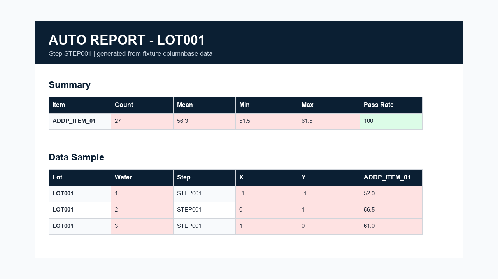
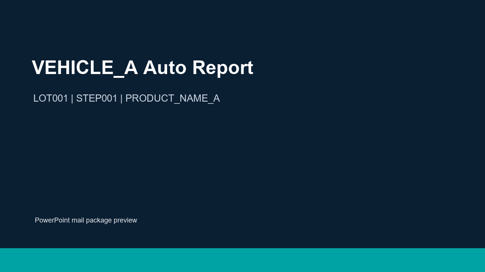
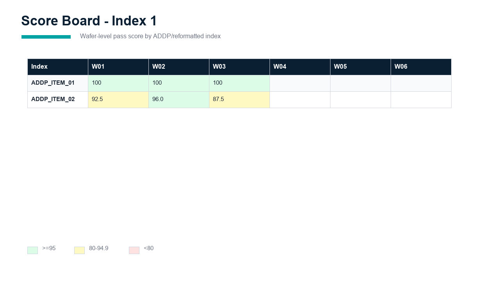
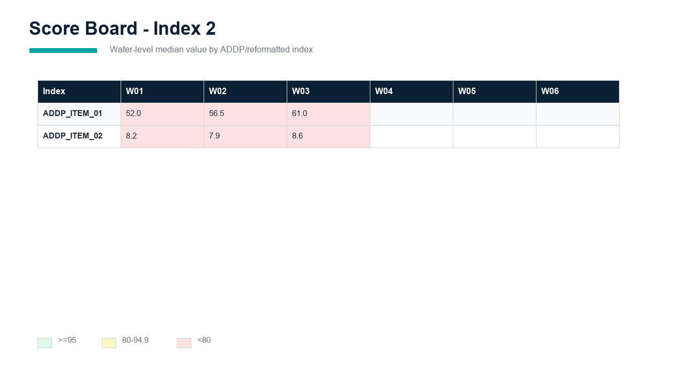

# Auto Report Skeleton

This repository contains an anonymized auto-report skeleton.

## Generate The Working Files

`Setup.py` is self-contained. Run it in the folder where you want the skeleton files:

```powershell
python Setup.py
```

It generates:

- `Main.py`
- `My_Function.py`
- `config.yaml`
- `README.md`

By default existing files are skipped. Use `--overwrite` to replace existing files.

## Local Smoke Setup

For local development in this repository:

```powershell
python -m pip install -r requirements.txt
python scripts\create_temp_fixtures.py
python Main.py VEHICLE_A
```

The report uses columnbase data directly. For ADDP items, put the required real item names in the reformatter `ADDP Form` column with braces, for example:

```text
({REAL_ITEM_A} + {REAL_ITEM_B}) / 2
```

The generated mail HTML is limited to 2 MB and the PPTX package is limited to 10 MB by default. Change `html_limit_mb` and `ppt_limit_mb` in `config.yaml` if needed.

## Template Outputs

Review these generated examples directly in GitHub before requesting design or content changes.

### Mail HTML



[Open template_report.html](templates/template_report.html)

### PowerPoint







[Download template_report.pptx](templates/template_report.pptx)

These files are generated from the local fixture data and are intended as visual templates for the mail body and PowerPoint package.
