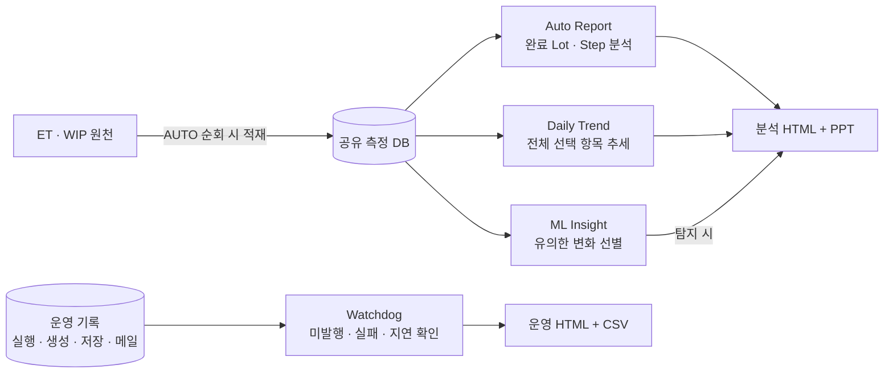

# ET Auto Report System

## 처음 읽는 분: 그림으로 전체 흐름 보기

**[가이드 열기 — docs/guide/index.html](docs/guide/index.html)** · [Markdown / Mermaid 가이드](docs/guide/auto-report-architecture.md)

`setup.py`를 실행하면 가이드도 함께 설치됩니다. 설치 폴더의 `docs/guide/index.html`을 브라우저로 열면 인터넷 연결 없이 그림과 설명을 볼 수 있습니다. 위 링크는 설치 폴더 기준입니다. GitHub에서는 아래 Mermaid 전체 흐름도를 읽고, 상세 가이드는 `setup.py`로 추출하세요.


```mermaid
flowchart LR
    ET["ET · WIP 원천"] -->|AUTO 순회 시 적재| DB[("공유 측정 DB")]
    DB --> A["Auto Report<br/>완료 Lot · Step 분석"]
    DB --> D["Daily Trend<br/>전체 선택 항목 추세"]
    DB --> M["ML Insight<br/>유의한 변화 선별"]
    A --> R["분석 HTML + PPT"]
    D --> R
    M -->|탐지 시| R
    OPS[("운영 기록<br/>실행 · 생성 · 저장 · 메일")] --> W["Watchdog<br/>미발행 · 실패 · 지연 확인"]
    W --> O["운영 HTML + CSV"]
```

| 읽는 순서 | 이해할 내용 |
|---|---|
| 1. 전체 흐름 | Auto Report · Daily Trend · ML Insight · Watchdog의 역할 |
| 2. 실행 구조 | Scheduler와 별도 Main 프로세스, 공유 데이터·운영 기록 |
| 3. 리포트 생성 | 측정 조회 → 대상 선택 → 분석 → 차트 → 저장 → 메일 |
| 4. 추세·ML | 전체 항목 검토와 유의한 변화 선별의 차이 |
| 5. 발송·복구 | 성공·재시도 가능·응답 불확실 상태의 처리 |

가이드는 2026-09-13 코드 기준입니다. 현재 Watchdog은 운영 **HTML/CSV**, Daily Trend와 ML Insight는 분석 **HTML/PPT**를 제공합니다. 아래에 남아 있는 이전 Watchdog 분석/PPT 설명보다 가이드의 역할 구분을 우선 참고하세요.

### Scheduler 하나로 시작하기

설치 폴더에서 `python Scheduler.py`를 실행하면 제품 순회와 **활성화 조건을 충족한 독립 서비스**를 함께 시작합니다.

| 경로 | 자동 기동 조건 | 기본값 |
|---|---|---|
| Auto Report | Scheduler의 제품 그룹 설정 | 설정된 제품 순회 |
| Watchdog | `My_config.py`의 `watchdog.enabled=True` | 감시 활성, 수신처 없음 → 메일 미발송 |
| Daily Trend | `daily_trend.enabled=True` + `products` + `recipients` | 비활성 |
| ML Insight | `mlmode.enabled=True` + `products` + `recipients` | 비활성 |

Watchdog의 기본 일일 보고 시각은 09:00, Daily Trend는 09:30, ML Insight는 10:00이며 운영 서버의 로컬 시각을 사용합니다. 수신처는 서비스별로 지정합니다. 기본 Auto Report 메일은 제품 설정의 `use_email_send`도 확인하세요. `--once` / `--drain`은 독립 서비스를 자동 기동하지 않습니다.

설정 변경 후 Scheduler를 다시 시작하세요. 이미 실행 중인 독립 타이머는 설정을 주기적으로 읽으며, Scheduler 종료와 별개로 계속 실행될 수 있습니다. 서버 자체가 꺼지면 Watchdog도 동작할 수 없습니다.

### ML Insight 차트 읽기

ML은 메일에서 항목별 전체 폭으로, PPT에서는 차트 한 개를 한 슬라이드에 표시합니다. Trend와 공간 상세는 각각의 비율을 유지하며 범례는 차트 밖에 표시합니다.

- **Trend**: 색은 제품/Split, 검정 테두리는 이전 성공 발행 이후 신규·변경 관측(첫 발행은 당일 측정)입니다. 검정선은 전체 그룹의 **일별 중앙값을 3일 이동평균한 참고선**입니다. 항목별 Y축 범위는 다를 수 있습니다.
- **공간 상세**: 왼쪽은 신규 관측의 위치별 중앙값(모든 Split 합성), 가운데는 신규와 과거의 차이, 오른쪽은 Split별 반경 중앙값과 3차 근사선입니다. 가운데의 빨강/파랑은 증가/감소이며 Spec 불량 표시가 아닙니다.
- **탐지 근거**: q는 여러 검정을 보정한 유의확률이며 불량률이 아닙니다. 탐지 여부는 q와 효과 크기 조건을 함께 사용합니다. 표본·좌표·공정시간 누락은 본문의 확인 사항과 첨부 목록을 함께 확인하세요.

> 반도체 **DC(ET) 측정 결과 자동 분석 → 자동 리포트 → 불량 해석**까지 한 번에 이어지는 시스템
> ET(Electrical Test) 측정 데이터 → 통계 자동 해석 → 불량(Anomaly)·원인 해석 → PPT/HTML 리포트 → 메일 발송.

---

## 📋 목차
- [운영 안정성·속도·일일 Watchdog](#운영-안정성속도일일-watchdog-2026-09-12)
- [개요](#개요)
- [주요 개선 사항 (이전 대비)](#주요-개선-사항-이전-대비)
- [저장소 구성 (setup.py 번들)](#저장소-구성-setuppy-번들)
- [빠른 시작](#빠른-시작)
- [전체 사용법 (설치 · 설정 · 실행 · 출력물)](#전체-사용법-설치--설정--실행--출력물)
- [아키텍처](#아키텍처)
- [불량 통계 자동 분석 (핵심)](#불량-통계-자동-분석-핵심)
  - [analyze_commonality — 코드 단독 동작](#analyze_commonality--코드-단독-동작)
  - [지식 규칙 엔진 — [RULE] 단일 포맷](#지식-규칙-엔진--rule-단일-포맷-코드-조합-판정--ai-불량-모드-판정-공용)
  - [지표(metrics) 계산식](#지표metrics-계산식)
  - [신호등 3색 등급](#신호등-3색-등급)
  - [Anomaly Trend Chart & spec-out WF MAP](#anomaly-trend-chart--spec-out-wf-map)
- [LLM 연결 제거](#llm-연결-제거)
- [설정 가이드 (My_config.py)](#설정-가이드-my_configpy)
- [리포트 구성 요소](#리포트-구성-요소)
  - [Score Board / WF MAP](#score-board--wf-map)
  - [PPT 차트 / 다중 lot](#ppt-차트--다중-lot)
  - [ADDP 파생 항목 (Reformatize)](#addp-파생-항목-reformatize)
- [로직 확장 가능성 · 분석 로직 카탈로그](#로직-확장-가능성--분석-로직-카탈로그)
  - [확장 포인트 (어디에 로직을 추가하나)](#확장-포인트-어디에-로직을-추가하나)
  - [넣을 수 있는 분석 로직 (아이디어)](#넣을-수-있는-분석-로직-아이디어)
  - [불량 모드 판정 지식 (참고)](#불량-모드-판정-지식-참고)
  - [통계 패턴 → 추정 원인 카탈로그](#통계-패턴--추정-원인-카탈로그)
- [주요 함수](#주요-함수)
- [데이터 흐름](#데이터-흐름)

---

## 운영 안정성·속도·일일 Watchdog (2026-09-12)

Scheduler는 Main의 종료 코드와 요청별 결과 JSON을 함께 확인합니다. 측정 완료와 리포트
생성·저장·메일 발송은 별도 상태로 기록하며, `RUN/OPS/operations.sqlite`에 prime key별
측정 이력, 발행 시도, 단계별 소요 시간, 미발행 사유, 수신처별 발송 결과를 보관합니다.

### Watchdog 설정과 실행

기존 `reformatter/scheduler.yaml`에 다음 블록을 추가합니다. 없는 키는 코드 기본값을 사용합니다.
수신처는 자동 추정하지 않습니다. `recipients: []`이면 발송하지 않고 미리보기만 저장합니다.

```yaml
watchdog:
  enabled: true
  daily_time: '09:00'          # 한국시간으로 설정된 운영 서버의 로컬 시간
  recipients: []              # ['user@example.com'] 또는 ['정확한_메일링_시트명']
  mail_vehicle: ''            # 메일 API/발신자 설정 제품; 빈 값이면 첫 순회 제품
  poll_sec: 30
  stale_sec: 180              # loop heartbeat 무응답 경고
  progress_stale_sec: 1800    # Main 단계 장기 체류 → 처리 지연 표시
  immediate_alerts: false    # true면 상태 이상/복구 때 추가 알림
  analysis_days: 14
  active_days: 3
  min_lots: 3
  low_score_pct: 95
  spec_out_pct: 1
  shift_sigma: 2
  shift_min_spec_frac: 0.02
  trend_correlation: 0.7
```

```bash
python Scheduler.py                       # 상시 Scheduler + 독립 watchdog 자동 기동
python Scheduler.py --watchdog            # watchdog만 독립 실행
python Scheduler.py --watchdog-preview    # 실제 메일 없이 HTML/PPT 생성
python Scheduler.py --watchdog-once       # 1회 점검; 일일 발송 조건이면 발송
```

Watchdog은 Scheduler의 자식 작업 처리와 분리된 프로세스입니다. Scheduler 종료 후에도
감시를 계속하며, 마지막 응답·최초 감지·명시적 종료 시각을 구분합니다. 정확히 확인되지 않은
중단 시각을 단정하지 않습니다. Main이 오래 처리 중이면 Scheduler 정지와 별도로 표시합니다.
동일 날짜의 일일 발송 성공은 영속 상태로 중복 방지하며, 주소·시간·임계값은 매 점검마다 다시 읽습니다.
`--once`/`--drain`은 독립 watchdog을 자동 기동하지 않습니다.
서버 자체 종료나 네트워크 단절 동안에는 같은 서버의 watchdog도 메일을 보낼 수 없습니다.
서버 재부팅 후 자동 시작은 운영 서버의 서비스/작업 스케줄러에 위 명령을 등록해야 합니다.

### 일일 보고 내용

- 정상 동작/정지 의심/명시적 종료/장기 처리 지연 및 감시 구간의 상태 변화 시각.
- 신규·갱신 측정 제품/lot/prime key와 측정 시각.
- prime key별 생성·저장 확인, 메일 성공/실패/응답 불확실/비활성, 시도 수, 소요 시간, 미발행 사유.
- 조회·피벗/ADDP·좌표 병합·분석·차트·저장·메일 단계별 시간 및 실행 실패.
- 제품별 반복 Spec out, 지속 저점수, 분포 중심 변화 표와 첨부 PPT 페이지 번호.

비교는 제품·Step·프로그램·온도·FULL/13pt·Spec/집계 규칙이 같은 집단 안에서만 수행합니다.
재측정은 prime key별 최신 측정을 사용하여 동일 lot 반복 실행이 반복 이상으로 집계되지 않습니다.
최근 기본 3개 lot의 연속 Spec out ≥ 1%, 연속 점수 < 95%, 또는 최소 6개 lot의
중심 변화 ≥ 2σ와 지속 방향/상관 조건을 사용합니다. 양측 Spec이면 Spec 폭 2%의 변화량
게이트도 적용합니다. 점수는 wafer별 Spec pass 비율 평균이며 집계 항목은 설정된 집계값 기준입니다.
표본 부족·Spec 없음·관측 이력 없음은 정상 판정과 구분합니다.

PPT는 해당 항목의 lot 중앙값 Trend, 전체 값 분포와 Spec 경계, Spec out 비율을 표시합니다.
Spec 밖 히스토그램 막대는 진한 붉은색입니다. 분포 그림은 24-bin 요약을 재구성한 근사 그림이고,
Spec out 수치는 원자료(집계 항목은 집계값)에서 계산합니다. 첨부 PPT는 10MB 미만으로 압축합니다.
관측 자료는 리포팅 데이터 처리 시 갱신되며, 새 발행 대상이 없는 사이클은 기존 자료를 사용합니다.
첫 설치 때 운영 성공 이력은 소급 추정하지 않으며, 기존 측정 로그의 첫 관측과 실제 신규 측정은
표의 측정 시각으로 구분할 수 있습니다.

### 안정성 및 재시도

- CSV/Parquet/HTML/PPT는 임시 파일 완성 후 원자적으로 교체합니다. ET 로그는 원시 파티션 저장 후 확정합니다.
- 실행별 임시 폴더와 제품별 OS 잠금으로 중복 실행의 파일 충돌을 막습니다.
- 원본 발행 파일을 `RUN/OPS/artifacts`에 보관하여 메일 재시도에 재사용합니다.
- 메일 연결/응답 timeout 기본 10/90초. 연결 전 timeout만 안전한 재시도 후보입니다.
  응답 유실, 연결 단절, 5xx는 발송 여부 불확실로 기록하고 자동 재전송하지 않습니다.
- 자동 발행 실패는 운영 이력에 확인된 대상만 다음 사이클에 재시도합니다(기본 총 3회).
  이미 성공한 수신처는 재발송하지 않습니다. 수동 트리거는 기존 Scheduler 재시도 설정을 따릅니다.
- 쿼리는 오류 최대 3회 후 실패 처리합니다. timeout된 스레드를 남겨둔 채 겹치는 쿼리를 계속 시작하지 않습니다.
- `RUN/OPS`에는 재시도 근거가 있으므로 운영 중 임의 삭제하지 않습니다. 발송 여부 불확실은 서버 수신 이력 확인이 필요합니다.

### 속도 개선 및 설정

- ET 조회는 최초/설정 변경/주기적 전체 갱신 외에는 최근 변경 기간만 조회합니다.
  `et_refresh_days=2`, `et_full_refresh_days=7`이 기본이며 지연 유입 특성에 맞게 조정합니다.
- 일별 Parquet에서 필요한 REAL 입력과 메타 컬럼만 조회합니다. 날짜 파티션의 크기/수정시각이 바뀌면 캐시를 무효화합니다.
- ADDP는 전체 피벗 결과를 캐시하여 행 전체를 참조하는 계산 의미를 유지합니다.
- 비교군 Trend 통계와 항목별 렌더 결과를 캐시합니다. 데이터·Spec·대상 lot·렌더 설정·코드 변경을 키에 반영합니다.
- 캐시는 기본 14일/2GB 상한으로 정리합니다. 운영/발송 이력 및 원본 산출물은 캐시 정리 대상이 아닙니다.
- 실제 개선 폭은 일일 보고의 단계별 시간으로 확인합니다. 샘플 테스트 시간은 운영 환경 성능 보장이 아닙니다.

## 개요

Python 기반 반도체 **DC(ET) 측정 데이터 자동 분석 · 리포트 생성 · 불량 해석** 시스템입니다.
DC 측정 결과를 자동으로 통계 분석하고, 리포트를 자동 생성하며, 불량(Anomaly) 해석까지 한 흐름으로 이어집니다.

- **ET(Electrical Test) 데이터 쿼리** → Hive 파티셔닝 Parquet 저장
- **DuckDB** 기반 고속 인메모리 처리 (Scale Factor / ADDP 파생 연산 / 피벗)
- **Pass Rate Score Board** + wafer별 WF MAP
- **불량 통계 자동 분석**: 코드만으로 동작하는 1차 이상 해석(Finding) — AI 없이도 항상 결과 산출
- **AI 다단계 해석(선택)**: 통계 Finding 위에 자연어 원인/조치 보강, 불량 모드 판정
- **PPT / HTML 리포트** 자동 생성 및 메일 발송

설계 목표 두 가지:
1. **코드 기반 분석** — 외부 LLM 연결 없이 통계 분석과 차트를 생성한다.
2. **준실시간** — 한 lot 리포트를 끝까지 처리하는 데 목표 20분 이내(현 데모 약 1분).

---

## 주요 개선 사항 (이전 대비)

기존 단일 스크립트/직렬 처리 대비, 아래와 같이 성능·분석 정밀도·운용성을 개선했습니다.

### 🚀 데이터·성능
- **Hive 파티셔닝 + DuckDB** — ET 데이터를 `RUN/DB/<vehicle>_daily/date=YYYY-MM-DD/data.parquet` **날짜 파티션**으로 적재하고, DuckDB `read_parquet(hive_partitioning=true)`로 조회 기간만 스캔합니다. 전체 재조회 없이 **필요한 날짜 범위만 고속 로드**(증분 누적).
- **차트/WF MAP 렌더링 병렬화** — 발행 시간의 대부분을 차지하는 matplotlib 렌더링을 **워커 프로세스로 병렬 처리**. 워커 수는 실행 환경의 **CPU 코어 수 + 가용 메모리를 보고 매 실행 자동 결정**(부족하면 직렬 폴백). 산출물은 REPORT ORDER 순서로 조립돼 **직렬 실행과 동일**. → [병렬 렌더링](#병렬-렌더링-발행-속도).
- **디스크 임시파일 제거** — PPT 차트는 디스크가 아닌 **메모리(BytesIO)**로 처리해 루트에 `tmp_*.jpg`를 남기지 않습니다.

### 🔬 이상(Anomaly) 분석 정밀도
- **WF MAP을 이상 분석에 연동** — ① [0] Anomaly Trend Chart의 이상 항목 **우측에 spec-out WF MAP**(통과=회색/이탈=빨강, 타깃 wafer 전량 우선, **모든 step_id**의 spec-out wafer를 표시하고 라벨에 step 매칭값 2자리 `(XX)` 표기) ② Score Board에 **wafer별 WF MAP 행**을 붙여 공간 패턴(엣지/센터/재발)을 바로 확인.
- **통계 자동 분석을 'wafer 단위'로 재설계** — 예전에는 *lot median vs 제품 chip median*으로 봤지만, 이제 **target lot의 각 wafer**를 **제품 전체의 'wafer별' 기준**과 비교합니다. spec-out은 **wafer별 이탈 비율**로 순위를 매기고, 주의(median/산포)는 **제품 wafer 분포 대비 wafer 이탈**로 판정 → lot 전체 평균에 묻히던 국소 이상을 잡아냅니다. → [analyze_commonality](#analyze_commonality--코드-단독-동작).
- **PCHK를 일반 Index로 통합** — PCHK도 spec-out이면 동일하게 **이상(CRITICAL)**. '측정이상 추정'은 코드가 겹침 신호만 basis에 남기고 basis에만 보관합니다(자동 원인 단정 없음).
- **주의(Flier) 방향 감시** — spec 이내지만 trend에서 튄 pt를 잡되, **`REPORT DIRECTION`에 맞는 spec 방향**은 `anomaly_flier_sigma`(정상 감도), **반대 방향**은 `anomaly_flier_sigma × anomaly_flier_offdir_relax`(기본 2.0배 완화 = 이상이 매우 클 때만) 초과 시에만 Flier로 봅니다. `BOTH`는 방향 개념이 없어 양방향 동일 감도(+ 산포 병행). 판정은 항목 자신의 '보통 wafer 산포' 기준 **비율(σ)** 이라 값 scale(1e-15~수백만)과 무관합니다. → [통계 자동 분석 튜닝](#통계-자동-분석-튜닝).
- **통계 분석 제외 항목 설정** — `anomaly_exclude_items`(무조건 완전 제외) / `anomaly_exclude_unless_rule`(**RULE에 걸릴 때만 부활하는 조건부 제외**)로 파생/마진 컬럼·tight-spec 항목 등을 **우선순위에서 제외**해 노이즈를 줄입니다(와일드카드 지원). → [통계 자동 분석 튜닝](#통계-자동-분석-튜닝).
- **판정 규칙 = `[RULE]` 자연어 한 줄** — 엔지니어는 `ANOMALY_KNOWLEDGE.md`의 `NL_RULES` 마커 사이에 **`[RULE] ...` 자연어 한 줄**씩만 적습니다. 발행 시 코드가 이를 **JSON 조건식으로 컴파일**(AI 우선, 미연결 시 키워드 fallback, 원문 sha256 캐시로 결정론 유지)해 **모든 규칙을 전부 점검하고, 조건을 만족하는 규칙마다 각각 코멘트**를 남깁니다(다중 매칭 전부 표기). **엔지니어의 룰 관리 지점 = md 파일 하나**. 매 발행마다 전 규칙 체크 결과를 터미널 `[RULE CHECK]` + `RUN/AI/anomaly_rule_check_*.txt/.json`으로 기록. → [지식 규칙 엔진](#지식-규칙-엔진--rule-단일-포맷-코드-조합-판정--ai-불량-모드-판정-공용).
- **측정순서(seq) 판정** — 측정순서(chip_x_adj 먼저 증가 → chip_y_adj 증가 = WF MAP 좌상단부터 한 줄씩 우측 진행)상 **연속 spec-out / 이탈 비율 / 앞부분 집중**을 규칙 조건으로 사용할 수 있고, **"A,B,C,D 모두에서 측정순서에 따른 이상"** 같은 다중 항목 공통 판정도 가능합니다.
- **AI 다단계 해석(선택)** — 통계 Finding 위에 triage→root-cause→final 3단계로 원인/조치를 자연어 보강. **AI 없거나 실패해도 코드 통계 분석은 그대로** 동작(AI-optional). 결과는 **평문 서술형 문장(핵심만 볼드)** 으로 표시하고, **`[RULE]`에 정의된 불량 모드만 표기**(규칙 미매칭 시 '수동 검토 필요'만 — AI 자유 제안·임의 링크는 리포트에 나오지 않음).

### 🎨 리포트·운용
- **Score Board 연속 색 보간 + lot 분리** — 단계식 임계색 폐기, `score_color_scale` 제어점 선형보간(PPT·HTML 동일 함수). 같은 root의 형제 lot을 평균으로 합치지 않고 **lot별 분리** 표시.
- **HTML=메일=포워딩 표시 통일** — 리포트 HTML의 보이는 스타일 전부(제목·표 테두리/색/폭·zebra·글꼴/여백)를 **inline style**로 지정. `<head>`의 `<style>` 블록은 브라우저 전용 보조(sticky 헤더/스크롤)만 담당 → 메일 뷰어가 style 블록을 무시해도, 포워딩 재작성 엔진이 flex/grid·%크기를 버려도 **동일하게 보임**(차트/WF MAP은 고정 px + table 배치).
- **setup.py 자가추출 번들** — 코어 소스 전체를 gzip+base64로 임베드, SHA-256 검증. 저장소엔 소수 파일만 두고 한 번에 배포.

---

## 저장소 구성 (setup.py 번들)

이 저장소에는 **7개 파일**이 올라갑니다.

| 파일 | 역할 |
|------|------|
| `setup.py` | **자가추출 번들**. 아래 6개 파일을 gzip+base64로 임베드. 실행하면 풀린다 |
| `Main.py` | 메인 파이프라인 (진입점) |
| `My_Function.py` | 유틸리티 + 데이터 쿼리 + PPT/차트 생성 |
| `My_config.py` | 글로벌 설정 + HTML 템플릿 내장(`_REPORT_HTML_TEMPLATE`) |
| `anomaly_engine.py` | **불량 통계 자동 분석 엔진** (`analyze_commonality`, 규칙 컴파일/판정, `interpret_with_ai`, `render_findings_html`) |
| `ANOMALY_KNOWLEDGE.md` | AI 해석 **페르소나·답변 스타일 + 판정 규칙(`[RULE]`)·PCHK 매핑** 가이드 — 엔지니어의 룰 관리 지점 |
| `README.md` | 본 문서 |

### setup.py (자가추출 번들)

`setup.py`는 위 6개 파일(자기 자신 제외)을 임베드한 **배포용 번들**입니다.
소스를 수정한 뒤에는 `python gen_setup.py`(로컬 전용 스크립트)로 재생성합니다.

```bash
python setup.py            # 현재 폴더에 6개 파일 추출
                           # (이미 있는 파일은 <파일명>.bak 으로 백업 후 덮어씀)
```

> setup.py는 추출 전 **SHA-256 체크섬**으로 번들 무결성을 검증합니다(불일치 시 중단).

### 사내 이식 시 (중요)

- **코어 코드는 `Main.py` / `My_config.py` / `My_Function.py` / `anomaly_engine.py` 4개 + `ANOMALY_KNOWLEDGE.md`** 뿐입니다.
- `bigdataquery`(DB 쿼리)는 사내 환경 모듈로 번들에 포함하지 않습니다. LLM 클라이언트는 사용하지 않습니다.
  - `bigdataquery`는 `Main.py`/`My_Function.py`가 직접 import 하므로, 사내든 로컬이든 **해당 모듈이 경로에 있어야** 합니다.
- 과거 `templates/report.html`로 분리돼 있던 HTML 템플릿은 추가 파일이 따라가지 않도록 `My_config.py`의 `_REPORT_HTML_TEMPLATE` 상수로 **내장**했습니다.

---

## 빠른 시작

```bash
# 1) 소스 추출
python setup.py

# 2) 기본 실행 (vehicle_A)
python Main.py vehicle_A

# 3) 강제 발행 (특정 LOT 즉시 리포트)
python Main.py _TRIGGER_vehicle_A_T6677.1_test
#                          └vehicle┘ └lot┘ └step┘

# 4) 자연어 규칙 변환 도구 (리포트 발행과 별개)
python Main.py --convert-nl-rules      # NL_RULES 변환 결과 미리보기 + 캐시 갱신(MD 변경 없음)
python Main.py --convert-nl-rules-md   # 변환해서 바로 MD의 ANOMALY_RULES에 [RULE]로 적용
python Main.py --rule-digest           # 규칙 제안 다이제스트 미리보기(발송/상태 변경 없음)
```

새 vehicle 추가:
1. `reformatter/config.yaml`에 vehicle 블록 추가
2. `reformatter/<vehicle>_reformatter.csv` 작성 (항목 정의: REAL / ADDP)
3. `python Main.py <vehicle>`

---

## 전체 사용법 (설치 · 설정 · 실행 · 출력물)

### 1) 요구사항

- **Python 3.9+**
- **패키지**: `pandas`, `numpy`, `duckdb`, `pyarrow`, `python-pptx`, `matplotlib`, `openpyxl`, `requests`, `pyyaml`, `Pillow`
- **사내 전용 모듈**(번들 미포함, 경로에 있어야 함): `bigdataquery`(ET/inline/WIP 쿼리).
- 설명 슬라이드 삽입은 이제 **python-pptx로 직접 복사** — PowerPoint(win32com) 설치 불필요.

### 2) 설치 (소스 추출)

```bash
python setup.py              # 현재 폴더에 전체 소스 추출 (기존 파일은 .bak 백업 후 덮어씀)
```
→ `Main.py / My_Function.py / My_config.py / anomaly_engine.py / ANOMALY_KNOWLEDGE.md / README.md`가 풀립니다(SHA-256 검증).

### 3) 필요 파일 (실행 전 준비)

| 파일/폴더 | 필수 | 역할 |
|---|---|---|
| `reformatter/config.yaml` | ✅ | vehicle별 설정(쿼리 파라미터·기간·토글 등) |
| `reformatter/<vehicle>_reformatter.csv` | ✅ | 항목 정의(REAL/ADDP), SPEC·`REPORT DIRECTION`·`SCALE FACTOR`·`CAT1/CAT2`·`PPT_ONLY` 등 |
| `.env` | 메일/S3 사용 시 | 메일/S3 자격 등 (GPT 설정은 미사용) |
| `HOL_Auto_Report_Description.pptx` | 선택 | CAT2별 설명 간지. 있으면 해당 슬라이드를 리포트에 직접 복사 삽입(없어도 진행) |
| 좌표 xlsx(zone define) | 선택 | WF MAP 실좌표(flat-zone) 보정용 |
| `ANOMALY_KNOWLEDGE.md` | 선택 | **판정 규칙(`[RULE]`)·PCHK 매핑** + AI 페르소나·답변 스타일 |

> `reformatter/`, `config.yaml`, `*.pptx/xlsx/png`, `.env`, mock 모듈은 **setup.py 번들에서 제외**됩니다(사내 별도 관리).

### 4) 설정 (My_config.py)

- **LLM 제거**: 기존 AI 토글은 호환성용이며 Main 발행에서 활성화할 수 없습니다.
- **규칙 컴파일**: `anomaly_nl_autocompile`(True — NL_RULES 자연어 규칙을 발행 시 자동 변환/적용).
- **분석 민감도**: `anomaly_lot_dispersion_ratio`(↑=덜 민감), 플라이어 `anomaly_flier_sigma`/`anomaly_flier_max_pts`/`anomaly_flier_offdir_relax`(반대 방향 완화 배수), 산포 절대량 게이트 `anomaly_disp_min_spec_frac`, 지식 규칙용 `anomaly_median_low_sigma`. **통계 우선순위 제외**: `anomaly_exclude_items`(완전 제외) / `anomaly_exclude_unless_rule`(RULE 매칭 시 부활, 와일드카드). → [통계 자동 분석 튜닝](#통계-자동-분석-튜닝).
- **WF MAP**: `wfmap_exclude_keywords`(예: `['PCHK']`).
- **이미지 해상도**: PPT `ppt_chart_dpi`/`ppt_map_jpg_quality`, HTML `html_chart_dpi`/`html_wfmap_dpi`(독립 조정).
- **색상**: `score_color_scale`(Score Board 연속 색), `score_color_scale_by_item`(ITEM별 override).
- **발송/업로드**: `use_email_send`(사내 메일 API), `use_s3_upload`(S3/DX 업로드), `use_description_page`(CAT2 간지).
- 자세한 표는 [설정 가이드](#설정-가이드-my_configpy) 참조.

### 5) 실행

```bash
python Main.py <vehicle>                       # 예약/조건에 따라 대상 lot 자동 리포트
python Main.py _TRIGGER_<vehicle>_<lot>_<step> # 특정 LOT 즉시 강제 발행
#              예) _TRIGGER_vehicle_A_T6677.1_test
```

### 6) 수동 트리거 모드 (2026-09-11)

기존 TRIGGER를 유지하며 다음 모드를 추가합니다. 맨 앞 `_`는 생략해도 됩니다.
`vehicle`은 `reformatter/<vehicle>_reformatter.csv` 파일명과 일치해야 합니다.
`lot` / `step`에 `_`는 사용할 수 없습니다. vehicle과 메일 주소·그룹명의 `_`는 지원합니다.
명령 인수는 아래처럼 따옴표로 감싸서 실행하세요.

```bash
python Main.py "_TRIGGER_vehicle_A_T6677.1_test"
python Main.py "_TRIGGER_FORCE_user@example.com_vehicle_A_T6677.1_test"
python Main.py "_TRIGGER_NORMAL_vehicle_A_T6677.1_test"
python Main.py "_TRIGGER_ALL_user@example.com_vehicle_A_T6677.1_test"
# mail에 메일링 엑셀의 정확한 시트명도 사용 가능
python Main.py "_TRIGGER_ALL_POWER_USER_vehicle_A_T6677.1_test"
```

| 모드 | 데이터 / 리포트 | 수신처 |
|---|---|---|
| TRIGGER | 기존 조회 기간의 전체 shot, 일반 리포트 | 기존 config / Scheduler 환경변수 |
| TRIGGER_FORCE_{mail} | 일반 리포트. 대상 lot+step의 prime key 진행날짜가 조회 기간보다 오래되면 그 날짜 **2일 전**까지 조회 시작일을 확장 | 지정 mail만 |
| TRIGGER_NORMAL | Extractor 좌표 파일 `Zone_Define`의 **13pt 열이 O / y / true**인 shot만 포함한 일반 리포트 | 기존 config / Scheduler 환경변수 |
| TRIGGER_ALL_{mail} | **CAT2(category)가 비어 있지 않은 모든 항목**의 Trend만, category별 HTML/PPTX | 지정 mail만 |

모든 트리거는 쿼리를 재실행하지 않고 현재 daily DB를 사용합니다. 실제 메일 발송은
`use_email_send=True`여야 합니다. `{mail}`은 실제 이메일 주소(여러 주소는 콤마 구분) 또는
메일링 엑셀의 정확한 시트명입니다. 없는 시트는 오류로 처리하며 기본 그룹으로 대체하지 않습니다.
Scheduler JSON 규약은 기존 TRIGGER 그대로 유지됩니다. 추가 모드는 위 Main CLI로 실행합니다.

- **FORCE**: `Final_et_log`의 대상 lot+step 진행날짜를 사용하며, 여러 prime key이면 가장 오래된
  날짜를 포함합니다. 확장 전/후 시작일과 일수를 로그에 남깁니다. 이미 기간 내이면 그대로 유지합니다.
  날짜가 없으면 오류로 중단하며, 보관되지 않은 원시 DB를 복원하거나 다시 쿼리하지 않습니다.
- **NORMAL**: 대소문자와 앞뒤 공백을 무시합니다. `1`, `yes`, 빈 값은 포함하지 않습니다.
  MASK + CHIP_X_POS + CHIP_Y_POS + FLAT_ZONE_POS로 shot을 매칭하여 대상·비교 trend 모두 필터합니다.
  Point 집계 전에 적용합니다. 13pt 열이 없으면 오류로 중단합니다.
- **ALL**: REPORT ORDER나 PPT_ONLY 여부에 관계없이 CAT2가 있는 REAL/ADDP 및 그 파생 항목을
  포함합니다. 조회 기간 내 데이터가 없는 항목은 로그에 남기고 생략합니다. 표·WF Map·설명 간지·
  이상 분석 없이 category별로 슬라이드당 최대 6개 Trend를 배치합니다.
  HTML의 모든 이미지는 base64 data URI입니다. **메일 HTML 본문 UTF-8 크기 < 2,000,000 bytes,
  PPTX 파일 크기 < 10,000,000 bytes**를 직렬화 후 검사하며 초과하면 전체 차트 해상도/품질을
  단계적으로 줄입니다. 항목 수를 줄여 맞추지 않으며 한계에 도달하면 발송을 중단합니다.
  첨부 PPTX를 포함한 메일 전체의 2MB 제한을 뜻하지 않습니다.
  파일명은 `<날짜>-<vehicle>-<lot>-<step>-ALL-Trends.html/.pptx`이며 기존 HTML/PPT 폴더에 저장합니다.
  ALL 산출물은 메일용이며 S3 업로드 및 별도 다이제스트 발송을 하지 않습니다.

Trend는 PPT/HTML 모두 고정 canvas와 여백을 사용합니다. 긴 Y축 제목은 작은 글씨로 줄이고
극단적으로 긴 경우 잘라 표시하며, 제목 길이 때문에 플롯 높이를 압축하지 않습니다.

### 7) 출력물

| 경로 | 내용 |
|---|---|
| `RUN/Report/<vehicle>/HTML/<날짜>-<prod>-<lot>-HOL_<step>_Report.html` | HTML 리포트([0] 요약·Score Board·Inline·상세) |
| `RUN/Report/<vehicle>/Mail/<...>.pptx` | 메일용 PPT (표지·Score Board·Anomaly 상세·항목별 차트·Index Aggregation) |
| `RUN/TEMP/anomaly_basis_<lot>_<step_id>.json/.csv` | Anomaly 판단 근거(device·PCHK 통합: spec-out wafer·robust 산포·이탈도·특이맵 trace + PCHK `meas_overlap_*` 동일 shot 겹침). 랏 완료 후에도 보존(이미지 파일만 정리) |
| `RUN/AI/ai_input_<lot>_<step_id>.md/.json` | AI에 실제 투입된 단계별 프롬프트(system/user)+응답 덤프(검증용) |
| `RUN/AI/anomaly_rule_check_<lot>_<step_id>.txt/.json` | **전 규칙 체크 결과**(모든 `[RULE]` 매칭/미매칭, 조건·결과·근거) |
| `RUN/AI/nl_rules_json.json` | NL_RULES 자연어 → JSON 규칙 컴파일 캐시(원문 sha256 일치 시 재사용 — "무엇으로 컴파일됐는지" 검수 지점) |
| `RUN/ARCHIVE/<lot>_<step_id>/` | **발행 스냅샷**(`use_archive_snapshot`) — `summary.json`(발행 메타·일시+findings+item_stats+rule_trace) + `target_rows.parquet`(target lot rows 중 **당시 REPORT ORDER index 컬럼만**+좌표 메타 — PCHK도 REPORT ORDER를 부여하면 포함). 규칙 제안 다이제스트/확정 사례 아카이브 입력 — **지워지거나 없어도 리포트 발행에 영향 없음** |
| `RUN/AI/rule_digest_<날짜>.txt` | **규칙 제안 다이제스트**(1일 1회) — 규칙별 매칭 현황·불량모드 매칭 통계·미매칭 반복 패턴의 `[RULE]` 제안. `rule_digest_state.json`이 발송일 기록 |
| `RUN/DB/<vehicle>_daily/date=YYYY-MM-DD/data.parquet` | Hive 파티션 ET 데이터 |
| `RUN/log/<prod>_log.txt` | 통합 실행 로그(30MB rotation) |

---

## 아키텍처

### 설정 3원화

| 파일 | 역할 | 편집 주체 |
|------|------|----------|
| `My_config.py` | 전체 공통 설정 (경로, 임계값, 색상, 토글) | 시스템 관리자 |
| `reformatter/config.yaml` + `*_reformatter.csv` | Vehicle별 항목·스펙·ADDP 정의 | Vehicle 담당자 |
| `ANOMALY_KNOWLEDGE.md` | **판정 규칙(`[RULE]` 자연어)·PCHK 매핑** + AI 해석 페르소나·답변 스타일 | 분석 설계자 |

**핵심 원칙**: 코드를 고치지 않고 위 3개 파일만 편집해서 동작을 바꾼다.

### 런타임 디렉토리(추출/실행 후 생성)

```
auto report/
├── reformatter/
│   ├── config.yaml                  # vehicle별 설정
│   └── vehicle_A_reformatter.csv    # 항목 정의 (REAL/ADDP/PCHK)
└── RUN/
    ├── DB/vehicle_A_daily/date=YYYY-MM-DD/data.parquet   # Hive 파티션 ET 데이터
    ├── TEMP/anomaly_basis_<lot>_<step_id>.json/.csv      # Anomaly 판단 근거(보존, 이미지만 정리)
    ├── AI/                                               # AI 입력 덤프·rule 체크 로그·NL 규칙 캐시
    ├── ARCHIVE/<lot>_<step_id>/                          # 발행 스냅샷(summary.json + target_rows.parquet)
    ├── EXAMPLE/                                          # (선택) AI 판정 예시 few-shot *.md
    ├── Report/vehicle_A/{HTML,Mail}/                     # 산출물
    └── log/<prod>_log.txt                                # 통합 실행 로그
```

---

## 불량 통계 자동 분석 (핵심)

리포트 최상단 **`■ [0] Anomaly Summary`** 섹션의 핵심 엔진입니다.
**외부 연결 없이 코드로 동작**합니다.

[0] 섹션은 위에서부터 다음 순서로 조립됩니다(`Main.py`):

1. **(AI 있으면) AI 다단계 해석** — 연한 색 박스, "AI 자동 생성 참고용" 안내(`[RULE]` 판정 문장 포함)
2. **통계 기반 자동 분석** — AI on이면 `render_findings_count_html`(`● 이상 N건 | ● 주의 N건` 한 줄만 —
   판정 상세는 위 AI 블록에), AI off면 `render_findings_html`(상위 목록, 전체 N건은 PPT 상세 참조)
3. **Anomaly Trend Chart** — 이상/주의 항목의 Trend 차트 + spec-out WF MAP 그리드

> 같은 통계 Finding이 PPT에서는 Score Board **바로 뒤** `Anomaly 상세(통계)` 페이지(`insert_findings_page`)에 **전체**가 들어갑니다.

### analyze_commonality — 코드 단독 동작

`anomaly_engine.analyze_commonality()`는 **각 측정 Index(항목)마다 한 개의 Finding**을 산출하고,
그 위에 **지식 규칙(`KNOWLEDGE`)으로 여러 항목을 조합한 판정**을 추가로 얹습니다.
**항목 단위 판정은 target lot의 '각 wafer'를 제품 전체의 'wafer별' 기준과 비교**하는 방식이며(PCHK 포함 전 항목 동일),
finding type과 우선순위(값이 클수록 위에 정렬)는 다음과 같습니다.

| 우선(priority) | type | severity | 조건 | 코멘트 |
|---|---|---|---|---|
| **40000+** | `DEFECT_MODE` | 🔴 이상 / 🟠 주의 | `ANOMALY_KNOWLEDGE.md`의 **`[RULE]`** 충족 → 여러 항목 조합 판정(매칭 규칙마다 각각 finding) | `[불량 모드] <note>` + LINK + spec-out wafer 번호. → [지식 규칙 엔진](#지식-규칙-엔진--rule-단일-포맷-코드-조합-판정--ai-불량-모드-판정-공용) |
| **30000+** | `KNOWLEDGE` | 🔴 이상 / 🟠 주의 | 수기 `[RULE]` 체이닝 블록의 산포 비교(`compare_disp`) 등 지식 판정 | `[지식 판정] <name>` |
| **20000+** | `SPEC_OUT` | 🔴 CRITICAL (이상) | 타깃 lot에서 spec(SPECLOW~SPECHIGH) 이탈 측정점 ≥ 1 | wafer별 (이탈 pt/측정 pt) 비율, 위치(radius zone)·PGM(pt) |
| **10000+** | `FLIER` | 🟠 WARNING (주의) | spec 미초과 + 어떤 wafer에서 **\|값−wafer median\| > `anomaly_flier_sigma`×보통 wafer 산포**인 pt가 1개 이상 (`anomaly_flier_max_pts`>0이면 그 개수 이하일 때만). **REPORT DIRECTION 방향 감시**: UPPER/LOWER는 spec 방향 정상 감도·반대 방향은 `×anomaly_flier_offdir_relax`(기본 2.0) 초과 시만, BOTH는 양방향 동일 감도 | worst wafer의 Flier pt 수 + 최대 이탈 σ |
| **10000+** | `DISPERSION` | 🟠 WARNING (주의) | spec 미초과 + **어떤 wafer의 산포** `> anomaly_lot_dispersion_ratio` 배 (`anomaly_disp_min_spec_frac`>0이면 절대 산포 게이트도 통과해야) | worst wafer 내부 산포가 '보통 wafer 산포'의 몇 배 |
| **하위(참고)** | `MEAS_SUSPECT` | 🟡 NOTICE (측정이상 추정) | **판정 제외(`wfmap_exclude_keywords`) PCHK**가 spec-out | 동일 shot 겹침 신호만 산출 → AI 측정이상 추정 입력 |

> **median 이탈은 더 이상 finding을 만들지 않습니다.** 각 wafer median이 제품 wafer 분포에서 몇 σ 떨어졌는지는
> **detail 문구·`anomaly_basis_<lot>_<step_id>.json`(`worst_wafer_median_sigma`)에 기록만** 하고, 이상/주의 판정 대상에서는 뺐습니다
> (median 기반 판정은 지식 규칙의 `median_low()`/`median_pctile()` 원자로 이전).

**wafer 단위 비교 기준** (제품=main vehicle 전체를 (lot, wafer) 단위로 계산):

| 지표 | 정의 |
|---|---|
| spec-out 순위 | ① **wafer 최고 이탈 비율**(`out pt / 측정 pt`) → ② **spec-out wafer 수** → ③ **REPORT ORDER** |
| median 이탈 σ | `|wafer median − 제품 wafer median 중심| / 제품 wafer median 산포(=wafer간 변동)` |
| 산포 배수 | `wafer 내부 robust 산포 / 보통 wafer 산포(=제품 각 wafer 내부 산포의 중앙값)` |
| robust 산포 | `1.4826 × MAD` (0이면 IQR/1.349 → std) — 이상치에 둔감 |

- **정렬**: `_priority(f)` 수식값 내림차순 → 동점 시 `DEFECT_MODE`는 MD 규칙 순서, 그 외는 `REPORT ORDER` 오름차순. `DEFECT_MODE(40000+) > KNOWLEDGE(30000+) > SPEC_OUT(20000+) > DISPERSION(10000+) > MEAS_SUSPECT(하위)` 순이 항상 보장됩니다. priority 값은 투명성을 위해 각 finding에 `priority` 필드로 부착됩니다.
- **각 detector는 항목 단위 try/except**라 한 항목이 실패해도 나머지 분석은 계속됩니다.
- **spec-out 분류는 리포팅 대상 `target_lot_id`에만 한정**합니다. 같은 root의 형제 lot은 이상으로 분류하지 않습니다.
- spec-out 판정은 reformatter의 `REPORT DIRECTION`(UPPER/LOWER/BOTH)을 따릅니다.
  예) `LOWER` 항목은 상한 초과를 불량으로 보지 않으므로, 상한을 넘어도 spec-out으로 잡지 않습니다(median 이탈은 detail·basis에만 기록).
- **PCHK도 일반 Index와 동일 판정**(spec-out → 이상). **PCHK 인식 기준 = reformatter의 `CAT2`가 `PCHK`이거나 `ALIAS`에 'PCHK' 부분일치**(예: `PCHK_LKG`, `RMAX_PCHK_LKG` 모두 인식 — Main.py 컬럼 보존과 anomaly_engine 판정 합류가 동일 기준). PCHK spec-out site에서 **동일 shot(wafer·PGM(pt)·CHIP_X/Y)에 다른 항목도 함께 spec-out**인 '겹침 신호'는 `anomaly_basis_<lot>_<step_id>.json`의 `meas_overlap_*`에 기록되고 finding에도 실려 **AI의 '측정이상 추정'** 판단 재료로 넘어갑니다. PCHK 종류별 검증 대상은 `ANOMALY_KNOWLEDGE.md`의 `PCHK_ITEM_MAP` 마커(`- PCHK명: CAT2_1, CAT2_2` — 그 CAT2에 속한 항목 전체와 대조, 원명/표시명 모두 인식, 매핑 없으면 전체 대조)로 관리합니다. PCHK가 `wfmap_exclude_keywords`에 걸리면 이상 판정 대신 `MEAS_SUSPECT`(🟡 측정이상 추정) 신호로만 산출합니다.
- 통계 우선순위에서 특정 항목을 빼려면 → [통계 자동 분석 튜닝](#통계-자동-분석-튜닝).

> **여러 Index 조합→불량 모드 판정은 코드가 deterministic하게 수행**합니다(지식 규칙 엔진).
> `ANOMALY_KNOWLEDGE.md`의 `NL_RULES` 마커에 **`[RULE]` 자연어 한 줄**씩 적으면 코드가 JSON 조건식으로
> 컴파일해 **모든 규칙을 전부 점검, 매칭되는 규칙마다 각각** `DEFECT_MODE` finding을 만듭니다.
> 지식판정(RULE)은 과거 AI 연결 경로의 기능으로 현재 발행에서는 비활성입니다. 이하 엔진 설명은 코드 참고용입니다.

### 지식 규칙 엔진 — `[RULE]` 단일 포맷 (코드 조합 판정 + AI 불량 모드 판정 공용)

여러 항목을 조합한 **불량 모드/risk 판정**을 **코드가 deterministic하게** 수행하는 경량 규칙 엔진입니다.
판정 규칙의 **주 경로는 `NL_RULES` 자연어 한 줄 → JSON 규칙**이고, 고급 사용자를 위한
**수기 `[RULE]` 체이닝 블록**(`ANOMALY_RULES` 마커)도 병행 지원합니다.

같은 규칙이 **AI 불량 모드 판정에도 그대로** 쓰입니다: 규칙의 `"큰따옴표"` 판정명(note)이 곧 불량 모드명이고,
AI가 규칙에 없는 모드명을 만들어도 코드 검증에서 걸러져 리포트에 표기되지 않습니다.

#### 주 경로 — `NL_RULES` 자연어 한 줄 → JSON 규칙 (엔지니어용)

`ANOMALY_KNOWLEDGE.md`의 **`NL_RULES:start … end` 마커 사이**(md의 `🔴 ✏️ 수정 영역 ①`)에
`[RULE]`로 시작하는 **자연어 한 줄 = 규칙 하나**를 적습니다. 항목명은 `[대괄호]`(원 ALIAS·표시명 모두 인식,
대소문자 무관), 판정 코멘트는 `"큰따옴표"`, URL을 적으면 매칭 시 링크로 첨부됩니다.

```
<!-- NL_RULES:start -->
[RULE] [VTH_N]가 이상 수준이면 "AA 불량"을 밝힌다.
[RULE] [VTH_N],[VTH_P]가 모두 이상이면 "BB불량" 임을 밝힌다
[RULE] [IDSAT_N]가 주의 수준을 넘고 Median이 4이하이면 "Trend 대비 이상" 을 적어준다
[RULE] [A],[B],[C],[D] 모두에서 측정순서에 따른 이상이 보이면 "측정순서 공통 이상(측정계 의심)" 임을 밝힌다
<!-- NL_RULES:end -->
```

- **컴파일**: 발행 시(`anomaly_nl_autocompile=True`) `compile_nl_to_json`이 자연어를 **JSON 규칙**
  (`{items, condition, not_items, trend_items, link, comment}`)으로 변환 — AI(gpt-oss-120b) 우선,
  미연결 시 키워드 fallback. 결과는 `RUN/AI/nl_rules_json.json`에 **원문 sha256과 함께 캐시**되어
  같은 규칙 텍스트면 캐시를 재사용(결정론·감사 가능, 규칙을 고치면 자동 무효화).
- **판정**(`evaluate_json_rules`): **모든 `[RULE]`을 전부 점검하고, 조건을 만족하는 규칙마다 각각**
  `DEFECT_MODE` finding을 만듭니다(하나만 고르지 않음 — 다중 매칭 전부 표기). 각 finding에는
  근거 자연어("A가 이상 수준이고 B도 이상 수준이므로 **BB불량** 판정"), spec-out wafer 번호(`[#1, #3]`),
  규칙의 링크가 붙습니다.
- 현재 Main은 통계(이상/주의) 판정만 사용하고, 지식 불량모드 판정은 호출하지 않습니다.

**JSON 조건(condition) 필드** — 자연어 표현이 아래로 변환됩니다(작성 가이드 표는 `ANOMALY_KNOWLEDGE.md`에 동일 매핑):

| 필드 | 자연어 예 | 의미 |
|---|---|---|
| `grade` | "이상 수준이면" / "주의 수준을 넘고" | `>=abnormal`(spec 이탈 존재) / `>=caution`(산포 확대) |
| `logic` | "모두/둘 다" | `all`(나열 항목 전부 만족) / `any`(기본) |
| `median` / `stddev` | "median이 4 이하" / "std가 100 이하" / "스펙 상한의 90% 넘으면" | wafer 대표값 비교. 우변에 숫자 또는 `spec_high`/`spec_low`(`*계수`), 범위는 배열(`[">=10","<=30"]`) |
| `disp_ratio` | "산포가 2배 넘으면" | worst wafer 산포배수 비교 |
| `spec_out` | "spec 이탈이 3개 이상이면" | spec-out pt 수 비교 |
| `seq_run` | "측정순서상 연속 3개 이상 이탈하면" | **측정순서상 연속 spec-out** 개수 비교(개수 없으면 `>=3`) |
| `seq_dead` | "측정점의 50% 이상이 이탈하면" | 측정순서 시퀀스 중 spec-out 비율(0~1) |
| `seq_front_heavy` | "측정 앞부분에 이탈이 몰려 있으면" | `true` — 앞 절반 ≥60% 이탈 + 뒤 절반 ≤20% |
| `flier_dev` | "6σ 이상 튄 pt(플라이어)가 있으면" | **플라이어 최대 이탈 σ** 비교 — spec 이내지만 wafer median 대비 크게 튄 pt("1pt 극단 이탈"). σ 명시 없이 "매우/크게 튄"이면 `>=6` 기본 |
| `flier_pt` | "소수 pt(한두 개)만 튀면" / "3개 이하 pt가" | 플라이어 pt 수(worst wafer) 비교 — `flier_dev`와 조합해 "소수 pt 극단 이탈" 표현 |
| `not_items` | "B,C,D에서 이상 수준 보이지 않으면" | 나열 항목 모두 이상 미만이어야 매칭(`not_grade`로 등급 변경) |
| `trend_items`+`trend` | "D,C,B,A로 갈수록 산포가 벌어지면" | robust std 배수가 그 순서로 단조 증가(asc)/감소(desc) |
| `link` / `comment` | URL / `"판정명"` | 매칭 시 링크 첨부 / 불량 모드명 |

> **측정순서 정의**: wafer별로 `chip_x_adj`가 먼저 증가하고 다음 `chip_y_adj`가 증가하는 순서 —
> `(1,1)→(2,1)→(3,1)→…` 즉 **WF MAP 기준 좌상단부터 한 줄씩 우측으로** 진행하는 실제 측정(터치다운)
> 순서입니다. `seq_*` 지표는 이 순서의 spec-out 시퀀스를 wafer별로 집계한 **최악값**으로 평가합니다.
> `logic: all` + items 여러 개와 조합하면 **"A,B,C,D 모두에서 측정순서에 따른 이상"** 공통 판정이 됩니다.

#### 고급 — 수기 `[RULE]` 체이닝 블록 (`ANOMALY_RULES` 마커)

다단계 분기(decision tree)·산포 억제/비교 같은 복합 규칙이 필요하면 `ANOMALY_RULES:start … end` 마커에
**`[RULE]` 블록 포맷**으로 직접 적을 수 있습니다(`_parse_chain_rules`가 파싱·평가). 자연어 규칙과 달리
**게이트 통과 후 먼저 만족한 분기 1개만** 채택합니다. 평소에는 이 마커를 **비워 두는 것이 기본**입니다
(NL_RULES가 주 경로 — 발행 시 자동 컴파일이 이 마커에 주입하지 않아 중복 판정이 없습니다).

**`[RULE]` 블록 키** (대소문자 무시):

```
[RULE]
name: Gate 모듈 불량 (VTH N·P 연동)      # 선택 — 트레이스/finding 라벨(없으면 trigger)
trigger: VTH_N                           # spec_out/seq_* 함수의 주체 & finding item
sev: critical                            # critical|warning (기본 critical)
when: spec_out >= 3                      # 게이트(비우면 항상 활성)
when2: all_sev(VTH, critical)            # 분기1 조건 (when2→note/link)
note: "Gate 모듈 불량 — Gate CD/Oxide 확인"
link: "http://<사내 위키>/gate-cd"
when2_else:
when3: seq_out(5)                        # 분기2 조건 (when3→note2/link2)
note2: "측정 순서 연속 이탈 — 프로브/측정 중단 확인"
when3_else:
note3: "단순 이탈"                        # else 분기
```

- **분기 평가**: 게이트(`when`) 통과 후 `when2→when3→…→else` 순으로 **먼저 만족한 분기 1개**의
  note/link만 `[불량 모드]` finding으로 채택(중복 없음, 최상단 priority). 분기 없이 `when`+`note`만 있으면
  게이트 참 = 그 note가 곧 불량 모드.
- **액션 키**(분기 대신/함께 사용 가능):
  - `suppress_disp: A, B` — 게이트 참일 때 해당 항목의 `DISPERSION`(주의) finding 억제(`when` 없으면 항상). spec-out(이상)은 유지.
  - `compare_disp: A,B | D,E` — 게이트 참일 때 두 그룹의 최대 산포배수를 비교하는 finding 생성.

**조건식** — `when`/`whenN`에서 ` AND `/` OR `로 원자(atom)를 결합합니다. 지원 원자/함수:

| 원자 | 의미 |
|---|---|
| `spec_out >= n` | trigger 항목의 spec-out pt 수 비교(`>= <= == < >`) |
| `seq_out(n)` | **측정순서**(chip_x_adj 먼저↑→chip_y_adj↑ = WF MAP 좌상단부터 한 줄씩 우측)상 연속 spec-out ≥ n (프로브 접촉/측정 중단 의심) |
| `seq_mostly_dead(f)` | 측정순서 시퀀스의 spec-out 비율 ≥ f(0~1, 거의 다 이탈 — 측정계 이상 의심) |
| `seq_front_heavy` | 앞 절반 이탈 많고(≥60%)·뒤 절반 양호(≤20%) — 측정 워밍업/드리프트 의심 |
| `seq_out(ITEM, n)` / `seq_mostly_dead(ITEM, f)` / `seq_front_heavy(ITEM)` | **지정 항목**의 측정순서 지표(trigger 무관) |
| `all_seq_out(A, B, …, n)` / `all_seq_front_heavy(A, B, …)` | 나열 항목 **'모두'** 측정순서 연속 spec-out ≥ n / 앞부분 집중 — "A,B,C,D 모두 측정순서 이상" 판정 |
| `sev(ITEM, critical)` 또는 `sev(ITEM) >= 이상\|주의\|참고` | 항목 severity 등급 비교. 미측정 항목은 참고(0) |
| `all_sev(A, B, …, critical)` 또는 `all_sev(A,B,…) >= 이상` | 나열 그룹(CAT2/항목)이 **모두** 해당 등급 이상 |
| `disp_desc(A,B,…)` / `disp_asc(…)` | 산포배수가 나열 순서로 단조 감소/증가 |
| `median_low(ITEM)` / `median_high(ITEM)` | target median이 제품 대비 `anomaly_median_low_sigma`(2.0)σ 이상 낮음/높음 |
| `median_pctile(ITEM) <= 5` | target median이 모집단 분포의 하위 5% 이내(`>=95`면 상위 5%) |
| `sev_cat2(CAT2) >= 이상` · `all_sev_cat2(…)>=이상` · `disp_desc/asc_cat2(…)` | CAT2 그룹의 '최대 등급·최대 산포'로 판정 |
| `spec_out_pt(ITEM) >= n` | 지정 항목의 spec-out pt 수(trigger 없이 임의 항목) |
| `spec_out_wafers(ITEM) >= n` | spec-out이 발생한 wafer 수 |
| `spec_out_ratio(ITEM) >= f` | wafer 최고 이탈 비율(out pt/측정 pt, 0~1) |
| `disp(ITEM) >= x` / `disp_cat2(CAT2) >= x` | worst wafer 산포배수 직접 비교(항목/CAT2 최대) |
| `median_dev_sigma(ITEM) >= x` | worst wafer median 이탈 σ(제품 wafer 기준) |
| `flier_dev(ITEM) >= x` | 플라이어 최대 이탈 σ(spec 이내지만 wafer median 대비 튄 pt) — "1pt 극단 이탈" 판정 |
| `flier_pt(ITEM) <= n` | 플라이어 pt 수(worst wafer) — `flier_dev`와 조합해 "소수 pt 극단 이탈" 표현 |
| `pattern(ITEM, Edge ring)` | 특이맵 라벨 부분일치(특이맵 판정 활성 시에만 라벨 존재) |
| `zone_share(ITEM, Edge) >= f` | spec-out 좌표 중 해당 zone(Edge/Middle/Center) 비율(0~1) |
| `repeat_shot(ITEM)` / `repeat_similar(ITEM)` | wafer간 동일 shot/유사 위치 반복 코멘트 존재(특이맵 판정 활성 시) |
| `meas_overlap(PCHK명) >= n` | PCHK와 동일 shot에서 다른 항목 동시 spec-out 겹침 수 |
| `measured(ITEM)` | 항목이 target lot에서 측정됨(미측정 가드) |
| `count_sev(critical) >= n` | 해당 등급 이상인 항목 '개수'(전 항목 대상) |
| `sev >= 1` / `median <op> RHS` / `stddev <op> RHS` / `disp_ratio > x` | trigger 항목의 등급 숫자(0참고/1주의/2이상)·대표 median/stddev(우변: 숫자 또는 `spec_high`/`spec_low[*계수]`)·산포배수 비교 |
| `median(ITEM) <op> RHS` / `stddev(ITEM) <op> RHS` / `rstd(ITEM) >= x` | **임의 항목**의 대표 median/std/robust std 직접 비교 |
| `rstd_asc(A, B, …)` / `rstd_desc(…)` | robust std 배수가 나열 순서대로 점점 커짐/작아짐("산포가 벌어지는 방향") |
| `NOT <원자>` | 원자의 부정 — "~가 아니면 / 이상이 보이지 않으면" |

- 측정순서 지표(`seq_*`)는 wafer별 시퀀스에서 **최악값으로 집계**해 평가합니다(별도 설정 없음).
- 규칙 평가는 전체가 try/except로 감싸져 **하나가 깨져도 나머지 분석은 계속**됩니다.
- **전 규칙 체크 결과가 매 발행마다 기록**됩니다: 터미널 `[RULE CHECK]` 요약 + `RUN/AI/anomaly_rule_check_<lot>_<step_id>.txt/.json`(매칭/미매칭 전량, 조건·결과·비고).
- **엔지니어가 `ANOMALY_KNOWLEDGE.md`만 편집**하면 코드 수정 없이 조합 판정 로직을 추가/수정할 수 있습니다.

### 자연어 규칙(NL_RULES) → `[RULE]` 자동 컴파일

**발행 시 판정에 쓰이는 주 경로는 위의 NL→JSON 변환**(`compile_nl_to_json`, 캐시
`RUN/AI/nl_rules_json.json`)입니다. 그와 별개로, 자연어 규칙을 **수기 `[RULE]` 체이닝 블록으로
변환하는 CLI 도구**가 있습니다(변환 결과를 눈으로 확인하거나 MD의 `ANOMALY_RULES`에 고정하고 싶을 때):

```bash
python Main.py --convert-nl-rules      # 자연어→[RULE] 변환 결과 미리보기 + 문구별 캐시 갱신(MD 변경 없음)
python Main.py --convert-nl-rules-md   # 변환해서 바로 MD의 ANOMALY_RULES 마커에 [RULE]로 적용(추적 주석 포함)
```

> ✍️ **비개발자용 작성 가이드는 `ANOMALY_KNOWLEDGE.md` 자체에 있습니다** — `[ ]` 항목명 규칙
> (원 ALIAS/표시명 모두 인식), '쓸 수 있는 함수/조건' 표(자연어→변환 매핑), 형식 예시.
> 같은 매핑이 컴파일 프롬프트(`NL_PATTERN_HINTS`)에도 주입되어 **가이드대로 쓰면 변환이 사실상
> 결정적**으로 됩니다.

현재는 키워드 규칙 변환과 코드 검증만 사용합니다. 명확히 해석할 수 없는 표현은
변환하지 않습니다. 과거 AI 연결에 종속된 지식 불량모드 판정은 발행에서 비활성입니다.

### 규칙 제안 다이제스트 (1일 1회, POWER_USER)

일반 자동 발행에서 `rule_digest_enabled=True`일 때 **규칙 현황과 개선 제안을 하루 1회** 생성합니다 (수동 트리거에서는 생략)(`build_rule_digest` —
`RUN/ARCHIVE` 스냅샷을 `rule_digest_window_days`(14일) 윈도우로 집계, `rule_digest_state.json`으로 중복 방지):

1. **규칙 현황** — 설정된 `[RULE]`별 최근 N일 매칭 건수/리포트(0회 규칙 = 정리 후보)
2. **불량 모드 매칭 통계** — 모드별 총 건수 + 발생 리포트, 측정이상(PCHK 겹침) 신호 건수
3. **미매칭 반복 패턴 → `[RULE]` 제안** — CRITICAL spec-out 항목 조합의 지지도(그 조합을 모두 포함한
   리포트 수)가 `rule_digest_min_repeat`(3) 이상인데 기존 규칙이 커버하지 않으면, "**~ index에서
   spec-out이 지속 발생 중 - 확인 요청**" 안내와 함께 **복붙 가능한 `[RULE]` 자연어 한 줄**로
   제안(템플릿 생성 = 항상 컴파일 가능. 모드명은 `"OOO(모드명 기입)"` 플레이스홀더 — **명명은 사람 몫**).
   **자동 반영 없음(propose-only)** — 반영/삭제 전까지 매일 반복 제안.
4. **좌표 재발 확인 요청** — 같은 index의 **동일 chip 좌표** spec-out이 `min_repeat`개 리포트 이상
   반복되면 안내(findings의 `spec_out_positions` 집계 — 특이맵 판정 OFF여도 동작, 리포트당 상한
   20pt 표본). **불량 모드와 연결되지 않아도** 레티클/프로브핀/척 등 systematic 후보 인사이트로 전달.

산출: `RUN/AI/rule_digest_<날짜>.txt` 저장 + 메일링 xlsx에 **`POWER_USER` 시트**가 있고
`use_email_send=True`면 그 수신처로 발송(시트가 없으면 파일만 — 기본 그룹으로 오발송하지 않음).
미리보기는 `python Main.py --rule-digest`. 스냅샷·규칙·수신처가 없어도 각 단계가 안전하게 축소 동작합니다.

### 지표(metrics) 계산식

`My_Function.insert_plots()`가 차트를 그리며 항목별 통계를 함께 계산해 `metrics_dict`로 넘깁니다.

| 지표 | 정의 |
|---|---|
| `global_med` / `global_std` | **모집단**(main vehicle 전체) median / std |
| `target_med` / `target_std` | **타깃 lot** median / std |
| `deviation` | `|target_med − global_med| / global_std` — 타깃 median이 모집단에서 몇 σ 떨어졌나 |
| `spec_outs` / `spec_out_count` | 타깃 lot의 spec 이탈 측정점 목록(값·좌표) / 개수 |

> ⚠️ **이상 판정 자체는 `metrics_dict`의 lot 단위 `deviation`을 쓰지 않습니다.** `analyze_commonality`는 위 [wafer 단위 비교 기준](#analyze_commonality--코드-단독-동작)(제품 wafer 분포 대비 wafer 이탈, robust MAD)으로 판정합니다. `metrics_dict`는 **차트 렌더링**과 Anomaly Trend Chart **항목 보충 선정**(findings가 top_n 미만일 때)에만 쓰입니다.

### 신호등 3색 등급

각 Finding은 **신호등 원(●) + 라벨**로 표시됩니다(HTML 요약·head, PPT 상세 모두 동일 색).

| 신호등 | severity | 라벨 | 요약 head 표기 | 현재 산출 detector |
|---|---|---|---|---|
| 🔴 빨강 | `CRITICAL` | 이상 | 이상 | `SPEC_OUT`(PCHK 포함), `DEFECT_MODE`/`KNOWLEDGE`(sev=critical) |
| 🟠 주황 | `WARNING` | 주의 | 주의 | `DISPERSION`(wafer 단위), `DEFECT_MODE`/`KNOWLEDGE`(sev=warning) |
| 🟡 노랑 | `NOTICE` | 주의 | (미집계) | `MEAS_SUSPECT`(판정 제외 PCHK spec-out — 측정이상 추정) |
| ⚫ 회색 | `INFO` | 참고 | (미표기) | — |

- **요약 head 건수(`● 이상 N | ● 주의 X`)는 `CRITICAL`/`WARNING`만 집계**합니다. `NOTICE`(측정이상 추정)는 finding·상세에는 나오지만 head 건수에는 넣지 않습니다.
- 색/라벨은 `anomaly_engine.py`의 **`_SEV_COLOR` / `_SEV_LABEL` / `_SEV_HEAD` 한 곳**에서 관리합니다.
  PPT 상세 페이지는 `My_Function.insert_findings_page`가 같은 색을 미러링합니다.
- 어떤 Finding을 어느 등급으로 둘지는 그 detector의 `_finding("CRITICAL"|"WARNING", ...)` 첫 인자로 결정됩니다.
- **코멘트(제목/상세 문구)는 detector 코드가 직접 생성**합니다. 문구를 바꾸려면 `analyze_commonality()` 안 `_finding(..., title=..., detail=...)` 문자열을, 민감도는 `My_config.py` 임계값을 수정합니다.

### Anomaly Trend Chart & spec-out WF MAP

[0] 섹션의 Trend 차트 그리드는 **통계 자동 분석(`code_findings`) 상위와 동일한 항목**을 사용합니다(콤마 분해·중복 제거 후 `merged_df` 컬럼 + Trend PNG가 있는 것만, 최대 `anomaly_trend_chart_top_n`개).

레이아웃은 두 그룹:

- **이상 탭** (`● 이상`): `SPEC_OUT` 항목을 **1행씩** — 좌측 Trend 차트 + **우측 spec-out WF MAP**.
- **주의 탭** (`● 주의`): 나머지를 가로 flex-wrap 배치(WF MAP 없음).

**spec-out WF MAP**(`render_specout_wfmaps_b64`):
- 칩 색: 통과=회색(`#bdbdbd`), spec 이탈(flier)=빨강(`#d32f2f`).
- **타깃 판정 = 리포트의 `lot_id` + `step_id` 조합**(`target_lot`/`target_step`). 타깃 WF MAP만 파란 테두리 박스로 묶고, 같은 lot이라도 **다른 step은 타깃이 아니며 테두리를 그리지 않습니다**.
- **타깃의 spec-out wafer는 전량 우선 표시**(25매 모두 spec이면 25장). 남는 칸만 그 외(다른 lot·다른 step)를 TKOUT_TIME 최신순으로.
- 상한은 `anomaly_wfmap_max_count`(=42)지만 **타깃 spec wafer는 상한과 무관하게 모두** 표시.
- spec_low/high는 `REPORT DIRECTION`을 반영해 전달 → Trend의 SPEC OUT 판정과 일치.
- **step_id 필터 없음** — 리포트 제품(`MASK==main_vehicle`)의 **모든 step_id**의 spec-out wafer를 표시합니다(Trend chart와 동일 스코프). 측정 단위(root_lot·fab_lot·wafer·tkout·**step_id**)로 그룹핑하므로 같은 wafer의 다른 step 측정은 별도 맵으로 분리됩니다.
- **라벨** = `{ROOT_LOT_ID} #{WAFER_ID} ({XX})` — `XX`는 그 wafer의 `STEP_ID`를 `dc_dict`(step_id→DC step 매칭테이블, `get_dc_step_from_id`)로 변환한 값의 **앞 2자리**(미등록 step은 괄호 생략). 여러 step이 섞였을 때 어느 step의 spec-out wafer인지 구분합니다. 매칭테이블에 **같은 step_id가 여러 DC layer에 등록**되면 `dc_dict`는 **먼저 선언된 DC layer**로 매칭합니다(first-wins). 타깃 라벨은 진파랑(`#0033cc`) **일반 폰트**(bold 아님), 그 외는 회색. 라벨이 맵 셀 폭을 넘으면 **자간을 자동으로 좁혀** 이웃 라벨과 겹치지 않게 그립니다.

**상태 스티커**: 각 Trend 차트 좌상단에 CSS 배지 — `SPEC OUT`(빨강) / `WARNING`(주황). PNG 자체는 수정하지 않으므로 PPT 차트에는 영향 없음(HTML [0]에만 적용).

---

## LLM 연결 제거

현재 Main은 LLM 클라이언트 import, 연결 테스트, mock 연결, AI 해석 호출을 하지 않습니다.
연결 성공/실패/미설정/AI 스킵 로그도 출력하지 않습니다. `.env`의 GPT 설정은 읽지 않으며,
기존 YAML의 `use_gpt_summary` / `use_gpt_multistep`가 True여도 발행 시 False로 고정합니다.
코드 통계 분석과 Trend는 유지됩니다. 과거 AI 연결에 종속된 지식 불량모드 판정은 비활성입니다.
자연어 규칙 CLI와 다이제스트는 키워드/코드 경로만 사용합니다.

## 설정 가이드 (My_config.py)

### 통계 자동 분석 튜닝

**"통계 기반 자동 분석의 민감도를 바꾸고 싶다" → `My_config.py`의 아래 값만 조정**하면 됩니다(코드 불변).
전부 `MyConfig.__init__` 안에 있고, 값이 클수록 **덜 민감**(이상/주의로 덜 잡음), 작을수록 **더 민감**합니다.

| 변수 | 기본값 | 무엇을 바꾸나 | ↑ 올리면 | ↓ 내리면 |
|------|--------|------|------|------|
| `anomaly_lot_dispersion_ratio` | `2.0` | **주의(산포)** 임계 배수 — target wafer 내부 산포가 '보통 wafer 산포'의 이 배수 초과 시 주의 | 큰 산포만 주의 | 약한 산포도 주의 |
| `anomaly_flier_sigma` | `3.5` | **주의(Flier)** 임계 σ — wafer median 대비 \|값−median\|이 '보통 wafer 산포'의 이 σ 초과 pt를 Flier로 판정 (0=OFF) | 확실히 뜬 pt만 | 살짝 뜬 pt도 |
| `anomaly_flier_max_pts` | `0` | Flier로 볼 wafer당 **최대 초과 pt 수 상한** — `0`=상한 없음(1개 이상이면 Flier). 양수면 초과 시 산포 확대로 판정 | 더 많은 pt도 Flier | 소수 pt만 Flier |
| `anomaly_flier_offdir_relax` | `2.0` | **Flier 반대 방향 완화 배수**(REPORT DIRECTION=UPPER/LOWER 전용) — spec 방향은 `anomaly_flier_sigma` 그대로, **반대 방향**은 `anomaly_flier_sigma × 이 값` 초과 시에만 Flier. `1.0`=완화 없음(양방향 동일). BOTH는 방향 개념이 없어 미적용 | 반대 방향은 더 큰 것만 | 반대 방향도 민감 |
| `anomaly_disp_min_spec_frac` | `0.0` | **주의(산포) 절대량 게이트** — worst wafer 절대 산포가 spec 폭(UCL−LCL)의 이 비율 미만이면 산포 주의 미발생 (`0`=게이트 OFF, 단측 spec 미적용) | spec 대비 큰 산포만 | 작은 산포도 |
| `anomaly_median_low_sigma` | `2.0` | 지식 규칙 `median_low/high(ITEM)` 원자의 임계 σ — target median이 제품 대비 이 σ 이상 낮을/높을 때 참(True) | 확실한 이동만 매칭 | 작은 이동도 매칭 |
| `anomaly_trend_chart_top_n` | `3` | [0] Anomaly Trend Chart / HTML 요약에 **보여줄 상위 항목 수**(CAT2당 대표 1개) | 더 많이 표시 | 핵심만 표시 |
| `anomaly_deviation_sigma` | `1.5` | Trend chart 항목이 top_n에 못 미칠 때 **`metrics_dict`로 보충 선정**하는 σ(판정 아님) | 보충 적게 | 보충 많이 |

> median 이탈은 finding 판정에서 빠져 있습니다 — 각 wafer median의 σ 이탈은 detail·basis에 기록만 되고,
> median 기반 판정은 지식 규칙(`median_low`/`median_pctile` 등)으로만 반영됩니다.

> **이상(spec-out)** 은 별도 임계가 없습니다 — spec(LCL/UCL) 이탈이면 무조건 이상입니다. spec 자체는 `reformatter/<vehicle>_reformatter.csv`의 `SPECLOW/SPECHIGH/REPORT DIRECTION`으로 정합니다.

#### 통계 우선순위에서 항목 제외 (`anomaly_exclude_items`)

파생/마진 컬럼처럼 통계 이상으로 잡을 필요 없는 항목을 **우선순위·finding·Trend Chart에서 통째로 제외**합니다
(Score Board·항목별 차트 등 나머지 리포트에는 그대로 나옵니다).

```python
# My_config.py — MyConfig.__init__
self.anomaly_exclude_items = [
    'MAWIN_minus_margin', 'MAWIN_plus_margin', 'MAWIN_ovl_index', 'MAWIN_new',  # 정확한 ALIAS
    'MAWIN_*',        # 와일드카드: MAWIN_ 로 시작하는 파생컬럼 전부
    'PCHK_*',         # 예: PCHK 계열 전부 통계 우선순위에서 빼고 싶을 때
]
```

- **대소문자 무시**, `fnmatch` 와일드카드(`*`, `?`) 지원. 빈 리스트(`[]`)면 제외 없음.
- 판정은 `anomaly_engine.item_excluded(name, patterns)` 한 함수가 담당 → `analyze_commonality`(finding·basis)와 `Main.py`(Trend chart 보충 선정) **양쪽에서 동일 적용**.
- 제외된 항목은 `RUN/TEMP/anomaly_basis_<lot>_<step_id>.json`에도 나타나지 않습니다.

#### 조건부 제외 — RULE에 걸릴 때만 부활 (`anomaly_exclude_unless_rule`)

`anomaly_exclude_items`가 **무조건 완전 제외**라면, 이쪽은 **평소엔 built-in 판정(spec-out/Flier/산포 확대)을 억제하되, `[RULE]`/`NL_RULES`가 그 항목을 trigger·참조해 매칭될 때만 finding으로 부활**시키는 조건부 제외입니다.

```python
# My_config.py — MyConfig.__init__
self.anomaly_exclude_unless_rule = [
    'ET_KELVIN_RES',   # 정확한 ALIAS
    'ET_KELVIN_*',     # 와일드카드도 가능 — 여러 항목 등록 가능
]
```

- **용도**: Kelvin RES처럼 WF MAP 컬러링을 위해 spec을 tight하게 잡아 **spec-out이 한두 개씩 상시** 뜨는 항목 — 그 노이즈로는 이상/주의를 띄우지 않되, 엔지니어가 정의한 RULE(예: `spec_out(ET_KELVIN_RES) >= 20`)에 걸리는 **진짜 이상일 때만** 잡고 싶을 때.
- **동작**: 대상 항목은 분석에서 **빠지지 않고**(spec_out_pt·severity·산포 등 컨텍스트가 유지되어 RULE이 실제 통계로 평가 가능) built-in finding만 억제합니다. 전 RULE 평가 후 그 항목을 참조·trigger한 RULE finding(`DEFECT_MODE`/`KNOWLEDGE`)이 있으면 built-in finding까지 되살리고, 없으면 최종적으로 제거해 Trend chart·요약·WF MAP 어디에도 노출하지 않습니다.
- **여러 항목 등록 가능**, `fnmatch` 와일드카드 지원, 대소문자 무시. `anomaly_exclude_items`와 동일한 `item_excluded` 매칭.
- **우선순위**: 한 항목이 `anomaly_exclude_items`(완전 제외)와 `anomaly_exclude_unless_rule` 둘 다에 걸리면 **완전 제외가 우선**(items에서 먼저 빠져 RULE 평가도 안 됨).

> 과거 detector의 잔여 설정(`anomaly_trend_slope_sigma`·`anomaly_split_separation`·`anomaly_site_recurrence_min_lots`·`anomaly_pchk_check`·`anomaly_lot_median_sigma` 등)은 **My_config에서 삭제되었습니다**(불량 모드/측정 의심/median 해석은 [지식 규칙 엔진](#지식-규칙-엔진--rule-단일-포맷-코드-조합-판정--ai-불량-모드-판정-공용)과 AI로 이전됨).

### Anomaly Trend Chart / WF MAP

| 변수 | 기본값 | 설명 |
|------|--------|------|
| `show_anomaly_trend_chart` | `True` | [0] Trend chart 섹션 ON/OFF (마스터) |
| `anomaly_trend_chart_top_n` | `3` | Trend chart 최대 개수(이상+주의 합산, 요약 상위와 동일 — 같은 CAT2는 대표 1개) |
| `anomaly_wfmap_specout` | `True` | 이상 항목 우측 spec-out WF MAP 표시 |
| `anomaly_wfmap_max_count` | `42` | spec-out WF MAP 총 표시 상한(타깃 spec wafer는 항상 전부) |
| `wfmap_exclude_keywords` | `['PCHK']` | ALIAS에 키워드 부분일치 시 WF MAP 미표시 + 통계 판정 제외(PCHK는 `MEAS_SUSPECT` 신호로만) |

### Score Board 색상 (연속 보간)

- `score_color_scale` = `[(점수,'#hex'), …]` 제어점 선형보간 (PPT·HTML 공통).
- `score_color_scale_by_item` — ITEM(ALIAS)별 스케일 override (예: 특정 항목은 90점도 빨강).
- `score_color_na` — 측정 없음(N/A) 색.
- 값→색은 **`GLOBAL_CONFIG.score_color(value, item)` 단일 함수**가 결정 → HTML·PPT 색 완전 일치. 글자색은 배경 휘도로 자동.

### 기타

| 변수 | 기본값 | 설명 |
|------|--------|------|
| `use_gpt_summary` / `use_gpt_multistep` | `False` | 호환성용; Main에서 항상 False로 고정 |
| `ai_stage_mode` | `'multi'` | AI 호출 모드 — `'multi'`(3단계) / `'single'`(Final 1회) |
| `anomaly_nl_autocompile` | `True` | NL_RULES 자연어 규칙을 발행 시 자동 컴파일/적용 |
| `use_archive_snapshot` | `True` | 발행 스냅샷(RUN/ARCHIVE) 저장 — 다이제스트/사례 아카이브 입력 |
| `rule_digest_enabled` / `_window_days` / `_min_repeat` | True / 14 / 3 | 규칙 제안 다이제스트(1일 1회, POWER_USER) — 집계 기간·제안 승격 반복 수 |
| `use_email_send` / `use_s3_upload` / `use_description_page` | False / True / True | 사내 메일 발송 / S3(DX) 업로드 / CAT2 간지 삽입 |
| `ppt_chart_dpi` / `ppt_chart_jpg_quality` / `ppt_map_jpg_quality` | 125 / 55 / 38 | PPT 차트 해상도·품질 (용량의 주 레버) |
| `html_chart_dpi` / `html_wfmap_dpi` / `html_img_scale` | 170 / 200 / 2 | HTML 차트·WF MAP 해상도(PPT와 독립) |
| `trend_tkout_agg` | `{'MAWIN':'P10'}` | 특정 항목은 site 전체 대신 tkout별 집계점으로 Trend 표시·이상/주의 판정. 집계 스펙: `'PXX'` 임의 백분위수(예 `P05`/`P95`/`P99.5`), `'MEDIAN'`(=P50), `'MEAN'` |
| `description_image_target_mb` / `_max_px` / `_min_px` / `_jpeg_quality` | 2.0 / 2400 / 600 / 85 | 설명(Description) 슬라이드 이미지 재압축 — 1장이 목표 MB를 넘으면 해상도 자동 축소 |
| `anomaly_detail_first_page_items` / `anomaly_detail_page_items` | 5 / 15 | PPT 'Anomaly 상세' 1페이지/이후 페이지당 finding 수 |

### 병렬 렌더링 (발행 속도)

차트/WF MAP 렌더링(matplotlib, 발행 시간의 대부분)을 **워커 프로세스로 병렬화**해
리포트 발행 속도를 높입니다. 워커 수는 실행 환경의 CPU 코어 수와 '가용' 메모리를
보고 매 실행 시 자동 결정됩니다.

| 변수 | 기본값 | 설명 |
|------|--------|------|
| `parallel_workers` | 0 | 워커 수 강제 지정 (0 = 환경 보고 자동 결정) |
| `parallel_max_workers` | 8 | 자동 결정 시 상한 |
| `parallel_mem_per_worker_gb` | 1.2 | 워커 1개당 예상 메모리(GB) |
| `parallel_reserve_gb` | 3.0 | 메인 프로세스 몫으로 남겨둘 가용 메모리(GB) |

- 자동 결정식: `workers = min(코어수, 상한, (가용GB − reserve) ÷ per_worker)` — 예) 4코어/50GB → 4워커, 2코어/10GB → 2워커.
- 가용 메모리가 부족하면 자동으로 **1(직렬)** 로 폴백해 종전과 동일하게 동작합니다(저사양 안전).
- 렌더링 결과(이미지 bytes)는 REPORT ORDER 순서대로 메인 프로세스가 PPT에 조립하므로 **산출물(PPT/HTML)은 직렬 실행과 동일**합니다.
- ⚠️ Windows 프로세스 spawn은 워커가 `__main__`(Main.py)을 다시 import 하므로, Main.py 실행 본문은 반드시 `if __name__ == "__main__":` 가드 안에 있어야 합니다(현재 구조 유지 필수).

---

## 리포트 구성 요소

### Score Board / WF MAP

- **HTML Score Board**: 컬럼 = `(FAB_LOT_ID, WAFER_ID)`. 같은 root의 형제 lot을 평균으로 합치지 않고 **lot별로 분리** 표시(타깃 lot 맨 왼쪽·연녹 강조 → reference → 형제 lot, lot내 wafer 오름차순).
- **wafer별 WF MAP 행**: 용량 문제로 HTML Score Board에서는 제거됨 — WF MAP은 PPT에서만 확인합니다.
- **PPT Score Board**(`insert_score_board`): (lot, wafer) MultiIndex 헤더(lot 가로 병합), ITEM 세로 병합, 타깃 lot 먼저, 측정된 wafer만 표기. 셀 색은 HTML과 동일한 연속 보간(`score_color`) + 테두리.
- **PPT wafer(점수) 열 폭**: 값이 `100.0` 정도라 기본 `0.40"`면 충분. lot_id가 그 lot의 wafer 열들에 가로 병합되므로 lot당 wafer 수가 적고 lot_id가 길면 필요한 만큼만 넓히되 **상한 `0.72"`**(lot_id가 아무리 길어도 열이 무한히 넓어지지 않음). wafer가 많아 슬라이드 폭을 넘으면 종전처럼 균등 축소(하한 `0.14"`). 표 전체 폭 = 실제 열 폭 합이라 wafer가 적으면 표도 좁게 나옵니다.
- 색은 PPT·HTML 모두 `GLOBAL_CONFIG.score_color()`를 호출하므로 동일합니다.

### Inline Table (데이터 없을 때)

- `[2] Inline Table`은 부가 정보입니다. INLINE 설정 시트 미기입(`Key=True` 항목 없음)·쿼리 결과 없음·시트 형식 이상 등으로 만들 수 없으면 **예외를 올리지 않고 헤더(열)만 있는 빈 표**로 렌더링합니다(`Main._build_inline_pivot` → `_empty_inline_pivot`).
- 즉 Inline 하나 때문에 리포트 발행·PPT·**메일 발송이 중단되지 않습니다**. 생략된 경우 로그에 `[WARN] Inline ...` 이 남습니다.

### PPT 차트 / 다중 lot

`insert_plots()`가 항목별 PPT 페이지(Box / Trend / WF MAP / Radius / CDF)를 그립니다.

- **WF MAP**: wafer당 최대 **13×13 칩 격자**, 격자에 맞춰 마커 자동 축소. **같은 PGM(pt)/subitem은 한 줄**(행=PGM, 열=wafer 전체)에서 폭을 꽉 채워 최대 크기. sparse wafer는 측정 칩만 표시.
- **WF MAP geometry(150mm 원 fit·shot pitch)는 좌표파일 기준**: 좌표 xlsx(Zone_Define)의 **MASK(vehicle)별 전체 chip layout(CHIP_X_ADJ/CHIP_Y_ADJ/Chip_Radius)**으로 계산(`set_chip_layout`) — 측정 point가 적은(예 13pt) wafer/항목도 full 측정과 동일한 원·칩 크기로 그려짐. 좌표파일이 없으면 종전처럼 측정 좌표로 폴백.
  - **색 = `REPORT DIRECTION`**(`_wfmap_cmap`): `LOWER`→낮은값 빨강/높은값 파랑(`coolwarm_r`), `UPPER`·`BOTH`→낮은값 파랑/높은값 빨강(`coolwarm`).
  - 단일 컬러바를 풀높이로 공유, 스케일 = 모집단 1~99% + lot 범위. 좌표는 zone_define(coordinate xlsx)과 inner-merge.
- **임시 차트 파일 없음**: 모든 PPT 차트는 디스크가 아니라 **메모리(BytesIO)**로 처리(루트에 `tmp_*.jpg` 미생성). HTML용 Trend PNG는 `RUN/OPS/temp/<실행>/<리포트>`에 임시 생성 후 **HTML에 base64로 내장**되며, 랏 완료 시 RUN/TEMP의 이미지 파일만 정리됩니다(anomaly_basis 등 비이미지는 보존).
- **다중 lot_id**(같은 root_lot_id가 같은 step에 함께 reporting): 리포트 단위 = `root_lot_id + step`(match_key)로 형제 lot이 함께 그려짐.
  - **Trend** = lot별 **색**, **Radius/Cumulative** = lot별 **marker**(색은 wafer). 모집단 median 선은 연회색(`#cccccc`).
  - 단, **spec-out(이상) 분류는 타깃 lot만**.

### ADDP 파생 항목 (Reformatize)

`Reformatize()`가 reformatter의 ADDP FORM을 계산해 파생 컬럼을 만듭니다.

- 지원: 사칙연산 / `rmax`·`rmin`(행단위 최대·최소) / `ABS`·`LOG`·`POWER`·`sqrt` / **`MA_Window`(다중 출력)**.
  - ⚠️ `STD`/`AVG`/`stddev`는 현재 미동작(Reformatize 시점엔 root_lot_id/wafer_id/tkout_time이 인덱스라 컬럼 참조 불가).
- **단일 출력**(예: `rmax({VTH_N},{VTH_P})`) → `{ALIAS}` 1개 → 페이지 1장.
- **다중 출력**(`MA_Window(...)`) → `{ALIAS}`, `{ALIAS}_minus_margin`, `{ALIAS}_plus_margin`, `{ALIAS}_ovl_index`, `{ALIAS}_new` → 각각 페이지화. (① Reformatize 생성 ② Main 컬럼 필터 `derived_addp` 보존 ③ insert_plots 페이지 목록 `{ALIAS}`+`{ALIAS}_*` 포함 — 셋 다 필요)
- ⚠️ 콤마가 든 ADDP FORM(`rmax({A}, {B})`, `MA_Window([0,1,2], …)`)은 reformatter CSV에서 **반드시 큰따옴표로** 감싸야 컬럼이 안 깨집니다.

---

## 로직 확장 가능성 · 분석 로직 카탈로그

> 이 시스템은 **코드 최소 수정으로 분석 로직을 계속 얹을 수 있게** 설계됐습니다.
> 아래는 "어디에 무엇을 추가할 수 있는가"와, 추가할 수 있는 **분석 로직 아이디어 · 참고 지식**입니다.
> (이 내용은 과거 `ANOMALY_KNOWLEDGE.md`에 있던 로직/지식으로, 문서화 목적상 README로 이관했습니다.)

### 확장 포인트 (어디에 로직을 추가하나)

| 확장 대상 | 위치 | 방법 |
|---|---|---|
| **새 이상 detector** | `anomaly_engine.analyze_commonality()` | 항목 루프 안에 `findings.append(_finding(sev, type, item, title, detail))` 한 줄 추가. 각 detector는 try/except로 독립 → 하나 실패해도 나머지 계속 |
| **판정 임계값** | `My_config.py` | `anomaly_lot_dispersion_ratio`, `anomaly_median_low_sigma` 등 상수만 조정 (코드 불변) → [통계 자동 분석 튜닝](#통계-자동-분석-튜닝) |
| **조합 판정 규칙(불량모드/측정순서/조합 판정)** | `ANOMALY_KNOWLEDGE.md` `NL_RULES` | **`[RULE]` 자연어 한 줄** 작성 → 발행 시 JSON 규칙으로 컴파일·전 규칙 점검·매칭마다 `DEFECT_MODE` finding(AI 연결 시 활성). → [지식 규칙 엔진](#지식-규칙-엔진--rule-단일-포맷-코드-조합-판정--ai-불량-모드-판정-공용) |
| **고급 체이닝 규칙(분기/산포 억제·비교)** | `ANOMALY_KNOWLEDGE.md` `ANOMALY_RULES` | 수기 **`[RULE]` 블록**(name/trigger/sev/when/whenN/note/link/suppress·compare_disp) — 기본은 비움. → [자연어 규칙 컴파일](#자연어-규칙nl_rules--rule-자동-컴파일) |
| **통계 분석 제외 항목** | `My_config.anomaly_exclude_items` | 파생/마진 컬럼 등을 우선순위에서 제외(와일드카드). `item_excluded`가 finding·Trend 양쪽 적용 |
| **AI 해석 톤/형식** | `ANOMALY_KNOWLEDGE.md` | 페르소나·스타일 텍스트 편집 (로직 아님) |
| **AI 다단계 프롬프트** | `anomaly_engine.interpret_with_ai()` | triage→root-cause→final 각 단계 프롬프트 문자열 수정 |
| **파생 지표(ADDP)** | `reformatter/<vehicle>_reformatter.csv` + `Reformatize()` | CSV에 `ADDP FORM` 행 추가. 새 연산 함수는 `Reformatize.addpf` 내부에 정의 |
| **WF MAP 종류/색** | `render_*_wfmap*` + `_wfmap_cmap`/`_wfmap_norm` | 색 규칙(diverging/기준)·격자 로직 교체 |
| **리포트 섹션** | `Main.py` HTML 조립부(`target0~N`) + `My_config._REPORT_HTML_TEMPLATE` | 새 `<div id="targetN">` 자리표시자 + 채우는 코드 추가 |
| **근거 데이터 산출물** | `analyze_commonality` → `RUN/TEMP/anomaly_basis_<lot>_<step_id>.json/.csv` | 판단 근거(spec-out wafer/robust 산포/이탈도)를 파일로 축적 (후처리·감사용) |

**설계 원칙**: 통계 계산은 `insert_plots`(→`metrics_dict`)와 `analyze_commonality`(robust MAD/IQR)로 나뉩니다. 코드 detector는 "항목 단위 단일 이상"을 산출하고, **여러 항목 조합→불량 모드 판정은 지식 규칙 엔진(`NL_RULES` `[RULE]`)이 코드에서 deterministic하게, AI 해석이 그 위에** 얹힙니다. 무거운 통계 로직을 코드에, 조합 판정 룰을 텍스트(MD)에 두어 단순·견고하게 유지합니다.

### 넣을 수 있는 분석 로직 (아이디어)

현재 코드 detector로 구현됐거나, detector로 **추가 가능한** 분석들:

- **spec-out 판정** *(구현됨)* — 방향(`REPORT DIRECTION`) 반영, wafer별 (이탈 pt/측정 pt) 비율로 순위(→ wafer 수 → REPORT ORDER).
- **median 이탈 (wafer 단위, robust)** *(계산됨 — finding 판정에는 미사용)* — target lot **각 wafer**의 median이 **제품 wafer median 분포**에서 몇 σ(MAD 기준) 이탈(worst wafer 채택). detail·basis에 기록하고, 판정은 지식 규칙 `median_low`/`median_pctile`로 처리.
- **산포 확대 (wafer 단위, robust)** *(구현됨)* — target lot **각 wafer** 내부 산포가 '보통 wafer 산포'의 몇 배(worst wafer 채택).
- **측정순서(seq) 이상** *(구현됨 — `[RULE]` 조건)* — 측정순서(chip_x_adj 먼저↑ = WF MAP 좌상단부터 한 줄씩 우측)상 연속 spec-out(`seq_run`)·이탈 비율(`seq_dead`)·앞부분 집중(`seq_front_heavy`)을 wafer별 최악값으로 집계. **여러 항목 공통**("A,B,C,D 모두 측정순서 이상") 판정 지원 — 프로브/측정계 기인 신호.
- **lot내 집단 분리(bimodality)** — 한 lot이 High/Low 두 집단으로 갈림 → 설비 챔버/슬롯 split 후보. (히스토그램 이봉성/gap 검정으로 detector화 가능)
- **동일 site spec-out 재발** — 같은 chip(X,Y)가 여러 lot에서 반복 이탈 → systematic(레티클/척/프로브핀). (위치별 재발 카운트로 detector화 가능)
- **Trend drift** — baseline(타 lot) 일별 median의 기간 기울기 → 타겟 이동/소모품 수명. (일별 회귀 기울기로 detector화 가능)
- **가속 DOE 추세** — 가속도순 TEG 묶음의 이상도 단조 증가 여부로 불량모드 working 판정.
- **PCHK 측정 신뢰성** *(구현됨)* — PCHK spec-out site에서 **동일 shot(wafer·PGM(pt)·CHIP_X/Y)에 다른 항목도 함께 spec-out**인 겹침 신호를 `anomaly_basis_<lot>_<step_id>.json`의 `meas_overlap_*`에 기록하고, **finding에도 함께 실어 AI에 전달**합니다. PCHK가 `wfmap_exclude_keywords`에 걸리면 이상/주의 '판정'에서는 제외하되 **`MEAS_SUSPECT`(NOTICE, 🟡 측정이상 추정) finding으로 신호만 산출**하고, 제외되지 않으면 일반 Index와 동일하게 CRITICAL로 판정하며 겹침 정보를 부가합니다. **"측정이상으로 볼지"의 판정은 `ANOMALY_KNOWLEDGE.md`의 '측정이상 추정 규칙'을 근거로 AI가** 수행합니다(엔지니어가 MD 편집 → AI 적용). PCHK별 검증 대상 ITEM 매핑은 `ANOMALY_KNOWLEDGE.md`의 `PCHK_ITEM_MAP` 마커로 관리(ALIAS/표시명 둘 다 인식).

### 특이맵(공간 패턴) 판정 기준 — `classify_specout_pattern`

spec-out chip **좌표 집합**(target lot, wafer간 중복 좌표 제거)의 공간 패턴을 코드가 분류해
finding `spec_out_pattern`·basis `spec_out_pattern_stats`에 담습니다. AI는 라벨을 인용만 합니다.

**제품 무관 동작 원리** — 제품마다 chip 좌표 범위가 달라도 전 판정을 정규화 좌표로 수행:
- 중심 `(cx,cy)` = 제품 전체 chip 좌표의 centroid. 전체 좌표는 **설정파일 기반 Chip_Radius 매핑**
  (Data Extractor 좌표·radius)이 있으면 그것, 없으면 모집단 측정 좌표(unique)로 대체.
- `r_norm` = 좌표별 radius / 제품 최대 radius (radius는 Chip_Radius 우선, 없으면 centroid 거리).
- 방향 = centroid 기준 **시계 각도**(12시=위). 좌표 y+가 아래 방향인 제품은
  `anomaly_pattern_thresholds={'y_positive_up': False}`로 상/하 반전.

**판정 = 규칙 목록(위에서부터 평가, '먼저 통과'한 라벨 채택)** — 판정 규칙은 **오직
`My_config.anomaly_pattern_rules`(list)로만** 정의합니다(하드코딩 기본 규칙 없음).
**기본값 `None` = 특이맵 판정 OFF**(라벨 미생성 — `pattern()`/`zone_share()`/`repeat_*()` 규칙 원자도
라벨이 없으므로 매칭되지 않음). 규칙 목록을 지정하면 **추가/삭제/순서변경/임계조정이 코드 수정 없이**
됩니다. 규칙 type과 판정식(파라미터 값은 권장 예시):

| type | 파라미터 (기본 규칙의 값) | 판정식 | 라벨 예 |
|---|---|---|---|
| `global` | `min_share`(0.5) | unique out 좌표 / 제품 전체 좌표 ≥ min_share | `전면성(전 좌표의 100%)` |
| `line` | `axis`('x'/'y'), `max_lanes`(2), `min_pts`(4) | 서로 다른 축값 개수 ≤ max_lanes | `세로 줄성(x=4, 5)` |
| `radius_band` | `r_min`, `r_max`, `cover`(0.7) | r_norm∈[r_min, r_max) 좌표 비율 ≥ cover | `Edge ring(84%)` (기본: Center≤0.45 / Edge≥0.85 / Middle 그 사이) |
| `clock` | `min_rnorm`(0.4), `resultant`(0.92), `min_frac`(0.75) | 방향 단위벡터 평균 길이 R ≥ resultant → 평균각을 시각으로. 0.92 = 사분면(90°, R≈0.90)보다 좁은 ≲75° 클러스터만 | `10시 방향 클러스터(집중도 0.96)` |
| `quadrant` | `cover`(0.7) | 한 사분면(우상/좌상/좌하/우하) 비율 ≥ cover | `우상 사분면(80%)` |
| `half` | `cover`(0.75) | 한 반면(상/하/좌/우) 비율 ≥ cover | `상반구(78%)`, `좌측 반면(76%)` |

- 전 규칙 불통과 → `산발(특정 패턴 없음)`. unique 좌표 < `min_pts`(3, 전역 옵션
  `anomaly_pattern_thresholds`) → `소수 pt`(판정 보류). `y_positive_up`(전역 옵션)으로 상/하 방향 반전.

**wafer 수 기반 게이트 + wafer간 반복 코멘트** (전역 옵션 키, `anomaly_pattern_thresholds`로 조정):

- **이상 wafer 1~2개**(`gate_few_wafer_max`=2): spec-out **총 `gate_few_wafer_min_pts`(4)pt 이상**일
  때만 특이맵을 판정합니다(미만이면 판정 보류 — 소수 pt 노이즈 오분류 방지. basis
  `spec_out_pattern_stats.gated`에 사유 기록).
- **이상 wafer 3개 이상**(`repeat_min_wafers`=3): pt 수가 적어도 wafer간 반복성을 검사해
  **코멘트를 finding detail에 남깁니다**(HTML/PPT/AI 모두 노출, finding `spec_out_commonality`):
  - `동일 shot 반복` — 같은 좌표(CHIP_X/Y)가 3개 wafer 이상에서 spec-out (상위 3개 좌표 표기).
  - `wafer간 유사 위치 반복` — 동일 shot 반복은 없지만 out 좌표의 `similar_overlap_frac`(50%) 이상이
    2개 wafer 이상에서 겹침.
  반복 위치는 레티클/프로브카드/척 등 systematic 원인 신호로, AI Triage가 그대로 인용합니다.
  (채택 패턴이 `전면성`이면 전 좌표가 out이라 반복이 자명하므로 코멘트를 생략합니다.)
- **"왜 이 특이맵인가" 추적**: `anomaly_basis_<lot>_<step_id>.json` → `spec_out_pattern_stats.rules`에
  **모든 규칙의 평가값(metric)·통과여부(passed)가 순서대로** 남습니다. 예:
  `{"name":"Edge ring","type":"radius_band","metric":0.84,"passed":true}` — 특정 제품맵이 이상하게
  분류되면 이 trace를 보고 규칙/임계를 조정하세요.
- **규칙 추가/삭제 예** (`My_config.anomaly_pattern_rules`):

```python
self.anomaly_pattern_rules = [
    {'name': '전면성',      'type': 'global',      'min_share': 0.5},
    {'name': '베벨 근접 링', 'type': 'radius_band', 'r_min': 0.93, 'r_max': 1.01, 'cover': 0.6},  # 신규
    {'name': 'Edge ring',   'type': 'radius_band', 'r_min': 0.85, 'r_max': 1.01, 'cover': 0.7},
    {'name': 'k시 방향 클러스터', 'type': 'clock', 'min_rnorm': 0.4, 'resultant': 0.92, 'min_frac': 0.75},
    # '반구'를 빼고 싶으면 그 규칙을 목록에서 제외하면 끝
]
```

- **수동 분류 테스트**(제품 좌표로 어떤 라벨이 나오는지 바로 확인):

```python
from anomaly_engine import classify_specout_pattern
label, stats = classify_specout_pattern(out_xy, all_xy, radius_of=coord_radius_map)
print(label); print(stats['rules'])   # 규칙별 평가 trace
```

### 불량 모드 판정 지식 (참고)

> 여러 Index 조합→불량 모드 판정은 **한 곳(`ANOMALY_KNOWLEDGE.md`의 `NL_RULES` 마커 안 `[RULE]` 한 줄들)** 에서 관리하고 **두 경로**로 쓰입니다:
> ① 코드 [지식 규칙 엔진](#지식-규칙-엔진--rule-단일-포맷-코드-조합-판정--ai-불량-모드-판정-공용)이 직접 평가해 `[불량 모드]` finding 생성(deterministic),
> ② AI Final의 `defect_mode`를 같은 `[RULE]` 판정명 목록과 대조·검증(규칙 밖 모드명은 걸러짐).
> (AI에는 ANOMALY_KNOWLEDGE.md만 전달됨 — README는 전달되지 않음). 새 불량 모드 추가/링크·코멘트
> 관리도 그쪽에서 하세요. 아래는 이해를 돕는 참고 지식(예시)입니다.

1. **Contact 미오픈 불량** — 조건: `RCNT_N`/`RCNT_P` spec-out → Contact 저항 초과(식각 미오픈/폴리머 잔류).
2. **Gate 모듈 불량 (VTH)**
   - 2-1. Gate CD/VTH 연동: `VTH_N` **AND** `VTH_P` 동시 spec-out → Gate CD 미달/Oxide 산포.
   - 2-2. N-MOS 단독: `VTH_N` spec-out AND `VTH_P` 정상 → N-Well 이온주입/채널 도핑 산포.
3. **구동전류(IDSAT) 불량** — `IDSAT_N`/`IDSAT_P`/`IDSAT_RATIO`/`IDSAT_SUM` spec-out → 이동도·CD·접합/콘택 저항. VTH 동반 여부로 Gate vs 구동 구분, RATIO 이동 시 N/P 비대칭.

### 통계 패턴 → 추정 원인 카탈로그

| # | 패턴(현상) | 추정 원인 | 확인 포인트 |
|---|---|---|---|
| 1 | **lot내 집단 분리**(bimodality) | 설비 챔버/슬롯 split, 프로브카드 차이, 로트 분할 투입 | 갈린 wafer군을 설비/챔버/슬롯 이력과 대조 |
| 2 | **lot 산포 확대**(std↑) | 측정 불안정(프로브 접촉), 공정 균일도 저하 | WF MAP에서 공간적(엣지/센터)인지·특정 wafer 기인인지, PCHK 동반 여부 |
| 3 | **lot median 이탈**(spec 내) | 공정 타겟 시프트, 직전 공정 인자 변동, 캘리브레이션 | 연관 index 동일 방향 동반 여부, Trend로 drift 판단 |
| 4 | **동일 site 재발** | 레티클/척 핫스팟, 프로브카드 핀, 스캐너 필드 | 위치가 레티클 내 동일 좌표인지, 프로브카드 교체 이력 |
| 5 | **Trend drift**(baseline) | 공정 타겟 drift, 소모품 수명, 캘리브레이션 drift | 기울기 시작 시점 vs PM/소모품/레시피 변경 시점 |
| 6 | **VTH 동시 이동(N&P)** | Gate CD 미달/초과, Gate Oxide 두께, 워크펑션 금속 | Gate CD/Oxide 인라인 계측 대조 |
| 7 | **VTH 단독 이동(N 또는 P)** | 해당 극성 Well/채널 이온주입 도즈·에너지 산포 | 해당 Implant SPC, 도즈 모니터 |
| 8 | **IDSAT 이동** | 이동도(스트레스/스페이서), CD, 접합/콘택 저항 | VTH 동반 여부로 Gate vs 구동 구분, RATIO로 N/P 비대칭 |
| 9 | **PCHK 동일 site 이탈** (최우선 caveat) | 실제 불량이 아니라 **측정 오류**(프로브 접촉/콘택 저항) 가능 | 재측정으로 재현성 확인 — **불량 판정 전 먼저 검토** |
| 10 | **가속 DOE 추세** | 가속(전압/온도/시간)에 따른 열화 진행 | 이상도 단조 증가면 불량모드 working, 단발이면 warning |

---

## 주요 함수

### Main.py
| 블록 | 설명 |
|----------|------|
| 진입/트리거 파싱 | `python Main.py <vehicle>` 또는 `_TRIGGER_<vehicle>_<lot>_<step>` |
| ET 쿼리 → Hive parquet | 빅데이터 서버 조회 후 daily 파티션 저장 |
| DuckDB 로드 | viewing_period 범위 로드 + Scale Factor / ADDP 연산 + 피벗 |
| `analyze_commonality` 호출 | 통계 Finding 산출(HTML [0] + PPT 상세 공용) |
| `interpret_with_ai` 호출 | (선택) AI 다단계 해석 |
| [0] HTML 조립 | AI 블록 + 통계 요약 + Trend chart 그리드 |
| `_build_inline_pivot` | Inline Table pivot 생성(데이터/설정 없으면 열만 있는 빈 표 반환 — 리포트·메일 계속) |

### My_Function.py
| 함수 | 설명 |
|------|------|
| `etdata_query` / `inlinedata_query` / `wipdata_query` | ET / 인라인 / WIP 데이터 쿼리 |
| `insert_score_board` | PPT Score Board 테이블 |
| `insert_plots` | PPT 항목별 차트(Box/Trend/WFMap/Radius/CDF) + `metrics_dict` 산출 |
| `insert_findings_page` | PPT 'Anomaly 상세(통계)' 페이지(전체 Finding) |
| `render_wafer_wfmaps_b64` | Score Board wafer별 WF MAP |
| `render_specout_wfmaps_b64` | [0] 섹션 spec-out WF MAP |
| `Reformatize` | ADDP 수식 컬럼 계산 |

### anomaly_engine.py
| 함수 | 설명 |
|------|------|
| `analyze_commonality` | 코드 기반 Index별 Finding 산출(이상/주의) + 지식 규칙 조합 판정(`DEFECT_MODE`/`KNOWLEDGE`) |
| `compile_nl_to_json` / `convert_nl_to_json` | `NL_RULES` 자연어 규칙 → **JSON 규칙** 컴파일(AI 우선·키워드 fallback, 원문 sha256 캐시) — 발행 시 주 경로 |
| `evaluate_json_rules` | JSON 규칙 × 항목 통계 컨텍스트 판정 — **전 규칙 점검, 매칭마다 각각 finding**(근거 자연어·wafer 번호·링크) |
| `_parse_chain_rules` | `ANOMALY_RULES` 마커의 수기 `[RULE]` 체이닝 블록 파싱(분기/seq_*/suppress·compare_disp) |
| `preview_nl_rules` / `apply_nl_rules_to_md` | CLI `--convert-nl-rules(-md)` — 자연어→`[RULE]` 미리보기 / MD 적용(문구별 캐시) |
| `build_rule_digest` | RUN/ARCHIVE 집계 → 규칙 현황·불량모드 통계·미매칭 패턴 `[RULE]` 제안 다이제스트(1일 1회, POWER_USER) |
| `_parse_pchk_item_map` | `PCHK_ITEM_MAP` 마커 파싱 — PCHK별 검증 대상 CAT2 매핑 |
| `classify_specout_pattern` | spec-out 좌표 공간 패턴(특이맵) 분류 — `anomaly_pattern_rules` 지정 시에만 |
| `interpret_with_ai` | Finding → AI 다단계(triage→root-cause→final) 해석 HTML (LLM 교체 가능) |
| `render_findings_html` / `render_findings_count_html` | Finding 리스트 → HTML(상위 top_n, 신호등 색 / 건수 한 줄) |

---

## 데이터 흐름

```
빅데이터 서버 (ET test)
    │  etdata_query()
    ▼
Hive 파티션 Parquet (RUN/DB/vehicle_A_daily/date=YYYY-MM-DD/data.parquet)
    │  DuckDB read_parquet(hive_partitioning=true)
    ▼
인메모리 Raw DataFrame
    ├─▶ Scale Factor 적용 (reformatter REAL 항목)
    ├─▶ ADDP Formula 계산 (Reformatize)
    └─▶ Pivot (세로→가로, merged_df)
         │
         ├─▶ insert_plots()  ──▶ PPT 차트 + metrics_dict
         │                          │
         ├─▶ analyze_commonality(merged_df, target_lot, metrics_dict, spec)  ──▶ code_findings
         │                          │
         │                          ├─▶ render_findings_html  ─▶ [0] 통계 요약(HTML)
         │                          ├─▶ insert_findings_page  ─▶ PPT 상세 페이지
         │                          └─▶ interpret_with_ai (선택) ─▶ [0] AI 해석(HTML)
         │
         ├─▶ Score Board (Pass Rate + WF MAP)
         └─▶ HTML 조립 → 저장 + PPT 저장 + (사내) S3 업로드 / 메일 발송
```

---

> 임계 σ/배수는 합성(더미) 데이터에서는 lot간 산포가 작아 크게 나올 수 있습니다. **실제 데이터 기준으로 `My_config.py`에서 조정**하세요.
