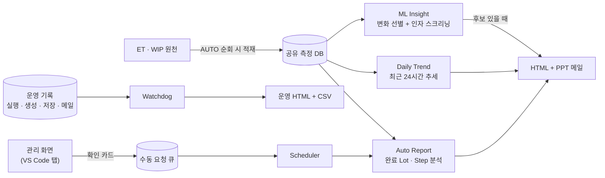

# ET Auto Report System

> 반도체 **DC(ET) 측정 → 통계 자동 분석 → PPT/HTML 리포트 → 메일 발송**을 한 흐름으로 처리하는 시스템.
> 이 문서는 **2026-09-29 코드 기준**입니다. 과거 버전의 [RULE]/NL_RULES 지식 규칙·AI 해석·규칙 다이제스트는
> 2026-09-22에 제거되었고 여기에는 적지 않습니다.

## 목차

1. [한눈에 보기](#1-한눈에-보기)
2. [설치](#2-설치)
3. [실행 — Scheduler 하나로 시작](#3-실행--scheduler-하나로-시작)
4. [VS Code(웹)에서 관리 화면 켜기](#4-vs-code웹에서-관리-화면-켜기)
5. [관리 화면 사용법](#5-관리-화면-사용법)
6. [사내 LLM(Gemma4) 연결 — 선택](#6-사내-llmgemma4-연결--선택)
7. [명령어 모음](#7-명령어-모음)
8. [메일 발송](#8-메일-발송)
9. [리포트 구성](#9-리포트-구성)
10. [ML Insight (실험 기능)](#10-ml-insight-실험-기능)
11. [이상 판정 로직 (Auto Report)](#11-이상-판정-로직-auto-report)
12. [설정 가이드](#12-설정-가이드)
13. [성능 · 용량 · 안정성](#13-성능--용량--안정성)
14. [출력물과 폴더](#14-출력물과-폴더)
15. [개발 · 배포](#15-개발--배포)
16. [참고: 주요 함수 · 데이터 흐름 · 해석 카탈로그](#16-참고-주요-함수--데이터-흐름--해석-카탈로그)

---

## 1. 한눈에 보기

| 구성 | 하는 일 | 산출물 |
|---|---|---|
| **Auto Report** | 측정 완료된 Lot × DC Step 마다 Score Board·이상 판정·항목별 차트 | HTML(메일 본문) + PPT(첨부) |
| **Daily Trend** | 최근 24시간 측정 항목을 카테고리별 Trend 로, Auto Report 와 같은 판정으로 이상·주의 요약 | HTML + PPT |
| **ML Insight** (실험) | 통계 검정·IF/LOF 로 변화 항목을 고르고, auto report 항목 페이지 구조 + ML_TABLE 인자 스크리닝 | HTML + PPT |
| **Watchdog** | 미발행·실패·지연·메일 상태를 하루 한 번 운영 요약 | HTML + CSV |
| **관리 화면** (Manager) | VS Code 탭에서 문장으로 명령·상황판·로그 쉬운 보기·ML 기준값 정렬 | 웹 화면(localhost) |


```mermaid
flowchart LR
    ET["ET · WIP 원천"] -->|AUTO 순회 시 적재| DB[("공유 측정 DB")]
    DB --> A["Auto Report<br/>완료 Lot · Step 분석"]
    DB --> D["Daily Trend<br/>최근 24시간 추세"]
    DB --> M["ML Insight<br/>변화 선별 + 인자 스크리닝"]
    A --> R["HTML + PPT 메일"]
    D --> R
    M -->|후보 있을 때| R
    OPS[("운영 기록<br/>실행 · 생성 · 저장 · 메일")] --> W["Watchdog"]
    W --> O["운영 HTML + CSV"]
    UI["관리 화면<br/>(VS Code 탭)"] -->|확인 카드| Q[("수동 요청 큐")]
    Q --> S["Scheduler"]
    S --> A
```

**원칙**
- 판정은 통계 코드가 한다. 사내 LLM 은 관리 화면의 **선택 레이어**(문장 해석·요약·ML 기준값 제안)이며 없어도 모든 기능이 규칙으로 동작한다.
- 실행·설정 변경은 항상 **확인 버튼**을 눌러야 일어난다(관리 화면 대화만으로는 아무것도 실행되지 않는다).
- 메일 1통의 본문 그림 수는 사내 메일 API 첨부 한도 안으로 맞춘다([8. 메일 발송](#메일-본문-그림-수-한도-attach-file-count-is-over-10)).

설치 폴더의 `docs/guide/index.html` 을 브라우저로 열면 그림으로 된 전체 흐름 가이드를 볼 수 있습니다(오프라인).

---

## 2. 설치

### 요구사항
- **Python 3.9+** (운영은 3.10 이상 권장)
- 패키지: `pandas`, `numpy`, `duckdb`, `pyarrow`, `python-pptx`, `matplotlib`, `openpyxl`, `requests`, `pyyaml`, `Pillow`, `scipy`, `scikit-learn`(ML Insight 의 IF/LOF)
- 사내 전용 모듈 `bigdataquery`(ET/Inline/WIP 조회)가 경로에 있어야 합니다(번들 미포함).

### 소스 추출
```bash
python setup.py
```
`setup.py` 는 실행 소스 전체(Main·Scheduler·관리 화면·가이드 문서)를 담은 **자가추출 번들**입니다.
SHA-256 으로 무결성을 확인한 뒤 현재 폴더에 풀고, 이미 있던 파일은 `<파일명>.bak` 으로 백업합니다.

> ⚠️ `My_config.py` 도 번들에 들어 있어 **다시 설치하면 덮어씁니다**. 관리 화면의 *ML 기준값 정렬*로 바꾼 값이나
> 직접 고친 값은 재설치 후 `.bak` 과 비교해 옮기세요(기준값 정렬 백업은 `RUN/OPS/config_backups/`).

### 실행 전 준비 파일 (번들 제외, 사내 관리)

| 파일/폴더 | 필수 | 역할 |
|---|---|---|
| `reformatter/config.yaml` | ✅ | 제품(vehicle)별 설정 — 조회 기간·메일 수신 시트·토글 |
| `reformatter/<vehicle>_reformatter.csv` | ✅ | 항목 정의(REAL/ADDP), SPEC·`REPORT DIRECTION`·`SCALE FACTOR`·`CAT1/CAT2`·`PPT_ONLY` |
| `reformatter/scheduler.yaml` | 자동 생성 | 제품 순회 그룹·주기·수동 요청 큐(없으면 첫 실행 때 기본값으로 생성) |
| `HOL_Auto_Report_Mailing_List.xlsx` | 메일 사용 시 | 수신 그룹 = 시트, `KNOX_ID` 열 |
| `RUN/DB/ML_TABLE_<vehicle>.parquet` | Daily/ML 사용 시 | wafer 단위 인자 표(root_lot_id, wafer_id + KNOB/MASK/EQP/INLINE/VM 열) |
| `HOL_Auto_Report_Description.pptx` | 선택 | CAT2 별 설명 간지 |
| 좌표 xlsx(Zone_Define) | 선택 | WF MAP 실좌표·Chip_Radius |
| `.env` | 메일/S3 사용 시 | 메일/S3 자격 |

---

## 3. 실행 — Scheduler 하나로 시작

설치 폴더를 연 VS Code Terminal 에서:

```bash
python Scheduler.py
```

하나로 아래가 모두 준비됩니다. 관리 웹 서버 시작이 실패하거나 브라우저 탭을 닫아도 Scheduler 는 계속 동작합니다.

| 경로 | 켜지는 조건 | 기본값 |
|---|---|---|
| Auto Report 제품 순회 | `scheduler.yaml` 제품 그룹(A/B/C, `every` 1/3/6 사이클) | 등록 제품 순회 |
| 관리 화면(Manager) | `My_config.manager.enabled=True` | 127.0.0.1:8765 |
| Watchdog | `My_config.watchdog.enabled=True` | 매일 09:00 |
| Daily Trend | `daily_trend.enabled=True` + 제품 + 수신 그룹 | 매일 09:30 |
| ML Insight | `mlmode.enabled=True` + 제품 + 수신 그룹 | 매일 10:00 |

- 세 일일 서비스의 기본 수신처는 `My_config.service_recipient_group = 'POWER USER'`(메일링 Excel 의 시트명과 정확히 일치해야 하며, 없으면 다른 시트로 대체 발송하지 않습니다).
- `products=[]` 이면 scheduler.yaml 에 등록된 제품을 씁니다. 시작·재시작만으로 메일을 보내지는 않습니다.
- 서비스별 1회 실행·미리보기(메일 없음): `python Scheduler.py --daily-trend-preview` / `--mlmode-preview` / `--watchdog-preview`.

---

## 4. VS Code(웹)에서 관리 화면 켜기

관리 서버는 Scheduler 가 **자동으로 띄우지만, VS Code 탭은 직접 열어야** 합니다(서버는 원격에서 브라우저를 강제로 열지 않습니다).

### 1) 접속 주소 확인
서버의 `RUN/OPS/manager_url.txt` 를 엽니다.

```
http://127.0.0.1:8765/#key=…            ← 1번째 줄: 직접 접속
<Notebook base>/proxy/8765/#key=…       ← 2번째 줄: JupyterHub/Notebook 환경일 때만
```
`#key=…` 는 접속 키입니다. 외부에 공유하지 말고, 주소를 옮길 때 **key 부분을 지우지 마세요**.
Manager 를 다시 시작하면 새 키가 만들어지므로 이 파일의 새 주소를 씁니다.

### 2) 환경별 여는 방법

| 환경 | 여는 방법 |
|---|---|
| **PC VS Code + Remote-SSH** | `Ctrl+Shift+P` → **Simple Browser: Show** (신버전은 **Browser: Open Integrated Browser**) → 1번째 줄 주소 붙여넣기. 안 열리면 하단 **PORTS** 탭에서 `8765` 를 Forward 한 뒤 주소의 포트만 바꾸고 `#key=…` 는 유지 |
| **브라우저 속 VS Code (사내 code-server / JupyterHub VS Code)** | `manager_url.txt` 의 **2번째 줄 `/proxy/8765/` 주소**를 새 브라우저 탭 또는 Simple Browser 로 엽니다. 2번째 줄이 없으면 `<지금 VS Code 주소의 base>/proxy/8765/#key=…` 로 직접 조립합니다(base 에 `/user/<사용자>/` 같은 기존 경로 포함) |
| **원격 Jupyter 커널만 연결한 PC VS Code** | 주소가 자동 전달되지 않습니다. Notebook 프록시 주소나 허용된 SSH 포트 포워딩으로 접속 |

- 화면은 VS Code 테마를 따라 밝게/어둡게 바뀌고, 오른쪽 위 달 버튼으로 바꿀 수 있습니다. 좁은 분할 화면에서는 세로로 배치됩니다.
- 한 번 열어 둔 탭은 5초마다 상태를 갱신합니다. `.ipynb` 셀은 필요 없습니다.

### 3) 관리 화면만 다시 켜기
```bash
python Manager.py            # 기존 Manager 프로세스를 먼저 종료(PID: RUN/OPS/manager.lock)
```
번들(setup.py)을 갱신했다면 Scheduler 만 재시작해서는 이미 떠 있는 옛 Manager 를 재사용하므로 **Manager 도 재시작**하세요.
관리 서버는 localhost 만 허용합니다(외부 공개 터널 불필요).

---

## 5. 관리 화면 사용법

상단 메뉴 **홈 · 로그 · 가이드**.

### 홈 — "무엇을 할까요?"
문장으로 적습니다: `ABC12 CC942300 스텝 발행해줘`, `vehicle_A DB 설치해줘`, `지금 상황 알려줘`, `최근 실패 원인 알려줘`, `ABC12 발행됐어?`.
기존 명령어(`_TRIGGER_…`, `--init-db 제품`, `--send-user ID --prime-key 제품_Lot_Step`)도 그대로 받습니다.

1. 제품·Lot·DC Step 이 여러 개 맞거나 빠져 있으면 **선택지로 되묻습니다**(번호나 이름 일부로 답해도 됨). 측정일이 기본 조회기간보다 오래되면 분석 범위(FORCE/SINGLE)를, 이미 발행한 대상이면 재실행 여부를 묻습니다.
2. 다 정해지면 **확인 카드** — **확인 후 접수**를 눌러야 Scheduler 대기열에 들어갑니다.
3. 대화 안 **진행 카드**가 접수 → 대기 → 처리 중 → 완료/실패를 5초마다 갱신합니다. 실패하면 원인·할 일을 쉬운 말로, 완료되면 **리포트 보기**.

오른쪽 **상황판**: Scheduler 가 지금 하는 일, 대기 요청, 확인이 필요한 일, 최근 운영 기록.
목록에서 고르는 편이 쉬우면 **직접 선택해서 요청**을 펼칩니다(제품 → Root Lot 검색 → 실제 Lot → DC Step → 분석 범위).
**접수 완료는 발행 완료가 아닙니다** — Scheduler 가 현재 제품 작업을 끝낸 뒤 처리합니다.

### ML 기준값 정렬 (홈 아래 패널)
ML Insight 인자 스크리닝의 기준값(`My_config.mlmode` 의 `factor_*` 6개)만 **문장으로 맞추는** 기능입니다.

1. 패널을 열면 현재 기준값과, 최근 ML 결과 기준 "지금 몇 건이 잡히는지"가 보입니다.
2. `밑둥 들림은 확실한 것만 보고 싶고, R² 는 0.2 정도 약한 상관도 보고 싶어` 처럼 적고 **제안 받기**.
3. 연결된 LLM(Gemma4)이 값을 제안하고, 코드가 **허용 키·허용 범위**만 통과시킨 뒤, 최근 ML 결과로 **바꾸기 전/후 신호 건수**를 다시 계산해 보여 줍니다. LLM 이 없거나 실패하면 문장 규칙(대상: 밑둥·R²·범주·유의수준 / 방향: 엄격하게·완화 / 숫자)으로 같은 형식의 제안을 만듭니다.
4. **My_config.py 에 적용**을 눌러야 파일에 씁니다 — 해당 숫자만 바꾸고 나머지 바이트는 그대로, 원본은 `RUN/OPS/config_backups/`, 이력은 `RUN/OPS/threshold_changes.jsonl`.
5. 다음 ML Insight 실행부터 새 기준값을 씁니다. 제안 뒤에 My_config.py 가 바뀌었으면 적용을 거부합니다(다시 제안).

| 키 | 뜻 | 허용 범위 |
|---|---|---|
| `factor_r2_min` | 수치 인자 R² 가 이 값 이상이면 "상관 높음" | 0.05 ~ 0.9 |
| `factor_tail_min` | 꼬리(P10/P90) 이동 최소(robust σ 배) | 0.1 ~ 3 |
| `factor_tail_ratio` | 움직인 꼬리 ÷ 반대쪽 꼬리 이동 최소 배수("한쪽만 들림") | 1 ~ 5 |
| `factor_tail_share_min` | x 양끝 구간의 꼬리 wafer 비율 차 최소 | 0.05 ~ 0.8 |
| `factor_level_effect_min` | 범주 인자 수준 간 차이 ε² 최소 | 0.02 ~ 0.6 |
| `factor_fdr_alpha` | BH 보정 q 기준 | 0.01 ~ 0.1 |

### 로그 · 가이드
- **로그 › 쉬운 보기**: 작업 시작/완료/실패·메일 발송·오류 → 뜻 → 할 일을 사건 목록으로. **원문**으로 원래 로그. 파일 끝 256 KB, 100/300/1000줄.
- **가이드**: 시작 안내(`docs/MANAGER_START.md`), 설치된 README, 전체 처리 흐름 문서.

---

## 6. 사내 LLM(Gemma4) 연결 — 선택

연결하면 관리 화면에서 ① 규칙이 못 읽은 문장 해석 ② 상황·실패·로그 요약 ③ **ML 기준값 제안**에 쓰입니다.
**실행 대상과 판정은 AI 가 정하지 않습니다** — AI 가 고른 Lot/Step 은 문장에 실제로 있고 측정 로그에 있을 때만, 기준값은 허용 키·범위 안에서만 쓰고, 실행·적용은 항상 확인 버튼입니다.

```python
# My_config.py
self.manager_llm = dict(enabled=True, provider='gemma4', api_url='https://<사내 LLM>/v1',
                        system_name='<Send-System-Name>', credential_key='', timeout_s=60)
```
비밀값은 환경변수 권장: `AUTO_REPORT_LLM_KEY`(x-dep-ticket), `AUTO_REPORT_LLM_URL`, `AUTO_REPORT_LLM_SYSTEM`, `AUTO_REPORT_LLM_USER`.
상단 **AI** 표시를 누르면 연결을 확인합니다. 호출이 실패하면 60초 동안 AI 를 쉬고 규칙만 씁니다. Gemma4 응답은 수 초~1분 걸릴 수 있습니다.
Main(리포트 생성) 경로에는 LLM 호출이 없습니다.

---

## 7. 명령어 모음

`<제품>` = `reformatter/config.yaml` 의 제품 키(= `<제품>_reformatter.csv`), `prime_key` = `<제품>_<lot_id>_<step_id>`.

### Main
| 목적 | 명령 |
|---|---|
| 평소 자동 실행(신규 측정 완료 Lot 발행) | `python Main.py vehicle_A` |
| 새 제품 초기 DB 적재(최근 200일, 리포트·메일 없음) | `python Main.py --init-db vehicle_A` |
| 지정 prime_key 한 건(기본 조회기간) | `python Main.py "_TRIGGER_vehicle_A_T6677.1_test"` |
| 기간 제한 없이 그 Lot·Step ET 만 | `python Main.py "_TRIGGER_SINGLE_vehicle_A_T6677.1_test"` |
| 오래된 Lot — 측정일 2일 전까지 기간 확장 | `python Main.py "_TRIGGER_FORCE_<메일 또는 시트>_vehicle_A_T6677.1_test"` |
| 좌표 파일 13pt shot 만 | `python Main.py "_TRIGGER_NORMAL_vehicle_A_T6677.1_test"` |
| CAT2 전 항목 Trend 전용 | `python Main.py "_TRIGGER_ALL_<메일 또는 시트>_vehicle_A_T6677.1_test"` |
| 여러 Lot 한 번에(같은 개수=짝, 한쪽 1개=공통) | `python Main.py "_TRIGGER_vehicle_A_L1,L2_S1,S2"` |
| 한 사람에게만 발송(엑셀 미사용) | `python Main.py --send-user user.id --prime-key vehicle_A_T6677.1_test [--single]` |

- lot_id / step_id 에 `_` 를 쓰지 않습니다(prime_key 를 오른쪽부터 나눕니다).
- `--init-db` 는 이번 실행만 `DB_Setting_mode=True, QueryTimeSpan=200` 등을 적용합니다(YAML 불변). 재실행하면 같은 날짜 파일을 갱신합니다.

### Scheduler
| 명령 | 동작 |
|---|---|
| `python Scheduler.py` | 상시 순회 + 관리 화면 + 일일 서비스 |
| `--once` / `--drain` | 사이클 1회 / 대기 트리거만 처리 후 종료(일일 서비스 자동 기동 안 함) |
| `--status` | 현재 상태 요약 |
| `--enqueue 제품_lot_step` | 수동 트리거 투입 |
| `--watchdog`·`--daily-trend`·`--mlmode` | 해당 서비스만 상시 실행 |
| `--*-once` / `--*-preview` | 1회 실행 / 메일 없이 미리보기 |

웹과 주고받는 큐 파일 규약: `docs/SCHEDULER_TRIGGER_CONTRACT.md`.

---

## 8. 메일 발송

- **기본**: 제품 `email_list_path` 의 엑셀에서 `email_receiver` 시트의 `KNOX_ID` 명단(ID 면 `@samsung.com` 보완). `use_email_send=True` 일 때만 발송.
- **수동 발행 수신처**: scheduler.yaml `trigger.email_receiver`(요청이 지정한 그룹은 `trigger.allowed_email_receiver` 허용목록으로 거름).
- **`--send-user`**: 엑셀을 읽지 않고 입력 ID + `@samsung.com` 한 명에게만(이번 실행만 메일 ON, S3 OFF).
- 응답이 불확실(연결 단절·5xx)하면 `unknown` 으로 기록하고 **자동 재전송하지 않습니다** — 수신 이력을 확인하세요.

### 메일 본문 그림 수 한도 (Attach file count is over 10)
사내 메일 API 는 본문 인라인(`data:image`) 그림도 첨부로 떼어 세는 경우가 있어, **그림 + 첨부(PPT)가 10개를 넘으면 메일 전체를 거부**합니다(2026-07 실제 발생). 그래서 모든 발행물은 메일 1통의 본문 그림을 `mail_inline_image_limit`(기본 8 = 10 − PPT 1 − 여유 1) 이하로 만듭니다.

| 발행물 | 그림 합치는 방식 |
|---|---|
| Auto Report | Anomaly Trend 상위 `anomaly_trend_chart_top_n`(3) + 합성 이미지 |
| Daily Trend | **한 줄(`html_columns` 칸) = 그림 1장** 띠, 넘치면 다음 메일로 |
| ML Insight | 항목당 시트 1장 + 인자 차트 1장, 넘치면 다음 메일로 |
| ALL Trends | 2열 시트 그림 |

발송 직전 가드가 한 번 더 비교해 넘치면 뒤쪽 그림을 "첨부 PPT 참조" 문구로 바꿔 발송이 실패하지 않게 합니다(저장된 HTML·PPT 에는 그대로). 메일 API 의 거부 사유는 메일 이력(reason)에 남고, 관리 화면이 쉬운 말로 옮깁니다.
모든 `` 는 `data:image` 인라인이고 1장당 `html_inline_img_max_kb`(100 KB) 이하입니다(큰 인라인 그림은 메일 서버가 첨부로 떼어 냄).

---

## 9. 리포트 구성

### Auto Report (Lot × DC Step)
**HTML**: `[0] Anomaly Summary`(통계 판정 요약 + Anomaly Trend Chart·spec-out WF MAP) → Score Board → Inline Table → 최근 DC 측정자재 상세.
**PPT**: 표지 → Score Board → Anomaly 상세(통계, 전체 finding) → CAT2 설명 간지 → 항목별 페이지 → Index Aggregation Table.

- **항목별 페이지**(`insert_plots`): 왼쪽 통계표·Box·WF MAP, 오른쪽 Trend·Radius·Cumulative. WF MAP 색은 `REPORT DIRECTION`(LOWER=낮은 값 빨강, UPPER/BOTH=높은 값 빨강), 좌표 파일이 있으면 제품 전체 chip layout 으로 원·칩 크기를 맞춥니다.
- **Score Board**: 컬럼 = (FAB_LOT_ID, WAFER_ID), 형제 lot 을 합치지 않고 lot 별로 분리. 색은 `score_color_scale` 연속 보간(HTML·PPT 같은 함수).
- **spec-out WF MAP**: target = 리포트의 **lot_id + step_id 조합**(파란 테두리 박스, 라벨 파란색 일반 폰트), 그 외는 오른쪽 회색 라벨. target spec-out wafer 는 전량 표시, 라벨 `{ROOT_LOT} #{WAFER} ({DC step 앞 2자리})`.
- Inline Table 을 만들 수 없으면 열만 있는 빈 표로 두고 발행은 계속합니다.
- Score CSV(`RUN/DB/Score/<제품>_score.csv`)를 HTML 저장 직후 prime_key 단위로 갱신합니다.

### Daily Trend
최근 24시간 `(시작, 종료]`에 측정된 항목을 카테고리별 3열 격자로(노란 띠 = last 24h, 검정 테두리 점 = 24시간 측정). 상단 **이상·주의 요약**은 Auto Report 와 같은 판정 함수를 쓰며 항목명을 누르면 해당 차트로 이동합니다. PPT 도 요약 → 카테고리별 Trend(요약에서 슬라이드 링크).

### Watchdog
정상/정지 의심/명시적 종료/장기 처리 지연, 신규·갱신 측정, prime key 별 생성·저장·메일 상태와 미발행 사유, 단계별 시간. 첨부는 UTF-8 BOM CSV.

---

## 10. ML Insight (실험 기능)

### 대상 선정
`candidate_source`: `daily`(Daily Trend 가 이상·주의로 본 항목만) / `ml`(모든 항목을 ML 기법으로 선별) / `either`(기본, 둘 중 하나).
ML 기법: split·시간 추이·분포/산포 변화·극단값 비율(통계 검정, 전체 BH 보정 + 기법별 효과 기준), 과거 wafer 로 학습한 Isolation Forest / LOF, 진단용 장비·공간 차이. q 는 불량률이 아니고, 탐지 없음이 전체 정상 판정은 아닙니다(연산 상한 도달 시 본문에 표시).

### 항목 페이지 — auto report 항목 페이지와 같은 구조
PPT: 요약 1장 → 항목마다 ① **항목 페이지** ② **ML_TABLE 인자 스크리닝** 페이지. 메일은 flow 웹앱 톤 카드에 같은 차트를 한 장으로 합쳐 싣습니다.

- 왼쪽 위 요약 표(선정 이유·ML 근거·인자 신호·자료), 왼쪽 **Box**(신호 난 범주 인자 → Split → 과거/신규 순으로 묶음, wafer 중앙값, 점선 = P10)·**WF MAP**(신규 site 중앙값 / 신규 − 과거), 오른쪽 **Trend·Radius·Cumulative**. 검정 테두리 점 = 신규 관측.

### ML_TABLE 인자 스크리닝
`ML_TABLE_<제품>.parquet` 열을 계열로 나눠 **wafer 단위**(wafer 마다 최신 측정 shot 중앙값)로 대조합니다.

| 계열(기본 패턴) | 종류 | 보는 것 |
|---|---|---|
| KNOB `KNOB_*` `SPLIT_*` / MASK `MASK_*` `RETICLE_*` / EQP `EQP_*` `CHAMBER_*` `RECIPE_*` `FAB_*` | 범주 | 수준 간 차이(Kruskal-Wallis ε²) — lot 안에서 갈리는 인자는 lot 중앙값을 뺀 값, lot 단위 인자는 root lot 중앙값끼리. 수준별 하단 꼬리 wafer 비율 |
| INLINE `INLINE_*` / VM `VM_*` | 수치 | **R²**(Pearson)와 **밑둥 들림** |

- **밑둥 들림** = x 를 구간으로 나눴을 때 **한쪽 꼬리(P10)만 움직이고 반대쪽 꼬리(P90)는 그대로**인 경우(분포 바닥만 들림). 양쪽이 같이 움직이는 전체 이동은 R² 가 잡습니다. 차트에서 주황 선이 움직인 꼬리입니다.
- 같은 lot 의 wafer 는 독립이 아니므로 Kish design effect 로 유효 표본을 줄여 p 를 계산하고, 리포트 전체 인자 검정에 BH 보정을 한 번 겁니다.
- 기준값은 [관리 화면 › ML 기준값 정렬](#ml-기준값-정렬-홈-아래-패널) 또는 `My_config.mlmode` 의 `factor_*` 키. 계열 패턴은 `factor_families` 로 바꿉니다.
- 결과 수치는 발행 폴더의 `influence.json`(인자별 검정 값)에도 남고, 기준값 정렬은 이 파일로 "바꾸면 몇 건"을 재분석 없이 계산합니다.
- 연관 신호는 탐색 결과이며 원인 확정이 아닙니다.

---

## 11. 이상 판정 로직 (Auto Report)

`anomaly_engine.analyze_commonality()` 가 **항목마다 target lot 의 각 wafer 를 제품 전체의 wafer 별 기준**과 비교합니다(PCHK 포함).

| 우선 | type | 등급 | 조건 |
|---|---|---|---|
| 20000+ | `SPEC_OUT` | 🔴 이상 | target lot 에서 spec(방향 `REPORT DIRECTION` 반영) 이탈 pt ≥ 1 |
| 10000+ | `FLIER` | 🟠 주의 | spec 이내지만 \|값 − wafer median\| > `anomaly_flier_sigma` × 보통 wafer 산포인 pt ≥ 1. UPPER/LOWER 의 반대 방향은 `× anomaly_flier_offdir_relax` |
| 10000+ | `DISPERSION` | 🟠 주의 | wafer 내부 산포 > 보통 wafer 산포 × `anomaly_lot_dispersion_ratio` (절대량 게이트 `anomaly_disp_min_spec_frac`, 기본 OFF) |
| 하위 | `MEAS_SUSPECT` | 🟡 측정이상 추정 | 판정 제외(`wfmap_exclude_keywords`) PCHK 의 spec-out — 동일 shot 겹침 신호 |

- robust 산포 = 1.4826 × MAD(0 이면 IQR/1.349 → std). median 이탈 σ 는 판정하지 않고 detail·근거 파일에만 기록.
- spec-out 은 **target lot 에만** 한정(형제 lot 제외). `trend_tkout_agg` 등록 항목(예 MAWIN=P10)은 **집계값 기준**으로 spec-out·이상 판정.
- 판정 근거는 `RUN/TEMP/anomaly_basis_<lot>_<step>.json/.csv`, 판정 안내문은 HTML `_chart_logic`·PPT `_note_lines` 가 My_config 값을 읽어 표시.
- 특이맵(공간 패턴) 라벨은 `anomaly_pattern_rules` 를 지정했을 때만 만듭니다(기본 OFF, [참고](#특이맵공간-패턴-규칙)).

---

## 12. 설정 가이드

| 대상 | 파일 |
|---|---|
| 전역(경로·임계값·화질·병렬·메일·일일 서비스·관리 화면·LLM) | `My_config.py` |
| 제품별(조회 기간·메일 시트·토글) | `reformatter/config.yaml` |
| 항목·Spec·ADDP | `reformatter/<vehicle>_reformatter.csv` |
| 제품 순회 그룹·주기·수동 요청 큐 | `reformatter/scheduler.yaml` |

### 이상 판정 민감도 (값이 클수록 덜 민감)
| 키 | 기본 | 뜻 |
|---|---|---|
| `anomaly_lot_dispersion_ratio` | 2.0 | 주의(산포) 배수 |
| `anomaly_flier_sigma` | 3.5 | 주의(Flier) σ (0 = OFF) |
| `anomaly_flier_max_pts` | 0 | Flier 로 볼 wafer 당 최대 pt(0 = 상한 없음) |
| `anomaly_flier_offdir_relax` | 2.0 | Spec 반대 방향 Flier 완화 배수 |
| `anomaly_disp_min_spec_frac` | 0.0 | 산포 절대량 게이트(spec 폭 대비, 0 = OFF) |
| `anomaly_trend_chart_top_n` | 3 | [0] Trend 차트 수(메일 그림 수와도 연결) |
| `anomaly_exclude_items` | `[...]` | 통계 판정에서 뺄 항목(와일드카드, 대소문자 무시) |
| `wfmap_exclude_keywords` | `['PCHK']` | WF MAP·판정 제외 키워드 |
| `trend_tkout_agg` | `{'MAWIN':'P10'}` | tkout 별 집계로 Trend·판정(`PXX`/`MEDIAN`/`MEAN`) |

### 화질·용량·메일
| 키 | 기본 | 뜻 |
|---|---|---|
| `ppt_chart_dpi` / `html_chart_dpi` / `html_wfmap_dpi` | 125 / 170 / 200 | PPT·HTML 해상도(독립) |
| `html_inline_img_max_kb` | 100 | 인라인 그림 1장 상한 |
| `ppt_mail_max_mb` × `ppt_budget_ratio` | 10 × 0.92 | PPT 첨부 한도(남은 용량으로 Description 화질 결정) |
| `html_mail_max_mb` | 2.0 | 메일 본문 한도 |
| `mail_attach_limit` / `mail_inline_image_limit` | 10 / 8 | 메일 API 첨부 한도 / 메일 1통 본문 그림 상한 |
| `mail_connect_timeout_sec` / `mail_read_timeout_sec` / `mail_max_attempts` | 10 / 90 / 3 | 메일 전송 |
| `use_email_send` / `use_s3_upload` / `use_description_page` | False / True / True | 발송·업로드·간지 |

### 병렬·조회
| 키 | 기본 | 뜻 |
|---|---|---|
| `parallel_workers` | 0 | 렌더 워커 수 강제(0 = 자동) |
| `parallel_max_workers` / `parallel_reserve_cores` / `parallel_mem_per_worker_gb` / `parallel_reserve_gb` | 8 / 1 / 1.2 / 3.0 | 자동 결정 상한·예비 코어·워커당 메모리·예비 메모리 |
| `product_lock_wait_sec` | 3600 | 같은 제품 작업이 돌고 있으면 기다리는 최대 시간 |
| `et_refresh_days` / `et_full_refresh_days` | 2 / 7 | ET 증분 조회 / 전체 재조회 주기 |

### 일일 서비스 (`watchdog` / `daily_trend` / `mlmode` dict)
공통: `enabled`, `daily_time`, `products`, `recipients`, `mail_vehicle`. ML 주요 키:

| 키 | 기본 | 뜻 |
|---|---|---|
| `candidate_source` | `either` | 대상 선정(daily/ml/either) |
| `modules` / `diagnostic_modules` | 7종 / 장비·공간 | 판정 기법 / 진단 기법 |
| `fdr_alpha`, `rank_effect_min`, `trend_min_correlation`, `distribution_min_distance` | 0.05, 0.33, 0.6, 0.3 | 검정 기준 |
| `analysis_seconds` / `analysis_max_tests` | 120 / 2000 | 연산 상한 |
| `factor_*` | 위 [표](#ml-기준값-정렬-홈-아래-패널) | 인자 스크리닝 기준값 |
| `factor_families` | `{}`(기본 계열) | 계열 패턴 덮어쓰기 |
| `factor_top_k` | 4 | 항목당 차트로 보여 줄 인자 수 |

config/ 파일은 설치 때 한 번만 씨앗으로 깔리므로 **새 설정 키의 기본값은 코드에도** 있습니다.

---

## 13. 성능 · 용량 · 안정성

- **데이터**: ET 를 `RUN/DB/<제품>_daily/date=YYYY-MM-DD/data.parquet` 날짜 파티션으로 적재, DuckDB `hive_partitioning` 으로 필요한 기간만 읽습니다. DuckDB threads·memory_limit 은 `resource_governor` 가 겁니다.
- **병렬 렌더**: `resource_governor.plan_workers` 가 서버 공용 슬롯(OS 파일 잠금)으로 여러 Main 합계 ≤ 코어 − `parallel_reserve_cores`, 실측 CPU·메모리 여유만큼만 워커를 씁니다(spawn). 결과는 REPORT ORDER 로 조립해 직렬 실행과 같습니다.
- **PPT 용량**: 차트는 팔레트 PNG/JPEG 중 작은 쪽, WF MAP 은 원본 해상도 팔레트 PNG. 저장 직전 `fit_ppt_budget` 이 메일 한도 안으로 Description 화질을 정하고, 그래도 넘으면 큰 차트부터 줄입니다.
- **원자적 저장**: CSV/Parquet/HTML/PPT 는 임시 파일 완성 후 교체. 발행 파일은 `RUN/OPS/artifacts` 에 보관해 메일 재시도에 재사용.
- **재시도**: 자동 발행 실패는 확인된 대상만 다음 사이클에 재시도(기본 3회). 이미 성공한 수신처는 재발송하지 않음. 연결 전 timeout 만 안전한 재시도 후보.
- **S3 업로드**는 백그라운드 스레드로 보내고 결과는 메인 스레드가 이력에 반영합니다.
- `RUN/OPS` 에는 재시도·중복 방지 근거가 있으므로 운영 중 지우지 않습니다.

---

## 14. 출력물과 폴더

```
auto report/
├── reformatter/                      config.yaml · <vehicle>_reformatter.csv · scheduler.yaml
├── docs/                             MANAGER_START.md · SCHEDULER_TRIGGER_CONTRACT.md · guide/
└── RUN/
    ├── DB/<vehicle>_daily/date=…/    ET 파티션 · ML_TABLE_<vehicle>.parquet · Score/<vehicle>_score.csv
    ├── Report/<vehicle>/{HTML,Mail}/ Auto Report HTML · PPT
    ├── TEMP/                         anomaly_basis_<lot>_<step>.json/.csv (판정 근거, 보존)
    ├── ARCHIVE/<lot>_<step>/         발행 스냅샷(summary.json + target_rows.parquet)
    ├── QUEUE/                        수동 요청 inbox · scheduler_state.json
    ├── OPS/                          operations.sqlite(운영 이력) · artifacts · daily_trend/ · mlmode/(HTML·PPT·catalog.csv·influence.json)
    │                                 manager_url.txt · config_backups/ · threshold_changes.jsonl
    └── log/                          <제품>_log.txt(30MB rotation) · scheduler_log.txt · ET 측정 로그
```

---

## 15. 개발 · 배포

- git 은 `Main.py`·`My_Function.py`·`My_config.py`·`README.md`·`setup.py`(+`tests/` 일부)만 추적합니다. `Scheduler.py`·`Manager.py`·`manager_*.py`·`manager*.html/js`·`ml_threshold_tuner.py`·`resource_governor.py`·`anomaly_engine.py` 는 **setup.py 번들로만 배포**됩니다.
- 소스를 고친 뒤 `python gen_setup.py` 로 setup.py 를 다시 만듭니다(새 파일은 `gen_setup.py` 의 `BUNDLE_FILES` 에 추가). setup.py 를 직접 고치지 않습니다.
- 수정 시 지킬 불변식은 설치 폴더의 `CLAUDE.md`(HTML 인라인 이미지, WF MAP 표기, 집계 항목 판정, 로그 청결, Scheduler 트리거 1회 보장, 메일 그림 수, 관리 화면 확인 카드 등).
- 테스트(가상 데이터·메일 모의, 사내 DB/메일 없음): `python -m pytest -q tests`.
- 운영 반영 전: 사용자 Excel 의 POWER USER 시트, Notebook 프록시/포워딩 허용 여부, 사내 Gemma4 연결을 확인합니다.

---

## 16. 참고: 주요 함수 · 데이터 흐름 · 해석 카탈로그

### 주요 함수
| 파일 | 함수 | 설명 |
|---|---|---|
| Main.py | `_main_impl` | 조회 → 발행 대상 → 분석 → 차트 → 저장 → 메일 |
| Main.py | `_daily_trend_report` / `_daily_trend_pack` | Daily Trend·ML Insight 발행(메일 분할) |
| Main.py | `_ml_report_pack` | ML 항목 페이지·인자 스크리닝 HTML/PPT |
| Main.py | `_durable_mail` / `_mail_attachment_guard` | 영속 메일 발송 / 첨부 개수 최종 가드 |
| Main.py | `_img_datauri` | 인라인 그림(1장 상한 보장) |
| My_Function.py | `insert_plots` / `insert_score_board` / `insert_findings_page` | PPT 항목 차트 / Score Board / Anomaly 상세 |
| My_Function.py | `daily_trend_entries` / `daily_auto_findings` | 일일 서비스 항목·판정 |
| My_Function.py | `ml_trend_select` / `ml_factor_screen` / `ml_influence_analyze` | ML 선별 / 인자 스크리닝 / root-lot 매칭 연관 분석 |
| My_Function.py | `Reformatize` | ADDP 파생 항목(사칙·rmax/rmin·ABS/LOG/POWER/sqrt·MA_Window 다중 출력) |
| anomaly_engine.py | `analyze_commonality` / `render_findings_html` / `classify_specout_pattern` | 이상 판정 / 요약 HTML / 특이맵 |
| ml_threshold_tuner.py | `propose` / `simulate` / `apply` | ML 기준값 제안·재판정·My_config 반영 |
| resource_governor.py | `plan_workers` / `duckdb_settings` | 병렬도·DuckDB 자원 |

### 데이터 흐름
```
빅데이터 서버(ET) ─etdata_query→ Hive 파티션 Parquet ─DuckDB→ Raw
   → Scale Factor · ADDP(Reformatize) · Pivot(merged_df)
      ├─ insert_plots → PPT 차트 + metrics_dict
      ├─ analyze_commonality → findings → [0] 요약(HTML) · Anomaly 상세(PPT)
      ├─ Score Board · Inline Table
      └─ HTML/PPT 저장 → S3(선택) → 메일
```

### ADDP 작성 요령
단일 출력(`rmax({VTH_N},{VTH_P})`) → 컬럼 1개, `MA_Window(...)` → `{ALIAS}`·`_minus_margin`·`_plus_margin`·`_ovl_index`·`_new`. 콤마가 든 식은 CSV 에서 큰따옴표로 감쌉니다. `STD/AVG/stddev` 는 미지원.

### 특이맵(공간 패턴) 규칙
`My_config.anomaly_pattern_rules`(list)를 지정했을 때만 spec-out 좌표 패턴 라벨을 만듭니다(기본 `None` = OFF). 규칙은 위에서부터 평가해 먼저 통과한 라벨을 씁니다.

| type | 주요 파라미터 | 판정 |
|---|---|---|
| `global` | `min_share` | 전체 좌표 대비 out 비율 |
| `line` | `axis`, `max_lanes`, `min_pts` | 한 축 값 개수 ≤ max_lanes |
| `radius_band` | `r_min`, `r_max`, `cover` | 정규화 반경 구간 비율 |
| `clock` | `min_rnorm`, `resultant`, `min_frac` | 방향 집중도 → 시계 방향 |
| `quadrant` / `half` | `cover` | 사분면 / 반면 비율 |

규칙별 평가값은 `anomaly_basis_*.json` 의 `spec_out_pattern_stats.rules` 에 남습니다. wafer 1~2개 이상이면 pt 수 게이트, 3개 이상이면 동일 shot·유사 위치 반복 코멘트(`anomaly_pattern_thresholds`).

### 통계 패턴 → 추정 원인 (해석 참고)
| 패턴 | 추정 원인 | 확인 |
|---|---|---|
| lot 내 집단 분리 | 챔버/슬롯 split, 프로브카드, 분할 투입 | 갈린 wafer 군을 설비 이력과 대조 |
| 산포 확대 | 프로브 접촉 불안정, 공정 균일도 | WF MAP 공간성, PCHK 동반 |
| median 이동(spec 내) | 타겟 시프트, 직전 공정 변동 | 연관 index 동반 방향, Trend drift |
| 동일 site 재발 | 레티클/척 핫스팟, 프로브 핀 | 레티클 내 동일 좌표, 카드 교체 이력 |
| VTH N&P 동시 이동 | Gate CD·Oxide·워크펑션 | Gate CD/Oxide 인라인 |
| IDSAT 이동 | 이동도·CD·접합/콘택 저항 | VTH 동반 여부, RATIO 로 N/P 비대칭 |
| INLINE 하단 꼬리 연관(밑둥 들림) | 특정 inline 조건에서만 생기는 불량 subpopulation | 해당 inline 구간 wafer 의 공정 이력 |
| PCHK 동일 site 이탈 | 측정 오류 가능 | **판정 전 재측정으로 재현성 확인** |

> 임계 σ/배수는 합성 데이터에서는 크게 나올 수 있습니다. 실제 데이터로 `My_config.py` 에서 조정하세요.
