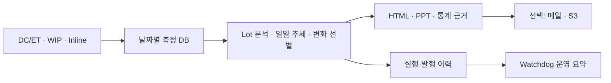
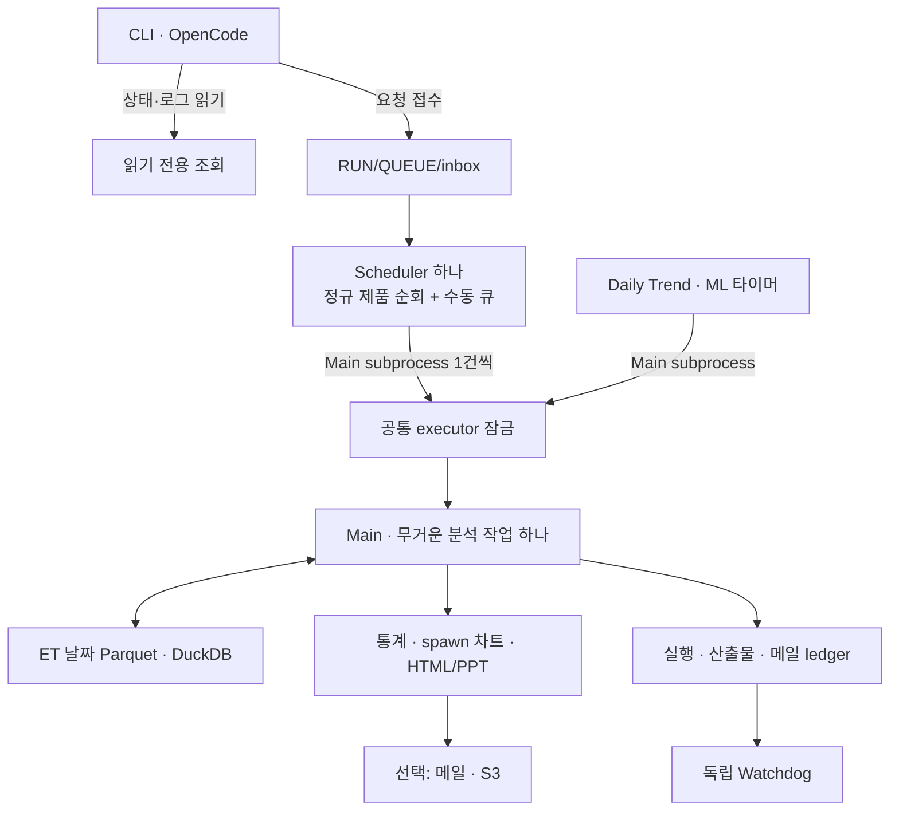

# Auto Report

**반도체 전기적 측정(DC/ET) 데이터를 Lot·Wafer 단위로 분석하고, HTML/PPT 보고서로 발행하는 Python 프로젝트다.**
측정값을 날짜별로 적재한 뒤 규격 이탈·산포·변화 신호를 차트와 통계 근거로 정리한다.
엔지니어는 개별 Lot의 상태, 최근 측정 추세, 변화와 함께 나타나는 공정 인자, 자동 발행의 운영 상태를 확인할 수 있다.

정규 작업은 Scheduler가 제품별로 순회하고, 수동 재발행은 같은 Scheduler 큐로 접수한다.
사내 OpenCode / oh-my-opencode는 요청 해석·로그 조회·큐 접수에 사용할 수 있다.
보고서 판정은 Python 통계 코드가 수행한다. 아래 설명은 2026-10-01 코드 기준이다.

## 어떤 결과를 얻는가

| 결과 | 확인하는 질문 | 주요 내용 | 파일 |
|---|---|---|---|
| **Auto Report** | 이 Lot·DC Step의 측정 결과는 어떤가? | Score Board, 규격 이탈·산포·Flier, 항목별 Trend·Wafer Map | HTML + PPT |
| **Daily Trend** | 최근 24시간에 무엇이 달라졌는가? | 카테고리별 추세, 신규 측정 강조, 공통 이상·주의 판정 | HTML + PPT |
| **ML Insight** | 어떤 변화가 유의하고 어떤 인자와 함께 나타나는가? | 통계 검정·IF/LOF 선별, ML_TABLE 인자 스크리닝 | HTML + PPT |
| **Watchdog** | 자동 발행이 정상적으로 진행되는가? | 실행 지연·실패·미발행·메일 상태와 단계별 시간 | HTML + CSV |


```mermaid
flowchart LR
    INPUT["DC/ET · WIP · Inline"] --> DB["날짜별 측정 DB"]
    DB --> ANALYSIS["Lot 분석 · 일일 추세 · 변화 선별"]
    ANALYSIS --> REPORT["HTML · PPT · 통계 근거"]
    REPORT --> SHARE["선택: 메일 · S3"]
    ANALYSIS --> LOG["실행·발행 이력"]
    LOG --> WATCH["Watchdog 운영 요약"]
```

메일 본문의 이미지는 HTML에 인라인으로 들어가며 PPT는 첨부용이다.
파일만 생성하는 요청도 지원한다. ML의 연관 신호는 원인 조사에 사용하는 탐색 결과다.

처음 읽는다면 [용어](#핵심-용어) → [설치](#시작하기) → [운영](#운영과-재발행) 순서로 보면 된다.
개발자는 [아키텍처](#아키텍처와-소스-구조), [개발·배포](#개발과-배포),
아래 [기술 참고](#기술-참고)를 확인한다.

## 핵심 용어

| 용어 | 이 프로젝트에서의 뜻 |
|---|---|
| **DC / ET** | 분석 대상인 반도체 전기적 측정 데이터. 코드·설정에서는 DC 또는 ET로 표현하며 ET는 Electrical Test |
| **Lot** | 측정·발행 대상으로 구분하는 Lot 식별자(`lot_id`). 형제 Lot도 별도로 취급 |
| **Wafer** | Lot 안의 개별 웨이퍼(`wafer_id`). 여러 chip/site의 측정값으로 통계와 Wafer Map 생성 |
| **DC Step** | 전기적 측정 단계. 같은 Lot이라도 Step이 다르면 별도 보고서 대상 |
| **vehicle / 제품** | `config.yaml`의 제품 설정 키. 조회 조건과 reformatter를 선택하는 이름 |
| **prime_key** | `<vehicle>_<lot_id>_<step_id>` 발행 식별자. 제품명은 `_` 허용, Lot/Step은 `_` 사용 불가 |
| **reformatter** | 제품별 CSV 항목 정의. 원천 항목, 배율, SPEC, 분류, 보고서 순서를 지정 |
| **REAL / ADDP** | 원천 측정 항목 / 원천 값을 계산해 만드는 파생 항목. ADDP 예: 차이·비율·MA_Window |
| **WIP / Inline** | Lot의 공정 진행 현황 / 공정 중 계측값. 발행 대상 확인과 비교 자료에 사용 |
| **TRIGGER** | 기존 DB로 지정 Lot·Step 보고서를 생성하는 수동 명령. Scheduler 큐에서 순차 실행 |
| **DB_SETTING** | 오늘 포함 적재 일수·병렬 조회 수를 지정하는 원시 DB 적재 전용 TRIGGER. 공통 executor 잠금 없이 실행, 같은 제품은 제품 잠금 유지 |
| **ML_TABLE** | 외부에서 준비하는 Lot·Wafer별 공정/장비/계측 인자 표. Daily/ML 분석에 결합 |

## 시작하기

설치 도구는 **프로그램·문서**를 푼다. Python 패키지, 사내 조회 모듈, 실제 제품 설정·측정 데이터·
메일 자격은 사내 환경에서 별도로 준비한다. 공개 저장소의 코드만으로 사내 데이터에 접근할 수는 없다.

### 1. 실행 환경과 설치

Python 3.10+ 환경에서 [setup.py](setup.py)를 실행한다.

```bash
python setup.py --target ./auto_report_run
cd auto_report_run
```

| 의존성 | 용도 |
|---|---|
| pandas · numpy · DuckDB · pyarrow | 측정 데이터 처리, 날짜 Parquet 저장·조회 |
| PyYAML · python-dotenv | YAML 설정과 환경변수 |
| matplotlib · Pillow · python-pptx · openpyxl | 차트·이미지·PPT·Excel 입력 |
| requests | Main의 메일/API 통신 모듈 |
| scipy | 통계·ML 선별과 인자 스크리닝 사용 시 필요한 통계 함수 |
| 사내 `bigdataquery` | ET·WIP·Inline 원천 조회 |
| boto3 / scikit-learn / psutil | S3 사용 시 / IF·LOF 사용 시 / 선택적 자원 실측 |

### 2. 사내 입력 준비

`vehicle_A` 등 이 문서의 값은 자리표시자다. 실제 제품 키와 승인된 운영 설정으로 바꾼다.

| 입력 | 준비할 내용 |
|---|---|
| `reformatter/config.yaml` | 제품별 조회 조건·기간·수신 그룹·발송/업로드 토글 |
| `reformatter/<vehicle>_reformatter.csv` | REAL/ADDP·SPEC·방향·CAT1/CAT2·REPORT ORDER·PPT_ONLY |
| `reformatter/scheduler.yaml` | 실제 제품 순회 그룹·주기·큐 설정. 없으면 운영 실행 시 예제 seed 생성 |
| `reformatter/report_items.yaml` | Daily/ML 제품별 기존 항목 선택·시간축·분류 dict. OpenCode 추가/삭제, 설치 보존 |
| 메일링 Excel | `HOL_Auto_Report_Mailing_List.xlsx`, 그룹별 시트와 `KNOX_ID` 열. 메일 사용 시 |
| `RUN/DB/ML_TABLE_<vehicle>.parquet` | Daily/ML의 wafer 단위 인자 표 |
| Inline/좌표 Excel · 설명 PPT | 설정된 분석 보조 입력 |
| `.env` | 메일/S3 자격. LLM 연결은 OpenCode에서 관리 |

운영 Scheduler를 시작하기 전에 실제 제품이 등록된 scheduler.yaml을 준비하고
제품 설정의 발송·업로드 토글, 수신 그룹과 Excel 시트명을 확인한다.

### 3. 상태 확인 후 Scheduler 시작

```bash
python Scheduler.py --status
python Scheduler.py
```

`--status`는 읽기 전용 조회다. 이어지는 상시 실행은 원천 조회·DB 적재와 조건에 따른 보고서 발행을 수행한다.
설치 폴더당 Scheduler 하나를 유지한다. 활성 설정에 따라 Watchdog·Daily Trend·ML 독립 타이머도 준비한다.
각 서비스의 제품·수신처·시각은 My_config.py에서 관리한다.

기본 서비스 시각은 서버 로컬 시간으로 Watchdog 09:00, Daily Trend 09:30, ML 10:00이다.
기본 그룹 `POWER USER`는 메일링 Excel 시트명과 정확히 일치해야 한다.
`products=[]`이면 순회에 등록된 제품을 사용한다.

**재설치는 My_config.py도 덮어쓴다.** 운영 설정을 먼저 비교·보존한다.
이전 소스·문서는 `.setup-backups/<고유값>/*.bak`로 보관한다.
운영 YAML·DB·큐·발행 이력·보고서는 보존하며 폐기된 AI 모듈/bytecode와 확인된 옛 AI 생성물만 정리한다.
설치 도구는 `.env`를 수정하지 않는다.

## 아키텍처와 소스 구조


```mermaid
flowchart TD
    USER["CLI · OpenCode"] -->|상태·로그 읽기| STATUS["읽기 전용 조회"]
    USER -->|요청 접수| INBOX["RUN/QUEUE/inbox"]
    INBOX --> S["Scheduler 하나<br/>정규 제품 순회 + 수동 큐"]
    S -->|Main subprocess 1건씩| GATE["공통 executor 잠금"]
    TIMER["Daily Trend · ML 타이머"] -->|Main subprocess| GATE
    GATE --> MAIN["Main · 무거운 분석 작업 하나"]
    MAIN <--> DB["ET 날짜 Parquet · DuckDB"]
    MAIN --> REPORT["통계 · spawn 차트 · HTML/PPT"]
    REPORT --> SEND["선택: 메일 · S3"]
    MAIN --> OPS["실행 · 산출물 · 메일 ledger"]
    OPS --> WATCH["독립 Watchdog"]
```

일반 제품 실행은 **설정 → ET 증분 적재/측정 완료 확인 → 발행 대상 선택 → 필요한 데이터 조회 →
SCALE FACTOR·ADDP·Pivot·좌표 연결 → 차트·통계 판정 → HTML/PPT/Score 저장 → 선택 발송** 순서다.
수동 TRIGGER는 기존 DB를 읽고 mode에 따라 비교범위를 정한다.
보고서 TRIGGER(`TRIGGER`/`SINGLE`/`NORMAL`/`FORCE`/`ALL`, 개인 발송 포함)는 제품 YAML 값과 관계없이
이번 실행에 `DB_Setting_mode=False`, `ptype_lot_turnoff=False`, `report_making=True`를 적용한다.
YAML 파일은 변경하지 않으며, 생성 전용 요청과 메일·S3 발송 설정은 별도로 적용한다.

| 소스 | 책임 |
|---|---|
| [Scheduler.py](Scheduler.py) | 그룹 순회, 큐 검증·중복/실행 이력, Main subprocess와 timeout, 일일 타이머, 상태 CLI |
| [Main.py](Main.py) | 명령 분기, 공통 실행 잠금, 분석 순서·보고서 조립·저장·메일 |
| [My_config.py](My_config.py) | 전역 코드 기본값, 제품 YAML 로딩, 제품별 경로·수신처·HTML 생성 |
| [My_Function.py](My_Function.py) | ET 적재·DB 읽기·ADDP, 차트/PPT 부품, 통계 ML·인자 분석, 운영 ledger·제품 잠금 |
| [anomaly_engine.py](anomaly_engine.py) | 규격 이탈·Flier·산포·공간 패턴 판정 |
| [resource_governor.py](resource_governor.py) | CPU/메모리 실측, 공용 렌더 슬롯, DuckDB 예산 |
| [operator_console.py](operator_console.py) | 단계명·콘솔 출력 |
| [report_items.py](report_items.py) | 기존 Auto Report ALIAS 검증·제품별 항목 dict·원자적 추가/삭제 |
| [report_review.py](report_review.py) | 후보 생성·검증·샘플 파일 등록·개인 발송·운영 반영 계획 |
| [runtime_versions.py](runtime_versions.py) | 로컬 코드 버전·시작 배너·공유 실행 lease·설정 보존 복원 |
| [gen_setup.py](gen_setup.py) → [setup.py](setup.py) | 편집 소스·문서를 압축 설치 번들로 생성 |

기본 설치는 Main.py·Scheduler.py·My_config.py·report_review.py **4개**와 보조 모듈 6개의 UTF-8 소스 ZIP
(`auto_report_runtime.zip`), 문서를 푼다. setup.py는 설치 도구다.
Git 체크아웃은 편집 소스·빌더·문서·테스트를 갖춘 개발용 구조다. `python gen_setup.py`로 setup.py를 재생성할 수 있다.
설치본은 위 4개 진입점과 ZIP으로 운영하는 구성이다. `--extract-sources`로 보조 모듈·빌더·테스트를 꺼낸다.
개별 보조 `.py`가 있으면 ZIP보다 먼저 import되므로 실제 실행 소스를 확인한다.

운영 이력은 `RUN/OPS/operations.sqlite`의 `records(kind,id,updated,payload)`에 저장한다.
더 자세한 흐름은 [전체 아키텍처 가이드](docs/guide/auto-report-architecture.md)에 있다.
설치 폴더의 `docs/guide/index.html`은 브라우저에서 여는 오프라인 그림 가이드다.
에이전트 지침은 [AGENTS.md](AGENTS.md), 큐 스키마는 [Scheduler 계약](docs/SCHEDULER_TRIGGER_CONTRACT.md)에 있다.

## 운영과 재발행

**상시 Scheduler가 실행 중이면 보고서 Main/TRIGGER는 큐에 접수한다.** DB setting 전용 명령은
공통 executor 잠금을 사용하지 않으므로 별도 실행할 수 있다. 같은 제품의 쓰기는 제품 잠금을 기다린다.
Scheduler는 현재 Main이 끝난 뒤 정규 제품 사이에서 수동 요청을 1건씩 처리한다.
일일 Daily/ML도 같은 실행 잠금을 기다린다.

```text
현재 제품 Main 완료
  → 수동 큐 최대 max_per_check건 순차 처리
  → 다음 정규 제품 Main
  → 다음 제품 사이에서 큐 재확인
```

### 파일만 생성하는 요청 예제

확인한 실제 제품/Lot/Step으로 바꿔 인수 배열로 접수한다.

```python
import json, subprocess, sys, uuid
request = {
    'req_id': 'manual-' + uuid.uuid4().hex,
    'kind': 'report', 'vehicle': 'vehicle_A',
    'lot_id': 'L001.1', 'step_id': 'S1', 'mode': 'TRIGGER',
    'generate_only': True, 'force': False,
}
subprocess.run([sys.executable, 'Scheduler.py', '--enqueue',
                json.dumps(request)], check=True)
subprocess.run([sys.executable, 'Scheduler.py', '--request-status',
                request['req_id']], check=True)
```

접수 성공은 생성·발송 성공이 아니다. req_id로 완료까지 확인한다.
실제 재발송은 검증·승인한 `email_receiver`, `generate_only=false`, 새 req_id + `force=true`를 사용한다.
`force=true`는 대상 중복 방지 우회, `mode=FORCE`는 분석 기간 확장이다.
기존 비교범위가 필요한 재발행을 비용만 보고 SINGLE로 바꾸지 않는다.

### 상태와 결과 확인

```bash
python Scheduler.py --status
python Scheduler.py --request-status <req_id>
```

| 확인 대상 | 위치·방법 |
|---|---|
| 큐 상태 | `RUN/QUEUE/scheduler_state.json`, `scheduler_status.json`, 요청 상태 CLI |
| 제품별 과정·오류 | `RUN/log/scheduler_log.txt`, `<vehicle>_log.txt`, ET 측정 로그 |
| 실행 결과 연결 | `RUN/OPS/results/<run_id>.json`, `scheduler_runs/<run_id>.json` |
| 보고서 | `RUN/Report/<vehicle>/`, Daily/ML은 `RUN/OPS/`의 서비스별 폴더 |
| DB 적재 | `RUN/DB/<vehicle>_daily/date=…/data.parquet`와 해당 ET 로그 |
| 메일 세부 상태 | `RUN/OPS/operations.sqlite`의 기록과 로그 |

두 상태 CLI는 설정/RUN/log를 생성하지 않는다. 스냅샷·PID·최근 로그를 함께 확인한다.
SQLite는 파일 존재 확인 후 `mode=ro`의 SELECT로 조회한다.
`My_Function.ops_*`는 조회에도 초기화/쓰기 연결을 하므로 운영 조회 도구로 직접 호출하지 않는다.
`done` 폴더에는 중복 스킵도 들어가므로 실제 생성물·메일 결과를 대조한다.
`unknown`은 결과가 미확인된 상태이며 수신 여부 확인 전 자동 재접수·재발송하지 않는다.

### 동시 실행을 제어하는 장치

- 일반/수동 보고서/Daily/ML Main은 같은 `RUN/OPS/locks/executor.lock`으로 무거운 작업을 직렬화한다.
  제품 잠금은 안쪽에 유지하며 업로드·차트 워커 종료까지 실행 잠금을 잡는다.
- DB setting 전용 TRIGGER와 `--init-db`는 executor 잠금을 건너뛴다. 제품 잠금·날짜별 저장 잠금·ET 로그 잠금은
  유지하고, 병렬 조회 프로세스가 모두 종료된 뒤 제품 잠금과 공용 자원 슬롯을 반납한다.
- `execution_lock_wait_sec` 기본 10800초. Scheduler 자식 timeout은 작업 예산 + 잠금 대기 예산이다.
- `trigger.max_pending=200`, `max_per_check=20`이 기본이다. 앞선 요청·현재 제품·일일 작업에 따라 대기한다.
- Scheduler OS 잠금은 중복 소비기를 막으며 `--force`로 살아 있는 잠금을 우회할 수 없다.
- 재시작 시 영속 active를 복구한다. 이전 Main/확인 가능한 잔여 프로세스가 살아 있으면 새 소비기를 막는다.
  결과가 없으면 unknown으로 남기며 수동 큐는 기본 재시도 없음, 설정해도 프로세스 시작 실패만 재시도한다.

공통 잠금은 같은 OPS 경로를 쓰는 설치본 사이에 적용된다. 단일 분석의 메모리까지 제한하는 하드 한도는 아니다.
실제 서버 종료 원인은 서버/OOM 로그로 확인하며 비정상 종료의 잔여 워커 정리는 운영 OS에서 검증한다.
Watchdog은 가벼운 운영 조회로 별도 실행한다.

## LLM을 통한 안전한 운영

OpenCode는 실제 설치 폴더의 [AGENTS.md](AGENTS.md)를 적용한다.
[OpenCode 규칙](https://opencode.ai/docs/rules/)은 지침을 LLM 문맥에 넣고,
[도구·에이전트 권한](https://opencode.ai/docs/permissions/)은 별도로 구성한다.

| 요청·역할 | 수행 범위 |
|---|---|
| “어떤 로그 있어?”, “왜 실패했어?” | 대상 로그·상태·읽기 전용 이력 조회 |
| “파일만 만들어줘”, “다시 발송해줘” | 대상·범위·발송 의도 확인 → 기존 큐 접수 → 결과 추적 |
| 운영 에이전트 | 코드 읽기·조회·검증된 접수. 모든 oh-my-opencode 하위 에이전트에도 같은 범위 |
| 개발 에이전트 | 설치 폴더에서 후보 생성 후 후보 소스/dict 수정·모의 테스트·샘플·반영 계획 |
| 배포 계정 | 검토한 번들 설치·계획된 재시작 |

**AGENTS는 지침이고, 코드 보호는 OpenCode 권한과 OS 파일 권한으로 강제한다.**
운영 계정은 소스·setup·config·큐 state/history를 읽기 전용으로 두고 필요한 inbox 접수만 쓰도록 한다.
`edit=deny`만으로 범용 shell/Python의 파일 쓰기가 막히지 않으므로 실행 명령도 좁게 허용한다.
개발/운영 환경을 분리하고 하위 에이전트가 더 넓은 권한으로 실행되지 않는지 검증한다.
명시적인 개선 요청은 [OpenCode 검토·반영 절차](docs/REPORT_REVIEW.md)로 진행한다.
운영본을 열어 요청해도 `report_review.py prepare`가 만든 후보에서 수정한다.
정확한 문법은 설치된 OpenCode와 [플러그인](https://github.com/code-yeongyu/oh-my-openagent)의 버전·스키마를 확인한다.

LLM 주소·키·모델 SDK는 Auto Report에 넣지 않는다.
제거된 Manager 웹·자연어 규칙·AI 출력 폴더를 복원하지 않는다.
코드 수정 요청만으로 운영 DB를 갱신하거나 실제 메일을 보내지 않는다.
사내 원천 데이터·DB·보고서·메일링 Excel·자격은 사용자 지시 없이 외부 Git/LLM/공유 서비스에 전송하지 않는다.

## 개발과 배포

**일상적인 OpenCode 개선·제품별 항목 변경은 [수정 → 테스트 → 샘플 → 운영 반영](docs/REPORT_REVIEW.md)을 따른다.**
“vehicle_A Daily Trend에 VTH_N 추가하고 LEAKAGE 빼줘”처럼 요청하면 기존 ALIAS를 검증하고
`reformatter/report_items.yaml` dict를 갱신한다. Daily/ML 전용 reformatter 열은 필요하지 않다.
일정·제품·수신처는 기존 설정을 유지하며, 선택한 항목에도 최근 측정 조건·ML 선별이 적용된다.
검토한 HTML/PPT를 지정한 사내 ID에 TEST 메일로 보내고 확인 후 승인한 번들·YAML만 운영본에 반영한다.

코드 변경 전 [AGENTS.md](AGENTS.md)와 [CLAUDE.md](CLAUDE.md)의 불변식,
현재 git 상태와 대상 diff를 읽고 기존 사용자 변경을 보존한다.

```bash
python setup.py --extract-sources
python -m pytest -q tests
python setup.py --build
python setup.py --target <임시검증폴더>
```

- 설치본에서 `--extract-sources`는 보조 모듈 6개·gen_setup.py·오프라인 테스트를 꺼내고 기존 파일을 보존한다.
- 수정·관련 오프라인 테스트 후 `--build` 또는 `python gen_setup.py`로 setup.py를 재생성한다.
  현재 진입점·설정·문서·추출 소스(없으면 ZIP)를 읽는다. setup.py 압축 DATA는 직접 편집하지 않는다.
- 테스트는 후보/개발 체크아웃에서 실행한다. 기본 설치의 tests는 후보에서 추출하며 사내 조회·메일·S3는 모의 처리한다.
- 임시 새 설치에서 Python 4개·ZIP import·CLI·운영 경로·spawn을 확인한다.
  운영 폴더에 검증용 재설치를 하지 않는다.
- 새 YAML 키는 기존 운영 YAML에도 동작하도록 코드 기본값을 둔다.
  새 파일은 `.gitignore`의 허용 목록·추적 여부와 번들 목록을 확인하고 `git add -A` 대신 검토한 파일만 명시한다.
- 번들 재생성·Git push만으로 실행 중인 서버가 업데이트되지는 않는다.
  운영 작업과 독립 서비스 상태를 확인한 뒤 새 번들 설치·재시작을 진행한다.

현재 코드 버전은 Scheduler/Main 시작 로그와 실행 결과의 `code_version`에 표시된다.
`python report_review.py versions`로 로컬 이력을 보고, 정상 종료 후
`python report_review.py rollback --version <코드ID>`로 실행 코드만 복원한다.
**Main.py·My_Function.py 등 코드가 돌아가며 My_config.py와 YAML·CSV·DB·큐·메일 이력은 현재 그대로 유지된다.**
설치 폴더 `.runtime-versions`에 실제 소스/ZIP의 코드 내용으로 버전을 저장하며 외부 Git은 사용하지 않는다.
업데이트도 `setup.py --target <운영폴더> --preserve-config`로 현재 설정을 유지한다.
검증·샘플·저장 범위·실행 중 복원 차단의 상세는 [검토 절차 6절](docs/REPORT_REVIEW.md#6-로컬-코드-버전과-이전-버전-복원)을 따른다.

## 기술 참고

아래는 운영자·개발자가 필요한 항목만 펼쳐 볼 수 있는 상세 설명이다.

<details>
<summary>보고서의 페이지 구성과 ML 인자 스크리닝</summary>

### Auto Report (Lot × DC Step)
**HTML**: `[0] Anomaly Summary`(통계 판정 요약 + Anomaly Trend Chart·spec-out WF MAP) → Score Board → Inline Table → 최근 DC 측정자재 상세.
**PPT**: 표지 → Score Board → Anomaly 상세(통계, 전체 finding) → CAT2 설명 간지 → 항목별 페이지 → Index Aggregation Table.

- **항목별 페이지**(`insert_plots`): 왼쪽 통계표·Box·WF MAP, 오른쪽 Trend·Radius·Cumulative. WF MAP 색은 `REPORT DIRECTION`(LOWER=낮은 값 빨강, UPPER/BOTH=높은 값 빨강), 좌표 파일이 있으면 제품 전체 chip layout 으로 원·칩 크기를 맞춥니다.
- **Score Board**: 컬럼 = (FAB_LOT_ID, WAFER_ID), 형제 lot 을 합치지 않고 lot 별로 분리. 색은 `score_color_scale` 연속 보간(HTML·PPT 같은 함수).
- **spec-out WF MAP**: target = 리포트의 **lot_id + step_id 조합**(파란 테두리 박스, 라벨 파란색 일반 폰트), 그 외는 오른쪽 회색 라벨. target spec-out wafer 는 전량 표시, 라벨 `{ROOT_LOT} #{WAFER} ({DC step 앞 2자리})`.
- Inline Table 을 만들 수 없으면 열만 있는 빈 표로 두고 발행은 계속합니다.
- Score CSV(`RUN/DB/Score/<제품>_score.csv`)를 HTML 저장 직후 prime_key 단위로 갱신합니다.

### Daily Trend
최근 24시간 `(시작, 종료]`에 측정된 항목을 카테고리별 3열 격자로(노란 띠 = last 24h, 검정 테두리 점 = 24시간 측정). 상단 **이상·주의 요약**은 Auto Report 와 같은 판정 함수를 쓰며 항목명을 누르면 해당 차트로 이동합니다. PPT 도 요약 → 카테고리별 Trend(요약에서 슬라이드 링크).
제품별 후보 항목은 `reformatter/report_items.yaml`의 `daily_trend` dict에서 선택한다.
미지정은 기존 Auto Report의 숫자 REPORT ORDER 항목 전체다. 시간축·분류도 같은 dict로 관리한다.

### Watchdog
정상/정지 의심/명시적 종료/장기 처리 지연, 신규·갱신 측정, prime key 별 생성·저장·메일 상태와 미발행 사유, 단계별 시간. 첨부는 UTF-8 BOM CSV.

### ML Insight

### 대상 선정
`report_items.yaml`의 `mlmode` dict로 제품별 후보 항목을 고른 뒤 `candidate_source`를 적용한다:
`daily`(Auto Report의 Daily 판정이 이상·주의로 본 항목만) / `ml`(선택 후보를 ML 기법으로 선별) / `either`(기본, 둘 중 하나).
ML 기법: split·시간 추이·분포/산포 변화·극단값 비율(통계 검정, 전체 BH 보정 + 기법별 효과 기준), 과거 wafer 로 학습한 Isolation Forest / LOF, 진단용 장비·공간 차이. q 는 불량률이 아니고, 탐지 없음이 전체 정상 판정은 아닙니다(연산 상한 도달 시 본문에 표시).

### 항목 페이지 — auto report 항목 페이지와 같은 구조
PPT: 요약 1장 → 항목마다 ① **항목 페이지** ② **ML_TABLE 인자 스크리닝** 페이지. 메일은 flow 웹앱 톤 카드에 같은 차트를 한 장으로 합쳐 싣습니다.

- 왼쪽 위 요약 표(선정 이유·ML 근거·인자 신호·자료), 왼쪽 **Box**(신호 난 범주 인자 → Split → 과거/신규 순으로 묶음, wafer 중앙값, 점선 = P10)·**WF MAP**(신규 site 중앙값 / 신규 − 과거), 오른쪽 **Trend·Radius·Cumulative**. 검정 테두리 점 = 신규 관측.

### ML_TABLE 인자 스크리닝
`ML_TABLE_<제품>.parquet` 열을 계열로 나눠 **wafer 단위**(wafer 마다 최신 측정 shot 중앙값)로 대조합니다.

| 계열(기본 패턴) | 종류 | 보는 것 |
|---|---|---|
| KNOB `KNOB_*` `SPLIT_*` / MASK `MASK_*` `RETICLE_*` / EQP `EQP_*` `CHAMBER_*` `RECIPE_*` `FAB_*` | 범주 | 수준 간 차이(Kruskal-Wallis ε²) — lot 안에서 갈리는 인자는 lot 중앙값을 뺀 값, lot 단위 인자는 root lot 중앙값끼리. 수준별 하단 꼬리 wafer 비율 |
| INLINE `INLINE_*` / VM `VM_*` | 수치 | **R²**(Pearson)와 **밑둥 들림** |

- **밑둥 들림** = x 를 구간으로 나눴을 때 **한쪽 꼬리(P10)만 움직이고 반대쪽 꼬리(P90)는 그대로**인 경우(분포 바닥만 들림). 양쪽이 같이 움직이는 전체 이동은 R² 가 잡습니다. 차트에서 주황 선이 움직인 꼬리입니다.
- 같은 lot 의 wafer 는 독립이 아니므로 Kish design effect 로 유효 표본을 줄여 p 를 계산하고, 리포트 전체 인자 검정에 BH 보정을 한 번 겁니다.
- 기준값은 `My_config.mlmode`의 `factor_*` 키입니다. 계열 패턴은 `factor_families`로 바꿉니다.
- 결과 수치는 발행 폴더의 `influence.json`(인자별 검정 값)에도 남습니다.
- 연관 신호는 탐색 결과이며 원인 확정이 아닙니다.

</details>

<details>
<summary>SPEC OUT·Flier·산포 판정과 항목·공간 패턴 참고</summary>

`anomaly_engine.analyze_commonality()` 가 **항목마다 target lot 의 각 wafer 를 제품 전체의 wafer 별 기준**과 비교합니다(PCHK 포함).

| 우선 | type | 등급 | 조건 |
|---|---|---|---|
| 20000+ | `SPEC_OUT` | 🔴 이상 | target lot 에서 spec(방향 `REPORT DIRECTION` 반영) 이탈 pt ≥ 1 |
| 10000+ | `FLIER` | 🟠 주의 | spec 이내지만 \|값 − wafer median\| > `anomaly_flier_sigma` × 보통 wafer 산포인 pt ≥ 1. UPPER/LOWER 의 반대 방향은 `× anomaly_flier_offdir_relax` |
| 10000+ | `DISPERSION` | 🟠 주의 | wafer 내부 산포 > 보통 wafer 산포 × `anomaly_lot_dispersion_ratio` (절대량 게이트 `anomaly_disp_min_spec_frac`, 기본 OFF) |
| 하위 | `MEAS_SUSPECT` | 🟡 측정이상 추정 | 판정 제외(`wfmap_exclude_keywords`) PCHK 의 spec-out — 동일 shot 겹침 신호 |

- robust 산포 = 1.4826 × MAD(0 이면 IQR/1.349 → std). median 이탈 σ 는 판정하지 않고 detail·근거 파일에만 기록.
- spec-out 은 **target lot 에만** 한정(형제 lot 제외). `trend_tkout_agg` 등록 항목(예 MAWIN=P10)은 **집계값 기준**으로 spec-out·이상 판정.
- 판정 근거는 `RUN/TEMP/anomaly_basis_<lot>_<step>.json/.csv`, 판정 안내문은 HTML `_chart_logic`·PPT `_note_lines` 가 My_config 값을 읽어 표시.
- 특이맵(공간 패턴) 라벨은 `anomaly_pattern_rules` 를 지정했을 때만 만듭니다(기본 OFF, [참고](#특이맵공간-패턴-규칙)).

### 주요 함수
| 파일 | 함수 | 설명 |
|---|---|---|
| Main.py | `_execute_serially` / `main` | 무거운 실행 경로의 공통 잠금·정리, CLI 분기 |
| Main.py | `_main_impl` | 조회 → 발행 대상 → 분석 → 차트 → 저장 → 메일 |
| Scheduler.py | `collect_requests` / `process_triggers` / `run_main` | 접수·중복/active 이력·Main subprocess/timeout |
| Main.py | `_daily_trend_report` / `_daily_trend_pack` | Daily Trend·ML Insight 발행(메일 분할) |
| Main.py | `_ml_report_pack` | ML 항목 페이지·인자 스크리닝 HTML/PPT |
| Main.py | `_durable_mail` / `_mail_attachment_guard` | 영속 메일 발송 / 첨부 개수 최종 가드 |
| Main.py | `_img_datauri` | 인라인 그림(1장 상한 보장) |
| My_Function.py | `insert_plots` / `insert_score_board` / `insert_findings_page` | PPT 항목 차트 / Score Board / Anomaly 상세 |
| My_Function.py | `daily_trend_entries` / `daily_auto_findings` | 일일 서비스 항목·판정 |
| My_Function.py | `ml_trend_select` / `ml_factor_screen` / `ml_influence_analyze` | ML 선별 / 인자 스크리닝 / root-lot 매칭 연관 분석 |
| My_Function.py | `Reformatize` | ADDP 파생 항목(사칙·rmax/rmin·ABS/LOG/POWER/sqrt·MA_Window 다중 출력) |
| anomaly_engine.py | `analyze_commonality` / `render_findings_html` / `classify_specout_pattern` | 이상 판정 / 요약 HTML / 특이맵 |
| resource_governor.py | `plan_workers` / `duckdb_settings` | 병렬도·DuckDB 자원 |

### 데이터 흐름
```
빅데이터 서버(ET) ─etdata_query→ Hive 파티션 Parquet ─DuckDB→ Raw
   → Scale Factor · ADDP(Reformatize) · Pivot(merged_df)
      ├─ insert_plots → PPT 차트 + metrics_dict
      ├─ analyze_commonality → findings → [0] 요약(HTML) · Anomaly 상세(PPT)
      ├─ Score Board · Inline Table
      └─ HTML/PPT 저장 → S3(선택) → 메일
```

### ADDP 작성 요령
단일 출력(`rmax({VTH_N},{VTH_P})`) → 컬럼 1개, `MA_Window(...)` → `{ALIAS}`·`_minus_margin`·`_plus_margin`·`_ovl_index`·`_new`. 콤마가 든 식은 CSV 에서 큰따옴표로 감쌉니다. `STD/AVG/stddev` 는 미지원.

### 특이맵(공간 패턴) 규칙
`My_config.anomaly_pattern_rules`(list)를 지정했을 때만 spec-out 좌표 패턴 라벨을 만듭니다(기본 `None` = OFF). 규칙은 위에서부터 평가해 먼저 통과한 라벨을 씁니다.

| type | 주요 파라미터 | 판정 |
|---|---|---|
| `global` | `min_share` | 전체 좌표 대비 out 비율 |
| `line` | `axis`, `max_lanes`, `min_pts` | 한 축 값 개수 ≤ max_lanes |
| `radius_band` | `r_min`, `r_max`, `cover` | 정규화 반경 구간 비율 |
| `clock` | `min_rnorm`, `resultant`, `min_frac` | 방향 집중도 → 시계 방향 |
| `quadrant` / `half` | `cover` | 사분면 / 반면 비율 |

규칙별 평가값은 `anomaly_basis_*.json` 의 `spec_out_pattern_stats.rules` 에 남습니다. wafer 1~2개 이상이면 pt 수 게이트, 3개 이상이면 동일 shot·유사 위치 반복 코멘트(`anomaly_pattern_thresholds`).

### 통계 패턴 → 추정 원인 (해석 참고)
| 패턴 | 추정 원인 | 확인 |
|---|---|---|
| lot 내 집단 분리 | 챔버/슬롯 split, 프로브카드, 분할 투입 | 갈린 wafer 군을 설비 이력과 대조 |
| 산포 확대 | 프로브 접촉 불안정, 공정 균일도 | WF MAP 공간성, PCHK 동반 |
| median 이동(spec 내) | 타겟 시프트, 직전 공정 변동 | 연관 index 동반 방향, Trend drift |
| 동일 site 재발 | 레티클/척 핫스팟, 프로브 핀 | 레티클 내 동일 좌표, 카드 교체 이력 |
| VTH N&P 동시 이동 | Gate CD·Oxide·워크펑션 | Gate CD/Oxide 인라인 |
| IDSAT 이동 | 이동도·CD·접합/콘택 저항 | VTH 동반 여부, RATIO 로 N/P 비대칭 |
| INLINE 하단 꼬리 연관(밑둥 들림) | 특정 inline 조건에서만 생기는 불량 subpopulation | 해당 inline 구간 wafer 의 공정 이력 |
| PCHK 동일 site 이탈 | 측정 오류 가능 | **판정 전 재측정으로 재현성 확인** |

> 임계 σ/배수는 합성 데이터에서는 크게 나올 수 있습니다. 실제 데이터로 `My_config.py` 에서 조정하세요.

</details>

<details>
<summary>설정 키와 코드 기본값</summary>

| 대상 | 파일 |
|---|---|
| 전역(경로·임계값·화질·병렬·메일·일일 서비스) | `My_config.py` |
| 제품별(조회 기간·메일 시트·토글) | `reformatter/config.yaml` |
| 항목·Spec·ADDP | `reformatter/<vehicle>_reformatter.csv` |
| Daily/ML별 제품→ALIAS→시간축/분류 | `reformatter/report_items.yaml` (상세: REPORT_REVIEW.md) |
| 제품 순회 그룹·주기·수동 요청 큐 | `reformatter/scheduler.yaml` |

### 이상 판정 민감도 (값이 클수록 덜 민감)
| 키 | 기본 | 뜻 |
|---|---|---|
| `anomaly_lot_dispersion_ratio` | 2.0 | 주의(산포) 배수 |
| `anomaly_flier_sigma` | 3.5 | 주의(Flier) σ (0 = OFF) |
| `anomaly_flier_max_pts` | 0 | Flier 로 볼 wafer 당 최대 pt(0 = 상한 없음) |
| `anomaly_flier_offdir_relax` | 2.0 | Spec 반대 방향 Flier 완화 배수 |
| `anomaly_disp_min_spec_frac` | 0.0 | 산포 절대량 게이트(spec 폭 대비, 0 = OFF) |
| `anomaly_trend_chart_top_n` | 3 | [0] Trend 차트 수(메일 그림 수와도 연결) |
| `anomaly_exclude_items` | `[...]` | 통계 판정에서 뺄 항목(와일드카드, 대소문자 무시) |
| `wfmap_exclude_keywords` | `['PCHK']` | WF MAP·판정 제외 키워드 |
| `trend_tkout_agg` | `{'MAWIN':'P10'}` | tkout 별 집계로 Trend·판정(`PXX`/`MEDIAN`/`MEAN`) |

### 화질·용량·메일
| 키 | 기본 | 뜻 |
|---|---|---|
| `ppt_chart_dpi` / `html_chart_dpi` / `html_wfmap_dpi` | 125 / 170 / 200 | PPT·HTML 해상도(독립) |
| `html_inline_img_max_kb` | 100 | 인라인 그림 1장 상한 |
| `ppt_mail_max_mb` × `ppt_budget_ratio` | 10 × 0.92 | PPT 첨부 한도(남은 용량으로 Description 화질 결정) |
| `html_mail_max_mb` | 2.0 | 메일 본문 한도 |
| `mail_attach_limit` / `mail_inline_image_limit` | 10 / 8 | 메일 API 첨부 한도 / 메일 1통 본문 그림 상한 |
| `mail_connect_timeout_sec` / `mail_read_timeout_sec` / `mail_max_attempts` | 10 / 90 / 3 | 메일 전송 |
| `use_email_send` / `use_s3_upload` / `use_description_page` | False / True / True | 발송·업로드·간지 |

### 병렬·조회
| 키 | 기본 | 뜻 |
|---|---|---|
| `parallel_workers` | 0 | 렌더 워커 요청 상한(0 = 자동); 자원·공용 슬롯 한도 적용 |
| `parallel_max_workers` / `parallel_reserve_cores` / `parallel_mem_per_worker_gb` / `parallel_reserve_gb` | 8 / 1 / 1.2 / 3.0 | 자동 결정 상한·예비 코어·워커당 메모리·예비 메모리 |
| `execution_lock_wait_sec` / `product_lock_wait_sec` | 10800 / 3600 | 공통 실행 잠금 / 같은 제품 잠금 대기 예산(초) |
| `et_refresh_days` / `et_full_refresh_days` | 2 / 7 | ET 증분 조회 / 전체 재조회 주기 |

### 일일 서비스 (`watchdog` / `daily_trend` / `mlmode` dict)
공통: `enabled`, `daily_time`, `products`, `recipients`, `mail_vehicle`. ML 주요 키:

| 키 | 기본 | 뜻 |
|---|---|---|
| `candidate_source` | `either` | 대상 선정(daily/ml/either) |
| `modules` / `diagnostic_modules` | 7종 / 장비·공간 | 판정 기법 / 진단 기법 |
| `fdr_alpha`, `rank_effect_min`, `trend_min_correlation`, `distribution_min_distance` | 0.05, 0.33, 0.6, 0.3 | 검정 기준 |
| `analysis_seconds` / `analysis_max_tests` | 120 / 2000 | 연산 상한 |
| `factor_*` | `My_config.py` 코드 기본값 | 인자 스크리닝 기준값 |
| `factor_families` | `{}`(기본 계열) | 계열 패턴 덮어쓰기 |
| `factor_top_k` | 4 | 항목당 차트로 보여 줄 인자 수 |

운영 YAML은 설치로 덮어쓰지 않습니다. scheduler.yaml seed는 운영 시작 시 없을 때 생성하며 **새 설정 키의 기본값은 코드에도** 둡니다.

</details>

<details>
<summary>명령어 전체 목록</summary>

아래 값은 자리표시자다. 제품은 `config.yaml`의 실제 키로, Lot/Step은 측정 이력으로 확인한다.
**상시 Scheduler가 있으면 Main 직접 명령 대신 해당 kind/mode의 큐 요청을 접수한다.**

| Scheduler 명령 | 동작 |
|---|---|
| `python Scheduler.py` | 상시 순회 + 일일 서비스 타이머 |
| `--enqueue KEY\|JSON` | inbox에 요청만 접수. Main은 실행하지 않음 |
| `--status` / `--request-status ID` | 읽기 전용 전체/요청별 상태 |
| `--once` / `--drain` | 단일 소비기로 정규 사이클 1회 / 대기 요청 처리. 상시 Scheduler 없을 때 |
| `--export-history` | 측정 history outbox 재생성(조회 전용 명령 아님) |
| `--watchdog` / `--daily-trend` / `--mlmode` | 해당 서비스 타이머만 실행 |
| `--*-once` / `--*-preview` | 일일 보고서 1회 / 메일 없이 미리보기 |

| Main 독립 실행 또는 큐에서 조립하는 명령 | 의미 |
|---|---|
| `python Main.py vehicle_A` | 신규 측정 완료 Lot의 자동 발행 |
| `python Main.py --init-db vehicle_A [--days 30] [--parallel 4]` | DB setting 적재, 기본 200일·직렬 조회, 리포트·메일·S3 없음 |
| `python Main.py "_TRIGGER_DB_SETTING_vehicle_A" --days 30 --parallel 4` | 오늘 포함 최근 30일 적재, 병렬 조회 최대 4개, executor 잠금 우회 |
| `python Main.py "_TRIGGER_vehicle_A_L001.1_S1"` | 기본 조회기간의 지정 대상 |
| `python Main.py "_TRIGGER_SINGLE_vehicle_A_L001.1_S1"` | 기간 제한 없이 선택 Lot/Step ET만 |
| `python Main.py "_TRIGGER_NORMAL_vehicle_A_L001.1_S1"` | 좌표 파일의 13pt shot만 |
| `python Main.py "_TRIGGER_FORCE_GROUP_vehicle_A_L001.1_S1"` | 측정일 2일 전까지 비교기간 확장, 수신 그룹 1개 |
| `python Main.py "_TRIGGER_ALL_GROUP_vehicle_A_L001.1_S1"` | CAT2 전 항목 Trend, 수신 그룹 1개 |
| `python Main.py --send-user user.id --prime-key vehicle_A_L001.1_S1 [--single]` | 도메인 없는 ID 1명에게 발송 |

파일만 생성하는 Main `--generate-only` 옵션은 없다. 큐의 `generate_only=true`를 사용한다.
여러 Lot/Step은 쉼표 목록, 같은 개수면 순서대로 짝, 한쪽 1개면 공통 적용, 최대 100개다.

DB setting은 Lot/Step 없이 제품만 지정한다. `--days`와 `--parallel`은 1 이상의 정수이며,
생략하면 제품 YAML의 `db_setting_days`/`db_setting_parallel`(코드 기본값 200/1)을 사용한다.
`SplitTimeSpan`(없으면 7일) 단위로 겹치지 않는 날짜 구간을 만들고 요청한 병렬 수 상한 안에서 조회한다.
실제 병렬 수는 `resource_governor`의 공용 슬롯·CPU·메모리·`parallel_max_workers` 한도를 따르며 로그에 표시한다.
WIP 조회·보고서·발송 상태 갱신·메일·S3는 수행하지 않는다. 적재 실패는 실패 종료로 전달한다.

Scheduler 큐도 `{"kind":"init_db","vehicle":"vehicle_A","days":30,"parallel":4}` 또는
`{"mode":"DB_SETTING","vehicle":"vehicle_A","days":30,"parallel":4}`를 받는다.
큐에 넣은 적재는 기존 순서대로 현재 Main 완료 후 실행한다. 즉시 별도 적재하려면 위 전용 CLI를 사용한다.

</details>

<details>
<summary>메일 발송과 본문·첨부 용량</summary>

- **기본**: 제품 `email_list_path` 의 엑셀에서 `email_receiver` 시트의 `KNOX_ID` 명단(ID 면 `@samsung.com` 보완). `use_email_send=True` 일 때만 발송.
- **수동 발행 수신처**: scheduler.yaml `trigger.email_receiver`(요청이 지정한 그룹은 `trigger.allowed_email_receiver` 허용목록으로 거름).
- **`--send-user`**: 엑셀을 읽지 않고 입력 ID + `@samsung.com` 한 명에게만(이번 실행만 메일 ON, S3 OFF).
- 응답이 불확실(연결 단절·5xx)하면 `unknown` 으로 기록하고 **자동 재전송하지 않습니다** — 수신 이력을 확인하세요.

### 메일 본문 그림 수 한도 (Attach file count is over 10)
사내 메일 API 는 본문 인라인(`data:image`) 그림도 첨부로 떼어 세는 경우가 있어, **그림 + 첨부(PPT)가 10개를 넘으면 메일 전체를 거부**합니다. 그래서 모든 발행물은 메일 1통의 본문 그림을 `mail_inline_image_limit`(기본 8 = 10 − PPT 1 − 여유 1) 이하로 만듭니다.

| 발행물 | 그림 합치는 방식 |
|---|---|
| Auto Report | Anomaly Trend 상위 `anomaly_trend_chart_top_n`(3) + 합성 이미지 |
| Daily Trend | **한 줄(`html_columns` 칸) = 그림 1장** 띠, 넘치면 다음 메일로 |
| ML Insight | 항목당 시트 1장 + 인자 차트 1장, 넘치면 다음 메일로 |
| ALL Trends | 2열 시트 그림 |

발송 직전 가드가 한 번 더 비교해 넘치면 뒤쪽 그림을 "첨부 PPT 참조" 문구로 바꿔 발송이 실패하지 않게 합니다(저장된 HTML·PPT 에는 그대로). 메일 API의 거부 사유는 메일 이력(reason)과 로그에서 확인합니다.
모든 `` 는 `data:image` 인라인이고 1장당 `html_inline_img_max_kb`(100 KB) 이하입니다(큰 인라인 그림은 메일 서버가 첨부로 떼어 냄).

</details>

<details>
<summary>데이터·렌더링·재시도·출력 폴더</summary>

- **데이터**: ET 를 `RUN/DB/<제품>_daily/date=YYYY-MM-DD/data.parquet` 날짜 파티션으로 적재, DuckDB `hive_partitioning` 으로 필요한 기간만 읽습니다. DuckDB threads·memory_limit 은 `resource_governor` 가 겁니다.
- **동시 작업**: Main 공통 executor 잠금으로 제품 순회·수동 보고서·Daily/ML의 무거운 처리를 직렬화합니다. DB setting 전용 CLI는 executor를 우회하며 같은 제품의 쓰기는 제품 잠금으로 보호합니다.
- **원시 DB 중복 방지**: 조회 구간은 날짜 경계를 공유하지 않습니다. 조회 결과의 완전히 같은 행을 제거하고 결과가 있는 날짜의 `date=YYYY-MM-DD/data.parquet`를 원자적으로 교체합니다. 같은 날짜 재적재는 append하지 않으며 다른 shot·항목·온도·재측정 행은 유지합니다. 조회 범위 밖 날짜와 빈 조회의 기존 파티션은 보존합니다. ET 로그는 잠금 안에서 prime_key별로 합쳐 한 행만 유지합니다.
- **ET 날짜 타입**: 조회 결과의 Categorical 날짜는 저장·비교·ET 로그 집계 전에 datetime으로 정규화합니다. 최종 측정 시각은 범주 순서가 아닌 실제 시간의 최댓값입니다.
- **병렬 렌더**: `resource_governor.plan_workers`가 공용 OS 슬롯과 실측 CPU·메모리 여유로 워커를 제한합니다(spawn). `parallel_workers` 요청도 코어 예비분·메모리·`parallel_max_workers`·실제 확보 슬롯 안에서만 적용합니다. 결과는 REPORT ORDER로 조립합니다.
- **PPT 용량**: 차트는 팔레트 PNG/JPEG 중 작은 쪽, WF MAP 은 원본 해상도 팔레트 PNG. 저장 직전 `fit_ppt_budget` 이 메일 한도 안으로 Description 화질을 정하고, 그래도 넘으면 큰 차트부터 줄입니다.
- **원자적 저장**: CSV/Parquet/HTML/PPT 는 임시 파일 완성 후 교체. 발행 파일은 `RUN/OPS/artifacts` 에 보관해 메일 재시도에 재사용.
- **재시도**: 정규 자동 발행은 안전하게 실패한 대상만 다음 사이클 재시도(기본 3회)하며 성공 수신처는 다시 보내지 않습니다. 수동 큐는 기본 `max_retry=0`. timeout·중단·결과 불명 요청은 자동 재실행하지 않습니다. 메일 연결 전 timeout과 발송 후 응답 불명은 구분합니다.
- **S3 업로드**는 백그라운드 스레드로 보내고 결과는 메인 스레드가 이력에 반영합니다.
- `RUN/OPS` 에는 재시도·중복 방지 근거가 있으므로 운영 중 지우지 않습니다.

```
auto report/
├── reformatter/                      config.yaml · <vehicle>_reformatter.csv · scheduler.yaml
├── docs/                             SCHEDULER_TRIGGER_CONTRACT.md · guide/
└── RUN/
    ├── DB/<vehicle>_daily/date=…/    ET 파티션 · ML_TABLE_<vehicle>.parquet · Score/<vehicle>_score.csv
    ├── Report/<vehicle>/{HTML,Mail}/ Auto Report HTML · PPT
    ├── TEMP/                         anomaly_basis_<lot>_<step>.json/.csv (판정 근거, 보존)
    ├── ARCHIVE/<lot>_<step>/         발행 스냅샷(summary.json + target_rows.parquet)
    ├── QUEUE/                        inbox · done/failed · outbox · pending/active/history 상태
    ├── OPS/                          operations.sqlite · locks · results · scheduler_runs · artifacts · daily_trend/ · mlmode/
    └── log/                          <제품>_log.txt(30MB rotation) · scheduler_log.txt · ET 측정 로그
```

</details>
