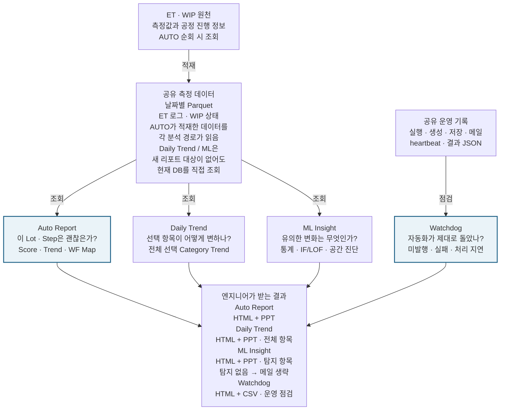
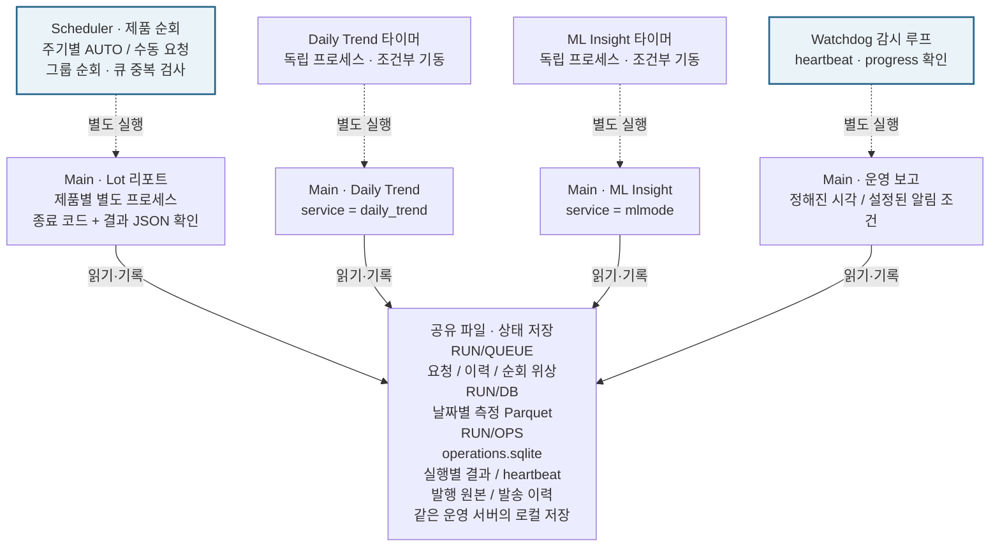
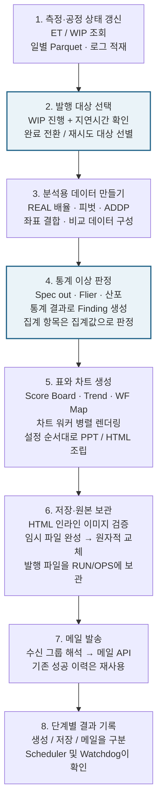
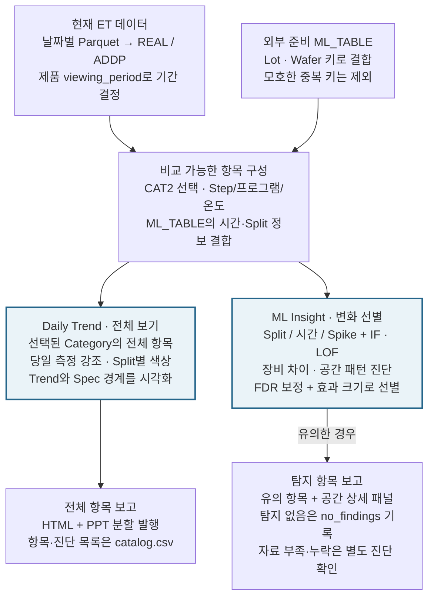
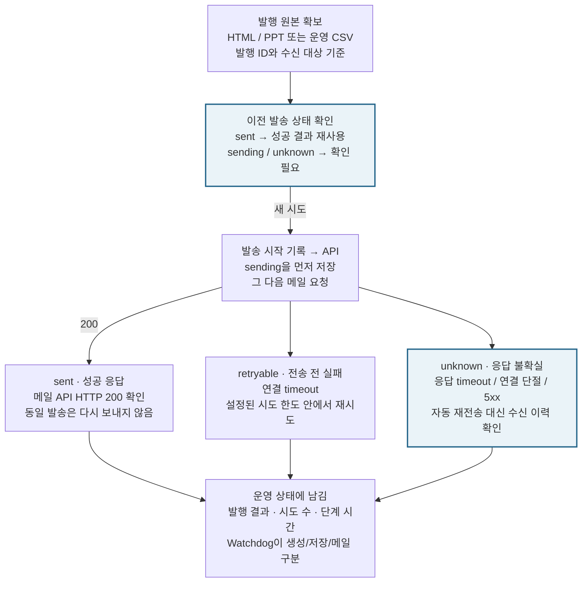

# Auto Report — 전체 흐름과 실행 구조

2026-09-30 설명 보완. 도식은 업무 역할·프로세스 경계를 보여 주며 최신 CLI·큐 계약은 README를 기준으로 합니다. **[그림 가이드 열기](index.html)** · [README로 돌아가기](../../README.md). 설치 폴더의 `docs/guide/index.html`을 브라우저에서 열면 인터넷 없이 읽을 수 있습니다. 실제 활성 서비스는 운영 설정을 확인하세요.

## 데이터 하나, 서로 다른 네 가지 질문

업무 흐름도 · 측정 데이터와 운영 기록은 서로 다른 목적으로 읽습니다.

- 업무 역할을 그린 그림입니다. 실제 프로세스 경계는 다음 그림에서 확인합니다.
- 각 실행은 RUN/OPS에 기록합니다. 로그 쓰기 화살표와 선택적 DX/S3 업로드는 전체도에서 생략했습니다.
- ML Insight 결과는 기본 Auto Report의 판정 규칙을 자동으로 바꾸지 않습니다.

## 실행은 나뉘고, 기록으로 연결된다

프로세스 구조 · 같은 Scheduler.py와 Main.py가 실행 인자에 따라 다른 역할을 맡습니다. 별도 프로세스여도 제품/수동/Daily/ML의 무거운 처리는 공통 실행 잠금으로 직렬화합니다.

- 상시 Scheduler가 활성화된 독립 타이머를 기동합니다. --once / --drain은 자동 기동하지 않습니다.
- OpenCode는 --enqueue로 inbox에 접수합니다. 현재 Main을 선점하지 않고 제품 사이에서 처리하며 pending→active→결과를 영속 기록합니다.
- 일반/수동 보고서/Daily/ML Main은 같은 RUN/OPS/locks/executor.lock을 기다립니다. DB setting 전용 TRIGGER/--init-db는 executor를 우회하며 제품 잠금과 공용 자원 한도를 유지합니다. Watchdog은 가벼운 조회로 분리합니다.
- 최신 대기 예산·복구·unknown·권한 경계는 [README](../../README.md)와 [큐 계약](../SCHEDULER_TRIGGER_CONTRACT.md)을 확인합니다.
- 그림의 읽기·기록 화살표는 접근 관계입니다. 모든 워커가 모든 저장소를 쓰는 뜻은 아닙니다.
- Watchdog은 Scheduler와 별도 프로세스지만 같은 서버에 있습니다. 서버가 꺼지면 감시 메일도 보낼 수 없습니다.

## 한 번의 측정이 리포트가 되기까지

일반 AUTO 경로 · 수동 트리거는 원천 쿼리를 건너뛰고 기존 DB의 지정 Lot · Step을 사용합니다.

- 번호는 이해를 돕는 논리 단계입니다. 차트 생성과 분석 호출 일부는 코드 안에서 서로 섞여 있습니다.
- Target은 lot_id + step_id로 식별합니다. prime key는 제품 + Lot + Step을 묶는 발행 식별자입니다.
- 외부 LLM 없이 코드로 분석합니다. 선택적 DX/S3 업로드는 저장 후 메일 전에 수행합니다.

## 전체 추세와 유의한 변화를 나눠 본다

Daily Trend와 ML Insight는 데이터 준비를 공유하지만, 선택 기준과 목적이 다릅니다.

- ML_TABLE은 외부에서 준비된 입력입니다. 이 보고 경로가 원천 ML_TABLE을 생성하지 않습니다.
- Daily Trend의 시간/Split 매핑은 설정할 때 사용합니다. ML Insight는 장비 등 진단 정보도 읽습니다.
- 제품별 측정 항목·시간/Split 매핑은 `reformatter/report_items.yaml`의 서비스별 dict가 정본입니다.
  기존 Auto Report ALIAS/REPORT ORDER만 선택하며 전용 reformatter 열은 읽지 않습니다.
  OpenCode의 후보 수정·샘플·승인 반영은 [검토 절차](../REPORT_REVIEW.md)를 따릅니다.
- IF/LOF는 과거 데이터로 학습하고 별도 기준 구간 및 새 측정을 비교합니다. 장비 연관성은 원인 확정이 아닙니다.
- with_vehicle는 ML 비교 데이터 확장 옵션입니다. 기본 리포트 판정으로 되먹임하지 않습니다.

## 메일 응답을 잃었다면, 성공도 실패도 단정하지 않는다

발송 상태 흐름 · 저장된 원본과 영속 이력이 중복 발송을 줄이는 기준입니다.

- HTTP 200은 메일 API 성공 응답이며, 수신자의 열람 확인을 뜻하지 않습니다.
- HTTP 4xx 등 확인된 요청 거부와 전송 전 파일·설정 오류는 failed입니다. 전송 후 응답을 확정하지 못한 예외와 5xx는 unknown이며 자동 재전송하지 않습니다.
- 기본 AUTO는 use_email_send를 확인합니다. Daily Trend / ML / Watchdog은 각 서비스의 발송 조건을 사용합니다.
- Watchdog은 관측된 실행 결과를 보고합니다. 기록이 없으면 정상이나 성공으로 추정하지 않습니다.

## 코드 근거와 문서 차이

| 코드 | 확인한 내용 |
|---|---|
| [Scheduler.py:281](../../Scheduler.py#L281) · `start_watchdog` | 독립 감시 프로세스 |
| [Scheduler.py:374](../../Scheduler.py#L374) · `start_daily_trend` | Daily Trend / ML 독립 타이머 |
| [Scheduler.py:496](../../Scheduler.py#L496) · `load_config` | 서비스 설정 병합 |
| [Scheduler.py:954](../../Scheduler.py#L954) · `run_main` | 별도 Main 및 종료 코드+JSON 검사 |
| [Scheduler.py:1082](../../Scheduler.py#L1082) · `process_triggers` | 수동 트리거·기존 DB·재시도 |
| `anomaly_engine.analyze_commonality` | 통계 코드로 판정, 외부 LLM 비연결 |
| [Main.py](../../Main.py) · `AUTO 조회 경로` | ET/WIP·완료 대상 선별 |
| [Main.py](../../Main.py) · `저장·S3·메일` | 인라인 검증 및 원본 보관 |
| [Main.py:4033](../../Main.py#L4033) · `_daily_trend_report` | 공통 일일 보고와 서비스 분기 |
| [Main.py:4352](../../Main.py#L4352) · `_watchdog_report` | 운영 HTML/CSV 출력 |
| [Main.py:817](../../Main.py#L817) · `_durable_mail` | sent/retryable/unknown 처리 |
| [My_Function.py:4702](../../My_Function.py#L4702) · `operations_root` | SQLite 운영 기록 |
| [My_Function.py:5000](../../My_Function.py#L5000) · `daily_trend_load` | 공유 DB 직접 조회 |
| [My_Function.py:5033](../../My_Function.py#L5033) · `daily_trend_ml` | 외부 ML_TABLE 결합 |
| [My_Function.py:5346](../../My_Function.py#L5346) · `ml_trend_select` | 통계/IF/LOF/FDR |
| [My_config.py](../../My_config.py) · `서비스 기본값` | Watchdog / Daily Trend / ML 설정 |

**2026-09-30 운영 구성:** Watchdog은 운영 HTML/CSV를 만들고, 분석은 별도 Daily Trend/ML 경로입니다. 운영 요청은 CLI/큐에서 처리하며 웹 관리 화면과 사내 LLM 어댑터는 제거되었습니다. 일일 서비스 기본값은 My_config.py에 있고 load_config에서 병합됩니다. 제품/수동/적재/Daily/ML은 공통 실행 잠금을 사용하며 미확인 큐 요청은 unknown으로 기록합니다. 정확한 운영값은 서버 설정으로 확인하세요. OpenCode 운영 지침은 설치 루트의 AGENTS.md를 따릅니다.

## 그림 속 용어

| 용어 | 뜻 |
|---|---|
| ET / WIP | 전기적 측정 결과 / 현재 공정 진행 상태 |
| Lot · Wafer · Step | 생산 묶음 / 개별 웨이퍼 / 측정 또는 공정 단계 |
| REAL / ADDP | 원 측정 항목 / 수식으로 계산한 파생 항목 |
| CAT2 / Split | 보고서 항목 분류 / 공정 조건별 비교 그룹 |
| WF Map / Finding | 웨이퍼 위치별 값·이상 지도 / 코드가 찾은 이상 소견 |
| IF / LOF | Isolation Forest / Local Outlier Factor: 과거 분포와 다른 관측을 찾는 모델 |
| FDR | 여러 항목을 동시에 검정할 때 거짓 발견 비율을 제어하는 보정 |
| heartbeat | 감시 대상 루프가 최근에 응답했는지 남기는 신호 |

## 가이드 구성과 갱신

HTML에는 다이어그램 5장이 내장되어 있습니다. 개별 SVG는 이미지로, `.mmd`는 Mermaid 편집 원본으로 사용할 수 있습니다.

소스 배포 폴더의 `docs/guide/` 문서를 수정한 뒤 `python gen_setup.py`로 설치 번들을 다시 생성합니다. `setup.py`는 생성물이므로 직접 편집하지 않습니다. 가이드 안의 코드 줄 번호는 문서 작성 시점 기준이며 코드 변경 후에는 함수 이름으로 찾아보세요.
